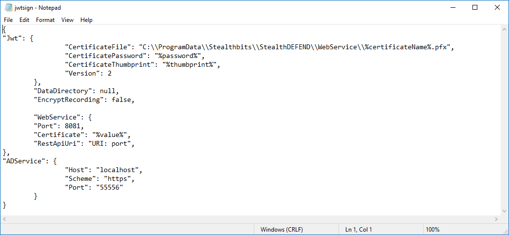

# Test Connection in Active Directory Sync Integration Fails

## Symptoms

Refer to the following symptoms present in your environment:

- In Netwrix Threat Manager (NTM), the test connection fails when you attempt to configure the **Active Directory Sync Integration**.
- The **Threat Manager Console** is configured to use the HTTPS protocol.

## Cause

The Active Directory Service is misconfigured and cannot be connected to via HTTPS.

## Resolution

Edit the Active Directory Service configuration to implement the HTTPS protocol. Follow these steps:

1. Proceed to the Web Service folder and locate the `appsettings.json` file to manage the service settings. Refer to the following default location:

   ```
   C:\Program Files\Stealthbits\StealthDEFEND\WebService
   ```

2. Locate the `"ADService"` node and alter the `Scheme` value to state `https`. Refer to the following example:

   ```json
   "ADService": {
     "Host": "localhost",
     "Scheme": "https",
     "Port": "55556"
   },
   ```

3. Locate or create the `JWT` node. Specify the relevant certificate values. Refer to the following example:

   ```json
   "Jwt": {
       "CertificateFile": "C:\\ProgramData\\Stealthbits\\StealthDEFEND\\WebService\\%certificateName%.pfx",
       "CertificatePassword": "%password%",
       "CertificateThumbprint": "%thumbprint%",
       "Version": 2
   },
   ```

4. Save the changes.

Refer to the following example of the `appsettings.json` file:

