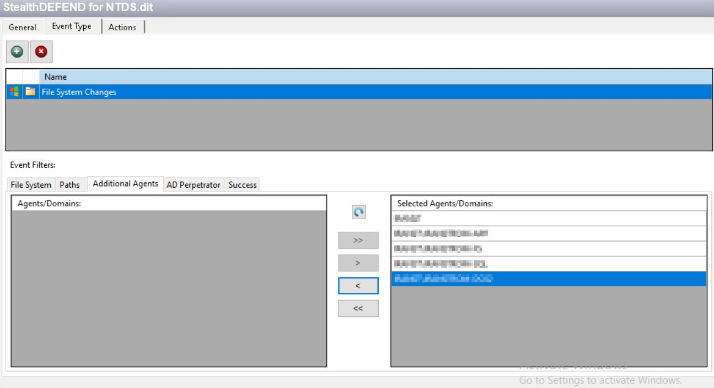

# Agent Blocked From Hooking Into LSASS

## Symptom

No events are received because the agent is unable to hook into LSASS.

Below is an example output found in the log:

```text
2024-10-01 17:24:07.269| Debug   | 0x09ac| executing NVInject, result: 6
```

## Cause

Third-party security tools are blocking the agent from hooking into LSASS.

## Resolution

To resolve this issue, follow the steps provided in the first resolution. If the issue persists, then proceed with the steps outlined in the second resolution:

- Correct the necessary endpoint protection exclusions. For more details, refer to the following article: https://docs.netwrix.com/docs/threatprevention/7_5 (Antivirus Software Considerations).
- Check if **SI Agent Safe Mode** is enabled. If enabled, it could prevent the LSASS hook from mitigating host reboots. For more information, see https://docs.netwrix.com/docs/threatprevention/7_5 (SI Agent Safe Mode).

  1. To verify this setting, review the **AD Agent** column in the interface:

     <br /><br />

  2. Enable or disable this setting using the **Agent Update Settings** option. Navigate to: https://docs.netwrix.com/docs/threatprevention/7_5 (Set Options Window).
  3. Access the settings via the following path: **Netwrix Threat Manager v7.3 > Administration > Policy Center > Agents Interface > Agents Interface Right-Click Menu > Update Agent Settings**. For details, see: https://docs.netwrix.com/docs/threatprevention/7_5 (Update Agent Settings).

## Related Articles

- https://docs.netwrix.com/docs/threatprevention/7_5 (Netwrix Threat Manager v7.3 - Antivirus Software Considerations)
- https://docs.netwrix.com/docs/threatprevention/7_5 (Netwrix Threat Manager v7.3 - SI Agent Safe Mode)
- https://docs.netwrix.com/docs/threatprevention/7_5 (Netwrix Threat Manager v7.3 - Set Options Window)
- https://docs.netwrix.com/docs/threatprevention/7_5 (Netwrix Threat Manager v7.3 - Update Agent Settings)
