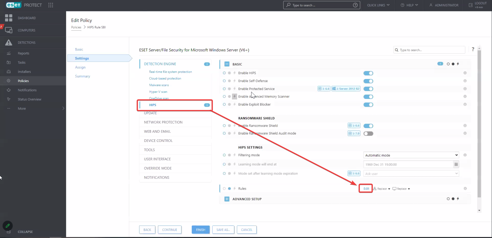
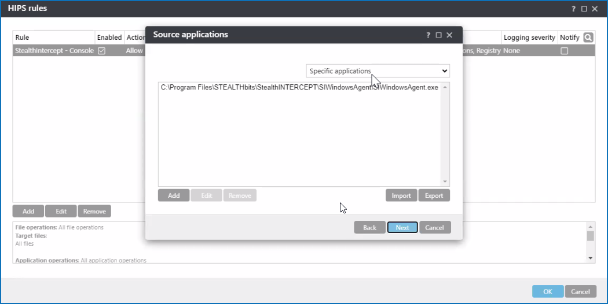

# Set Up ESET HIPS Rules to Allow Threat Prevention SI Agent Hook

## Question

How to set up ESET HIPS rules to allow Threat Prevention SI Agent hook?

## Answer

1. In the left pane of your **ESET PROTECT Web Console**, select **Policies**. Select the **Detection Engine** tab > **HIPS**.
2. Under the **Rules** section, click **Edit**.

   

3. In the **HIPS Rules** window, click **Add**.
4. Specify the **Rule name**, select **Allow** for the **Action** type, and proceed by clicking **Next**.

   

5. Select **Specific applications** in the dropdown list, and click **Add** to add the path to `SIWindowsAgent.exe`. Refer to the following code block for a default path:

   ```text
   C:\Program Files\STEALTHbits\StealthINTERCEPT\SIWindowsAgent\
   ```

   Proceed to the next step by clicking **Next**.

   

6. Switch the **All file operations** switch to the on position, and proceed by clicking **Next**. Click **OK** to save changes.

   

7. Once the configuration steps are completed, proceed to the **Assign** tab. Assign the new rule to corresponding systems.

   

8. The rule should become visible in your ESET host. Refer to the **Advanced Setup** menu > **HIPS** tab > **Basic** section > **Rules** tab.

   

> **NOTE:** Once the rule is applied, SI Agent should be restarted.

## Related articles

- [Create a HIPS rule and enforce it on a client workstation using ESET PROTECT (8.x – 10.x) ⸱ ESET 🛡️](https://support.eset.com/en/kb8018-create-a-hips-rule-and-enforce-it-on-a-client-workstation-using-eset-protect)
- [Enable or disable HIPS in ESET products (15.x–16.x) ⸱ ESET 🛡️](https://support.eset.com/en/kb2811-enable-or-disable-hips-in-eset-products)
