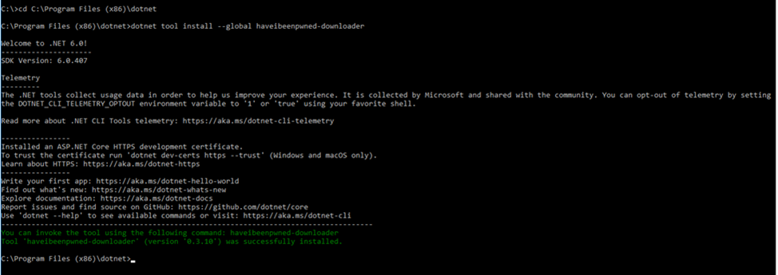
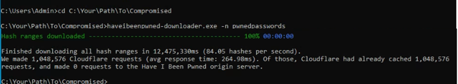

# Pwnd Passwords Database Downloader for Netwrix Threat Prevention

## Before you start

- Please note that [Pwnd Passwords Downloader](https://github.com/HaveIBeenPwned/PwnedPasswordsDownloader) is a third party, open source tool, created by the HaveIBeenPwned team, and distributed under a BSD 3-Clause License. You might experience issues during the hash download process, depending on your threading settings or the load on the CloudFlare backend. The Pwnd Passwords Downloader tool will automatically retry to continue downloading the hashes until it fully completes the download process.
- HIBP (Have I Been Pwned database) hashes can take up to **30 GB**. The resultant database after converting your hashes for SI is almost the same in size. Make sure that you have enough free space on your disk.

## Instructions

### Step 1. Install .NET 6.0

**IMPORTANT.** It is strongly recommended to install .NET 6 first as it only guarantees to get the latest breached hashes from Have I Been Pwned (HIBP).

1. Download and install .NET 6 from https://dotnet.microsoft.com/en-us/download/dotnet/6.0

### Step 2. Install Pwnd Passwords Downloader

1. Open Command Prompt, and navigate to your .NET install folder (e.g. `C:\Program Files (x86)\dotnet`).
2. Run:

```bash
dotnet tool install --global haveibeenpwned-downloader
```



### Step 3. Update an already installed Pwnd Passwords Downloader

1. Open Command Prompt
2. Run:

```bash
dotnet tool update --global haveibeenpwned-downloader
```


### Usage of Pwnd Passwords Downloader

To download NTLM hashes:

1. Navigate to the folder where you want to download the hashes
2. Download all NTLM hashes to a single txt file, called for example `pwnedpasswords.txt`:

```bash
haveibeenpwned-downloader.exe -n pwnedpasswords
```



### Step 4. Prepare Pwned DB for SI

1. Run Netwrix Threat Prevention (SI) console.
2. Select Configuration\’EPE setting’ menu item.
3. Select **File** button.
4. Click **Select File** and choose downloaded txt file.
5. Click the **Update** button.


