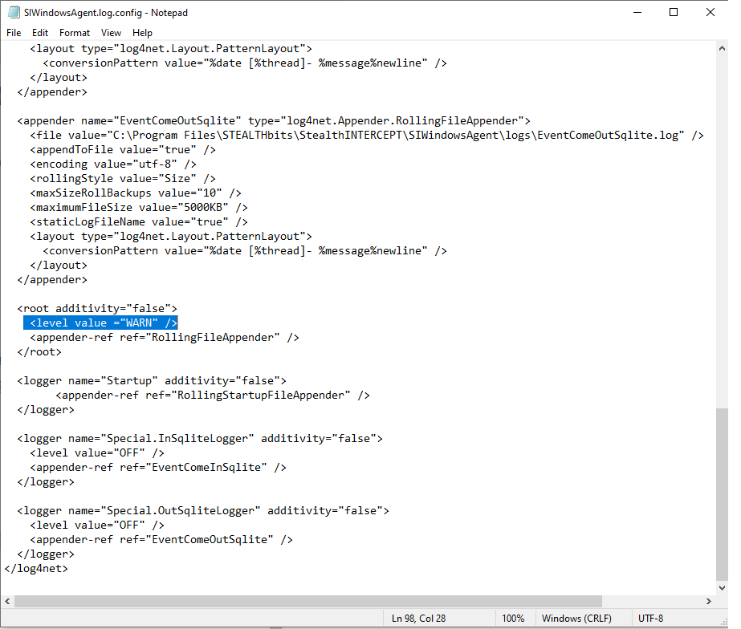

# Enabling Debug Logging on the Netwrix Threat Prevention Windows Agent

## Overview
This article describes how to enable debug logging on the Netwrix Threat Prevention Windows agent.

## Instructions
There are two options.

> **NOTE:** Version 8.1 changed the logging engine used by the agent, so the `SIWindowsAgent.log.config` file has a different format. In version 8.1 and later:
>
> - The root element is `<nlog>` instead of `<log4net>`, and the `minlevel` attribute on a `<logger>` rule sets the log level rather than a `<level>` element.
> - Saving the file applies the change immediately. Restarting the `SIWindowsAgent` service is not necessary.
> - Option 2 writes a log level back to the configuration file, so it survives a service restart.

### Option 1
1. Access the server with the SI Windows agent running.
2. Open the Windows Agent installation folder. The default location is `...\STEALTHbits\StealthINTERCEPT\SIWindowsAgent\`
3. Edit the file named `SIWindowsAgent.log.config` in your favorite text editor.
4. Change `WARN` to `DEBUG` in the appropriate portion of that file:

   

5. Save the `.log.config` file and restart the `SIWindowsAgent` service.

### Option 2
1. Open the **Netwrix Threat Prevention Administration Console** on the SI management server.
2. Select **Agents**.
3. Click the **Pencil** icon at the top left of the window.
4. Change the drop-down under **New Agent Log Level** to `DEBUG`.
5. Select the agents whose log level you want to change from the list below.
6. Click the **Update Log Levels** button to apply the change.

After collecting debug logs, set Netwrix Threat Prevention Windows agent logging back to `WARN`.
