# PingCastle Enterprise Installation and Configuration

import Tabs from '@theme/Tabs';
import TabItem from '@theme/TabItem';

## Description

PingCastle Enterprise is a tool designed to improve and follow the
Active Directory overall security level. This software has been
developed to be compatible with most of the possible existing
configurations. The goal is to provide reliable data to present the situation to the
management, enabling continuous improvement over time.

## Requirements

**System Specifications**

PingCastle Enterprise requires:

- Windows Server operating systems that support ASP.NET 8.0
  - Windows Server 2012 R2
  - Windows Server 2016
  - Windows Server 2019
  - Windows Server 2022 (recommended)
  - Windows Server 2025 (recommended)

For more information on Windows Server support lifecycles, refer to the [Windows Lifecycle Fact Sheet](https://support.microsoft.com/en-us/help/13853/windows-lifecycle-fact-sheet).

For ASP.NET 8.0 operating system compatibility, refer to the [.NET 8.0 supported OS documentation](https://learn.microsoft.com/en-us/dotnet/core/install/windows#supported-versions).

**PingCastle.exe**

The PingCastle.exe scanner has an embedded ASP.NET package and can run on any Windows operating system without additional dependencies.

### Database

PingCastle Enterprise requires a Microsoft SQL Server database to store its data.

Supported database editions:

- **SQL Server Express**: Suitable for testing and lite user environments
- **SQL Server Standard**: Recommended for production environments as needed
- **SQL Server Enterprise**: Supported for high-availability production environments

PingCastle Enterprise uses Entity Framework Core 2 for database operations. Partial support for PostgreSQL is provided on a best effort basis at this stage. Other database engines are not specifically supported.

### External System Dependencies

PingCastle Enterprise requires:

- **ASP.NET 8.0 Hosting Bundle**: Required for hosting the web application
- **IIS (Internet Information Services)**: Used as the web server with Windows Authentication enabled by default

:::info
The ASP.NET 8.0 Hosting Bundle should be installed before configuring IIS to ensure proper module registration. If installed in the wrong order, run a repair on the ASP.NET 8.0 Hosting Bundle to resolve any issues.
:::

### Logon Providers

PingCastle Enterprise supports multiple authentication methods:

- **Local Authentication**: Built-in username and password authentication
- **Windows Authentication**: Integrated Windows authentication using Active Directory credentials
- **OpenID Connect**: Standards-based authentication with identity providers such as Entra ID, Okta, and others
- **SAML2**: SAML 2.0 federation for enterprise single sign-on solutions

## License

<Tabs>
  <TabItem value="current" label="Current (3.5+)" default>

Licenses are issued per user with soft limits on domain and user counts. Contact your sales representative for details on the licensing structure.

  </TabItem>
  <TabItem value="legacy" label="Legacy (Versions prior to 3.5)">

Licenses are based on the number of domains managed, with licenses available up to unlimited. The number of domains includes subdomains of a forest.

- Domain Controllers are not counted for licensing purposes, only domains
- Licenses are bundled in packs of 10 domains, up to 60, with an unlimited license thereafter

**Example**: If you have contoso.com with two subdomains called uk.contoso.com and us.contoso.com, this would require a 10-domain licensing pack.

  </TabItem>
</Tabs>

## Architecture

PingCastle Enterprise uses a distributed architecture where the scanner (PingCastle.exe) performs Active Directory assessments and sends reports to the central Enterprise server for analysis, storage, and visualization.

### Architecture Overview

```mermaid
graph LR
    subgraph Core["Active Directory Domain"]
        direction TB
        Enterprise["🏢 PingCastle Enterprise<br/>IIS + SQL Server<br/>HTTPS: 443"]
        DB[("💾 SQL Server<br/>Database")]
        Scheduler["⚙️ Scheduler<br/>PingCastle.exe"]
        LocalAD{{"🌐 Local<br/>Active Directory"}}
        
        Users["👥 Users"] -->|HTTPS| Enterprise
        Enterprise -->|Stores| DB
        Scheduler -->|Scans| LocalAD
        Scheduler -->|Uploads| Enterprise
    end
    
    subgraph Trusted["Trusted Domains"]
        TrustedAD{{"🔗 External Domains<br/>via AD Trusts"}}
    end
    
    subgraph Disconnected["Disconnected/Air-Gapped Domain"]
        direction TB
        IsolatedAD{{"🔒 Isolated<br/>Active Directory"}}
        RemoteScanner["⚙️ PingCastle.exe<br/>Scheduled Scan"]
        
        RemoteScanner -->|Scans| IsolatedAD
    end
    
    Scheduler -.->|Scans via<br/>Trust| TrustedAD
    RemoteScanner -.->|🔌 API Upload<br/>HTTPS Port 443| Enterprise
    RemoteScanner -.->|💾 Manual Transfer<br/>USB/Email/XML| Enterprise
    
    style Enterprise fill:#2196F3,color:#fff,stroke:#1976D2,stroke-width:3px
    style DB fill:#4CAF50,color:#fff,stroke:#388E3C,stroke-width:2px
    style Scheduler fill:#FF9800,color:#fff,stroke:#F57C00,stroke-width:2px
    style RemoteScanner fill:#FF9800,color:#fff,stroke:#F57C00,stroke-width:2px
    style LocalAD fill:#9C27B0,color:#fff,stroke:#7B1FA2,stroke-width:2px
    style TrustedAD fill:#9C27B0,color:#fff,stroke:#7B1FA2,stroke-width:2px
    style IsolatedAD fill:#E91E63,color:#fff,stroke:#C2185B,stroke-width:2px

```



### Key Components

#### PingCastle Enterprise Server

- Hosted on IIS with Windows Authentication
- Requires SQL Server database for data storage
- Accessible via HTTP/HTTPS (ports 80/443)
- Provides web interface for administrators and users
- Built-in scheduler for automated scanning of local and trusted domains

#### PingCastle.exe Scanner

- Standalone executable with embedded .NET runtime
- Performs Active Directory security assessments
- Generates reports in XML and HTML formats
- Can run on any Windows system
- Requires standard Active Directory ports (389, 636, 88, 3268, 3269)

#### Report Upload Methods

**API Upload (Connected Domains)**
- PingCastle.exe connects directly to Enterprise server via HTTPS (port 443)
- Automated upload after scan completion
- Requires API key configuration
- Real-time data synchronization

**Manual Transfer (Disconnected Domains)**
- Export XML reports from isolated environments
- Transfer via USB drive, email, or secure file transfer
- Import through Enterprise web interface
- Suitable for air-gapped or highly secure networks

#### Network Ports

##### PingCastle Enterprise Server

| Service | Port | Protocol | Notes |
|---------|------|----------|-------|
| HTTP | 80 | TCP | Optional, typically redirected to HTTPS |
| HTTPS | 443 | TCP | Recommended |

##### Active Directory Scanning

| Service | Port(s) | Protocol | Notes |
|---------|---------|----------|-------|
| LDAP | 389 | TCP/UDP | |
| LDAPS | 636 | TCP | |
| Kerberos | 88 | TCP/UDP | |
| Global Catalog | 3268, 3269 | TCP | |
| DNS | 53 | TCP/UDP | |
| SMB | 445 | TCP | |


## Quick Installation


<Tabs>
  <TabItem value="production" label="Production Installation" default>

Follow these steps for a production-ready installation of PingCastle Enterprise.

#### Prerequisites

1. Download the PingCastle Enterprise MSI Installer
2. Windows Server (see [Requirements](#requirements) section)
3. SQL Server (Express, Standard, or Enterprise)

#### Installation Steps

#### Step 1: Install IIS with Windows Authentication

Install the IIS Web Server Role with Windows Authentication feature:

```powershell
dism /online /enable-feature /featurename:IIS-WebServerRole /featurename:IIS-WebServerManagementTools /featurename:IIS-ManagementConsole /featurename:IIS-WindowsAuthentication
```

#### Step 2: Install ASP.NET 8 Hosting Bundle

Download and install the [ASP.NET 8 Hosting Bundle](https://dotnet.microsoft.com/en-us/download/dotnet/8.0).

:::warning
IIS must be installed **before** the ASP.NET 8.0 Hosting Bundle. If installed in the wrong order, repair the Hosting Bundle installation to ensure proper module registration.
:::

#### Step 3: Install SQL Server

Install SQL Server (Express, Standard, or Enterprise edition) based on your needs. See the [Database](#database) section for guidance on which edition to choose.

For SQL Express, visit [SQL Server Express Downloads](https://learn.microsoft.com/en-us/sql/database-engine/configure-windows/sql-server-express-localdb?view=sql-server-ver16).

#### Step 4: Run the MSI Installer

1. Launch the PingCastle Enterprise MSI installer
2. Accept the license terms
3. Enter your license key (provided by PingCastle support or licensing teams)

:::info
If the license key is missing, contact PingCastle support or your account manager.
:::

#### Step 5: Configure Database Connection

During installation, choose one of two database configuration options:

**Option A: Let the installer create the database**
- Provide SQL Server connection details
- Installer creates the database and grants permissions automatically

**Option B: Provide a custom connection string**
- Use an existing database
- Provide the complete connection string

The installer will automatically configure IIS, create the application pool, and set up database permissions.

:::note
When the software is uninstalled, the database is **not** automatically removed.
:::

:::tip Remote SQL Server Setup
If you're configuring a remote SQL Server (not on the local machine), see the [Remote Database Configuration](#remote-database-configuration-manual-installation) section for detailed setup instructions including SQL Authentication and Windows Authentication options.
:::

  </TabItem>
  <TabItem value="testpoc" label="Test/POC Installation">

For testing and proof-of-concept environments, you can streamline the installation process using automation tools.

:::warning
This simplified setup is recommended for **testing only**. For production environments, use the Production Installation tab for proper configuration and upgrade support.
:::

#### Prerequisites

1. Download the PingCastle Enterprise MSI Installer
2. Windows Server or Windows 10/11
3. Administrative PowerShell access

#### Installation Steps

#### Step 1: Install IIS with Windows Authentication

```powershell
dism /online /enable-feature /featurename:IIS-WebServerRole /featurename:IIS-WebServerManagementTools /featurename:IIS-ManagementConsole /featurename:IIS-WindowsAuthentication
```

#### Step 2: Install ASP.NET 8 Hosting Bundle

```powershell
# Direct Download Link 8.0.23
$Uri = "https://dotnet.microsoft.com/en-us/download/dotnet/thank-you/runtime-aspnetcore-8.0.23-windows-hosting-bundle-installer"
$DownloadDirectory = "C:\Tools"
$Executable = "$DownloadDirectory\aspnet8.exe"
if(-Not (Test-Path $DownloadDirectory)){ mkdir $DownloadDirectory }
# Download
Invoke-WebRequest -Uri $Uri -OutFile "$Executable"
# Install
& $Executable /install /quiet
```

#### Step 3: Install SQL Server Express with Chocolatey

For test and POC systems, you can use [Chocolatey](https://chocolatey.org/) to automate SQL Server Express installation:

```powershell
# REQUIRES Administrative PowerShell
# Install Chocolatey (https://chocolatey.org/install)
Set-ExecutionPolicy Bypass -Scope Process -Force; [System.Net.ServicePointManager]::SecurityProtocol = [System.Net.ServicePointManager]::SecurityProtocol -bor 3072; iex ((New-Object System.Net.WebClient).DownloadString('https://community.chocolatey.org/install.ps1'))

# Install SQL Server Express (https://community.chocolatey.org/packages/sql-server-express)
choco install sql-server-express
```

#### Step 4: Run the MSI Installer

1. Launch the PingCastle Enterprise MSI installer
2. Follow the installation wizard
3. Enter your license key
4. Configure the database connection (typically using the local SQL Express instance)

:::tip Remote SQL Server Setup
If you're configuring a remote SQL Server instead of using the local instance, see the [Remote Database Configuration](#remote-database-configuration-manual-installation) section for detailed setup instructions including SQL Authentication and Windows Authentication options.
:::

  </TabItem>
</Tabs>

# Various options

**Custom login message**

You can define a custom message at the login page. You have to use the
custom option "customLoginMessage".

For example:


The login page becomes:


Please note that the setting push RAW html without escaping. The
expected html is using the [bootstrap](https://getbootstrap.com/) css
styles. Also due to the CSP protection, you cannot inject custom CSS or
JAVASCRIPT.

## Post Installation - Common Steps

### IIS Maximum Upload Configuration

The default IIS upload limit may need to be increased to accommodate large report files. While there are multiple methods to configure this setting (web.config, IIS Manager), the simplest approach is using PowerShell:

```powershell
Import-Module WebAdministration

$siteName   = "PingCastleEnterprise"
$newLimit   = 1GB   # Byte value - PowerShell converts this automatically

Set-WebConfigurationProperty `
  -PSPath "IIS:\Sites\$siteName" `
  -Filter "system.webServer/security/requestFiltering/requestLimits" `
  -Name "maxAllowedContentLength" `
  -Value $newLimit
```

:::info
For more information on alternative configuration methods, search for "maxAllowedContentLength" in IIS documentation.
:::

### Manual Report Import Size Limit

If you need to import reports larger than 200MB manually, you'll need to adjust the client-side file size limit:

1. Open the JavaScript configuration file at:
   ```
   C:\Program Files\Netwrix\PingCastleEnterprise\wwwroot\js\Reports\import.js
   ```

2. Locate the `maxFilesize` parameter and change it from `200` to `1024` (or your desired limit in MB):
   ```javascript
   maxFilesize: 1024  // Changed from 200 to 1024 MB
   ```

:::warning
This setting only affects the client-side validation. Ensure your IIS upload limit (configured above) is set appropriately to handle files of this size.
:::

:::note
This setting is only for the UI-Based imports.
:::

### Automatic Forest Exploration Setup

For large environments, you can simplify scan configuration by using automatic forest exploration. This allows PingCastle to discover and scan all domains within a forest automatically using a wildcard in the `--server` parameter.

#### Manual Execution

To manually scan all domains in a forest:

```powershell
PingCastle.exe --healthcheck --server *.domain.fqdn --Level Full
```

Replace `domain.fqdn` with your actual forest root domain name.

#### Automated Execution (Agent Setup)

For scheduled scans with automatic upload to PingCastle Enterprise:

```powershell
PingCastle.exe --healthcheck --server *.domain.fqdn --Level Full --api-endpoint https://pingcastle.yourdomain.fqdn --api-key <Key from Configuration -> Agents with upload permission> --out "SchedulerLogs\<fqdn>.txt"
```

**Parameters:**
- `*.domain.fqdn` - Wildcard pattern to scan all domains in the forest
- `--api-endpoint` - URL of your PingCastle Enterprise server
- `--api-key` - API key created in Configuration → Agents with upload permission
- `--out` - Log file path for the scan output

:::tip
The wildcard pattern `*.domain.fqdn` will automatically discover and scan all child domains within the specified forest, eliminating the need to configure individual domain scans.
:::

### Scheduler Configuration

PingCastle Enterprise includes a built-in scheduler to automate scans. This is particularly useful when the solution is installed in a central forest and needs to scan all child domains automatically.

#### Permission Requirements

To use the scheduler, the application pool identity must have **local administrator permissions** on the server. This is a Windows requirement for creating and managing tasks in the Microsoft Windows Task Scheduler.

By default, PingCastle runs as a limited user (ApplicationPoolIdentity), which cannot access the network or modify system settings. Choose one of the following configuration options:

<Tabs>
<TabItem value="localsystem" label="LocalSystem Identity" default>

The easiest approach is to change the application pool identity from ApplicationPoolIdentity to LocalSystem:

1. Open the IIS console and navigate to **Application Pools**
2. Select the PingCastle Enterprise application pool
3. Click **Advanced Settings**

   

4. Find the **Identity** setting and change it to **LocalSystem**

   

   

5. Restart the application pool

</TabItem>
<TabItem value="custom" label="Custom Application Pool Identity">

If you prefer to use a custom application pool identity such as a Group Managed Service Account (gMSA), Managed Service Account (MSA), or a domain user, this approach provides a middle ground between using LocalSystem (Option 1) and the Least Privilege Setup (Option 3).

#### When to Use a Custom Identity

A custom identity is particularly useful when:

- **Accessing a remote SQL Server database**: The custom account can use Windows Authentication to connect to SQL Server on another server
- **Implementing specific security policies**: Your organization requires domain accounts instead of built-in system accounts
- **Centralizing service account management**: Using gMSAs provides automatic password management and enhanced security
- **Using with Least Privilege Option**: This account can be combined with the least privilege option to set up tasks with specific permissions

#### Understanding Application Pool Identity

The application pool identity is the Windows account that PingCastle Enterprise runs as. This account determines what network resources (like remote databases) and local resources (like the Task Scheduler) PingCastle can access.

#### Account Types

You can use any of the following account types as a custom identity:

- **Domain User Account**: Standard Active Directory user account
- **Managed Service Account (MSA)**: Single-server service account with automatic password management
- **Group Managed Service Account (gMSA)**: Multi-server service account with automatic password management (recommended for production)

:::tip
gMSAs are recommended for production environments as they provide automatic password management and enhanced security without manual password rotation.
:::

#### Configuration Steps

#### Step 1: Create or Identify the Service Account

**For Group Managed Service Account (gMSA):**
```powershell
# Create a gMSA in Active Directory
New-ADServiceAccount -Name PingCastleSvc `
    -DNSHostName server.domain.local `
    -PrincipalsAllowedToRetrieveManagedPassword "PingCastleServers"

# Install the gMSA on the server
Install-ADServiceAccount -Identity PingCastleSvc
```

**For standard domain account:**
Create a regular user account in Active Directory with a strong password and set it to never expire.

#### Step 2: Grant Local Administrator Permissions

Add the account to the local **Administrators** group on the PingCastle Enterprise server. This is required for the Task Scheduler to create and manage scheduled tasks (this is a Windows restriction due to the Task Scheduler permission model).

```powershell
# Add domain account to local Administrators group
Add-LocalGroupMember -Group "Administrators" -Member "DOMAIN\PingCastleSvc"
```

#### Step 3: Configure the Application Pool in IIS

1. Open the IIS console and navigate to **Application Pools**
2. Select the PingCastle Enterprise application pool
3. Click **Advanced Settings**
4. Find the **Identity** setting and change it to **Custom account**
5. Enter the credentials:
   - **For domain users**: `DOMAIN\username` and password
   - **For gMSA/MSA**: `DOMAIN\accountname$` (note the `$` suffix, leave password blank)
6. Click **OK**

#### Step 4: Configure SQL Server Access (Optional)

If using a remote SQL Server database, grant the custom identity permissions:

```sql
-- Create login for the service account
CREATE LOGIN [DOMAIN\PingCastleSvc] FROM WINDOWS;

-- Grant database access
USE PingCastleEnterprise;
EXEC sp_addrolemember 'db_owner', 'DOMAIN\PingCastleSvc';
```

Update your connection string to use Windows Authentication:
```
Server=sqlserver.domain.local;Database=PingCastle;Trusted_Connection=True;MultipleActiveResultSets=true;Encrypt=True;TrustServerCertificate=True
```

#### Step 5: Restart the Application Pool

```powershell
Restart-WebAppPool -Name "PingCastleEnterprise"
```

#### Hybrid Approach: Custom Identity + Least Privilege

You can combine a custom identity with the Least Privilege Setup (Option 3) for enhanced security:

1. **Use a custom identity without local administrator rights** for the application pool
2. **Create scheduled tasks manually** using an administrator account (or separate privileged account)
3. **Grant the custom identity only start/stop permissions** on the scheduled tasks using the PowerShell script from Option 3
4. The custom identity can run PingCastle Enterprise and manage tasks without full administrator privileges

This hybrid approach provides:
- Remote database access via Windows Authentication
- Minimal permissions for Task Scheduler operations
- Centralized service account management with gMSA
- Enhanced security posture

See **Least Privilege Setup** tab for the PowerShell scripts to grant task permissions.

</TabItem>
<TabItem value="leastprivilege" label="Least Privilege Setup">

If you want to minimize the permissions granted to the application pool identity, you can create scheduled tasks manually or through scripts, then grant the application pool identity only **start and stop** permissions (not edit permissions).

PingCastle uses a folder named "PingCastle" in the Windows Task Scheduler. The scripts below use the COM API to manage security descriptors, which is not available through the native PowerShell API.

#### Function: New-PingCastleHealthCheckScheduledTask

This function creates a new scheduled task for PingCastle health checks.

```powershell
<#
.SYNOPSIS
Creates or updates a PingCastle HealthCheck scheduled task.

.DESCRIPTION
Creates (or updates) a scheduled task named:

  PingCastle HealthCheck <DomainFqdn>

in the \PingCastle Task Scheduler folder.

The task:
- Runs PingCastle.exe with healthcheck parameters
- Uploads results to PingCastle Enterprise using API endpoint and key
- Runs weekly on a configurable day and time
- Runs as SYSTEM by default (or a specified service account)
- Runs whether the user is logged on or not
- Runs with highest privileges
- Is configured for Windows Server 2019 or later

The function is idempotent and safe to re-run.

.PARAMETER DomainFqdn
The domain FQDN being assessed.

Example:
corp.example.com

.PARAMETER PingCastleEnterpriseUrl
The PingCastle Enterprise API endpoint used for result upload.

Example:
https://pingcastle.domain.local

.PARAMETER AgentApiKey
The PingCastle Enterprise agent API key used for authentication.

.PARAMETER FolderPath
The Task Scheduler folder in which to create the task.

Defaults to:
\PingCastle

The folder is created automatically if it does not exist.

.PARAMETER ProgramPath
Full path to PingCastle.exe.

Default:
C:\Program Files\Netwrix\PingCastleEnterprise\PingCastle.exe

.PARAMETER DayOfWeek
Day of the week the task runs.

Default:
Sunday

.PARAMETER Time24h
Start time in 24-hour format (HH:mm).

Default:
21:00

.PARAMETER RunAsUser
Optional user account to run the task under.

If omitted, the task runs as:
SYSTEM

If specified, RunAsPassword must also be provided.

.PARAMETER RunAsPassword
SecureString password for the RunAsUser account.

Required when RunAsUser is specified.

.PARAMETER OutputFolder
Relative folder (from the PingCastle.exe directory) used to store output files.

Default:
SchedulerLogs

.PARAMETER OutputFileName
Optional override for the output file name.

Default:
<DomainFqdn>.txt

.EXAMPLE
New-PingCastleHealthCheckScheduledTask `
  -DomainFqdn "domain.local" `
  -PingCastleEnterpriseUrl "https://pc.domain.local" `
  -AgentApiKey "APIKEY"

Creates a weekly PingCastle health check task running as SYSTEM
every Sunday at 21:00.

.EXAMPLE
New-PingCastleHealthCheckScheduledTask `
  -DomainFqdn "corp.example.com" `
  -PingCastleEnterpriseUrl "https://pc.corp.example.com" `
  -AgentApiKey "APIKEY" `
  -DayOfWeek Wednesday `
  -Time24h 02:30

Creates a task with a custom weekly schedule.

.EXAMPLE
$pw = Read-Host "Password" -AsSecureString
New-PingCastleHealthCheckScheduledTask `
  -DomainFqdn "corp.example.com" `
  -PingCastleEnterpriseUrl "https://pc.corp.example.com" `
  -AgentApiKey "APIKEY" `
  -RunAsUser "CORP\svc_pingcastle" `
  -RunAsPassword $pw

Creates a task that runs under a service account instead of SYSTEM.

.EXAMPLE
New-PingCastleHealthCheckScheduledTask -WhatIf

Shows what would be created or updated without making changes.

.OUTPUTS
PSCustomObject

Returns a summary including:
- Task name and folder
- RunAs account
- Schedule
- Program and arguments
- Output file path

.NOTES
Requires administrative privileges.

Uses the Task Scheduler COM API (Schedule.Service).

Task compatibility is set to Windows Server 2019+ (Win10 scheduler compatibility).
#>

function New-PingCastleHealthCheckScheduledTask {
    [CmdletBinding(SupportsShouldProcess = $true, ConfirmImpact = 'High')]
    param(
        # Domain FQDN used in task name and --server (e.g. corp.example.com)
        [Parameter(Mandatory)]
        [ValidateNotNullOrEmpty()]
        [string]$DomainFqdn,

        # PingCastle Enterprise API endpoint (e.g. https://pc.domain.local)
        [Parameter(Mandatory)]
        [ValidateNotNullOrEmpty()]
        [string]$PingCastleEnterpriseUrl,

        # Agent API key used for --api-key
        [Parameter(Mandatory)]
        [ValidateNotNullOrEmpty()]
        [string]$AgentApiKey,

        # Task Scheduler folder (defaults to \PingCastle)
        [Parameter()]
        [ValidateNotNullOrEmpty()]
        [string]$FolderPath = '\PingCastle',

        # PingCastle.exe path
        [Parameter()]
        [ValidateNotNullOrEmpty()]
        [string]$ProgramPath = 'C:\Program Files\Netwrix\PingCastleEnterprise\PingCastle.exe',

        # Weekly schedule options (defaults: Sunday 21:00)
        [Parameter()]
        [ValidateSet('Sunday','Monday','Tuesday','Wednesday','Thursday','Friday','Saturday')]
        [string]$DayOfWeek = 'Sunday',

        [Parameter()]
        [ValidatePattern('^\d{2}:\d{2}$')]
        [string]$Time24h = '21:00',

        # Run as SYSTEM by default. If provided, task will run as this account (prompt/secure string required).
        [Parameter()]
        [string]$RunAsUser,

        [Parameter()]
        [System.Security.SecureString]$RunAsPassword,

        # Optional: override output folder (relative to working dir), and filename
        [Parameter()]
        [ValidateNotNullOrEmpty()]
        [string]$OutputFolder = 'SchedulerLogs',

        [Parameter()]
        [ValidateNotNullOrEmpty()]
        [string]$OutputFileName
    )

    begin {
        function Ensure-FolderExists {
            param([Parameter(Mandatory)][string]$Path)
            if (-not (Test-Path -LiteralPath $Path)) {
                New-Item -ItemType Directory -Path $Path -Force | Out-Null
            }
        }

        function Get-TaskFolder {
            param(
                [Parameter(Mandatory)]$Service,
                [Parameter(Mandatory)][string]$Path
            )

            # Normalize: must start with "\" and not end with "\" unless root
            if ($Path -notmatch '^\\') { $Path = "\" + $Path }
            if ($Path.Length -gt 1) { $Path = $Path.TrimEnd('\') }

            try {
                return $Service.GetFolder($Path)
            } catch {
                # Create missing folders recursively
                $parts = $Path.Trim('\').Split('\')
                $currentPath = '\'
                $folder = $Service.GetFolder('\')

                foreach ($p in $parts) {
                    $nextPath = if ($currentPath -eq '\') { "\$p" } else { "$currentPath\$p" }
                    try {
                        $folder = $Service.GetFolder($nextPath)
                    } catch {
                        $folder.CreateFolder($p, $null) | Out-Null
                        $folder = $Service.GetFolder($nextPath)
                    }
                    $currentPath = $nextPath
                }
                return $Service.GetFolder($Path)
            }
        }

        function Build-WeeklyTriggerBoundary {
            param(
                [Parameter(Mandatory)][string]$Time24h
            )
            # Create an ISO boundary like 2026-01-29T21:00:00 (today) - scheduler will align by Repetition/DaysOfWeek
            $dt = [DateTime]::Today.Add([TimeSpan]::Parse($Time24h))
            return $dt.ToString("yyyy-MM-dd'T'HH:mm:ss")
        }

        function DayOfWeek-ToTaskSchedulerBitmask {
            param([Parameter(Mandatory)][string]$Day)
            # Task Scheduler days bitmask:
            # Sunday=0x1, Monday=0x2, Tuesday=0x4, Wednesday=0x8, Thursday=0x10, Friday=0x20, Saturday=0x40
            switch ($Day) {
                'Sunday'    { 0x1 }
                'Monday'    { 0x2 }
                'Tuesday'   { 0x4 }
                'Wednesday' { 0x8 }
                'Thursday'  { 0x10 }
                'Friday'    { 0x20 }
                'Saturday'  { 0x40 }
                default     { throw "Invalid DayOfWeek: $Day" }
            }
        }
    }

    process {
        $taskName = "PingCastle HealthCheck $DomainFqdn"

        # Output file naming default
        if (-not $OutputFileName) {
            $OutputFileName = "$DomainFqdn.txt"
        }

        # Ensure output folder exists next to PingCastle.exe by default
        $programDir = Split-Path -Parent $ProgramPath
        $outDirFull = Join-Path $programDir $OutputFolder
        Ensure-FolderExists -Path $outDirFull

        $outFileFull = Join-Path $outDirFull $OutputFileName

        # Build arguments EXACTLY as desired (quotes only where needed)
        $arguments = @(
            '--healthcheck'
            '--server', $DomainFqdn
            '--api-endpoint', $PingCastleEnterpriseUrl
            '--api-key', $AgentApiKey
            '--out', ('"' + $outFileFull + '"')
        ) -join ' '

        # ---- Task Scheduler COM API ----
        $svc = $null
        try {
            $svc = New-Object -ComObject 'Schedule.Service'
            $svc.Connect()

            $folder = Get-TaskFolder -Service $svc -Path $FolderPath

            $task = $svc.NewTask(0)

            # Registration info
            $task.RegistrationInfo.Description = "PingCastle weekly healthcheck upload for $DomainFqdn"
            $task.RegistrationInfo.Author      = $env:COMPUTERNAME

            # Principal / Run level
            $TASK_RUNLEVEL_HIGHEST = 1
            $task.Principal.RunLevel = $TASK_RUNLEVEL_HIGHEST

            # Settings: run whether user is logged on or not, start when available, etc.
            $task.Settings.Enabled = $true
            $task.Settings.StartWhenAvailable = $true
            $task.Settings.Hidden = $false
            $task.Settings.AllowHardTerminate = $true
            $task.Settings.DisallowStartIfOnBatteries = $false
            $task.Settings.StopIfGoingOnBatteries = $false
            $task.Settings.MultipleInstances = 0 # IgnoreNew

            # Configure for: Windows Server 2019 or later
            # Task Scheduler uses "Compatibility" via Settings.Compatibility.
            # 4 == Win8.1, 5 == Win10. Server 2019 maps well to Win10 compatibility.
            $task.Settings.Compatibility = 5

            # Trigger: weekly Sunday 21:00 by default
            $TASK_TRIGGER_WEEKLY = 3
            $trigger = $task.Triggers.Create($TASK_TRIGGER_WEEKLY)
            $trigger.StartBoundary = Build-WeeklyTriggerBoundary -Time24h $Time24h
            $trigger.Enabled = $true
            $trigger.WeeksInterval = 1
            $trigger.DaysOfWeek = DayOfWeek-ToTaskSchedulerBitmask -Day $DayOfWeek

            # Action: Start a program
            $TASK_ACTION_EXEC = 0
            $action = $task.Actions.Create($TASK_ACTION_EXEC)
            $action.Path = $ProgramPath
            $action.Arguments = $arguments
            $action.WorkingDirectory = $programDir

            # Logon types:
            # 5 = SERVICE_ACCOUNT (SYSTEM)
            # 1 = PASSWORD (run whether user is logged on or not, with stored password)
            $TASK_LOGON_SERVICE_ACCOUNT = 5
            $TASK_LOGON_PASSWORD = 1

            $userId = $null
            $password = $null
            $logonType = $TASK_LOGON_SERVICE_ACCOUNT

            if ($RunAsUser) {
                if (-not $RunAsPassword) {
                    throw "RunAsPassword is required when RunAsUser is specified."
                }

                # Convert SecureString -> plain for COM registration (unavoidable for RegisterTaskDefinition)
                $bstr = [Runtime.InteropServices.Marshal]::SecureStringToBSTR($RunAsPassword)
                try { $password = [Runtime.InteropServices.Marshal]::PtrToStringBSTR($bstr) }
                finally { [Runtime.InteropServices.Marshal]::ZeroFreeBSTR($bstr) }

                $userId = $RunAsUser
                $logonType = $TASK_LOGON_PASSWORD
            }
            else {
                # SYSTEM
                $task.Principal.UserId = 'SYSTEM'
                $logonType = $TASK_LOGON_SERVICE_ACCOUNT
            }

            # Register / update task
            $TASK_CREATE_OR_UPDATE = 6

            if ($PSCmdlet.ShouldProcess("$FolderPath\$taskName", "Create/Update weekly PingCastle healthcheck task")) {
                $registered = $folder.RegisterTaskDefinition(
                    $taskName,
                    $task,
                    $TASK_CREATE_OR_UPDATE,
                    $userId,
                    $password,
                    $logonType,
                    $null
                )

                # Return a useful object
                [pscustomobject]@{
                    TaskName          = $taskName
                    Folder            = $FolderPath
                    RunAs             = $(if ($RunAsUser) { $RunAsUser } else { 'SYSTEM' })
                    HighestPrivileges = $true
                    Compatibility     = 'Windows Server 2019+ (Win10)'
                    Trigger           = "Weekly $DayOfWeek $Time24h"
                    Program           = $ProgramPath
                    Arguments         = $arguments
                    WorkingDirectory  = $programDir
                    OutputFile        = $outFileFull
                }
            }
        }
        finally {
            if ($svc) { try { [void][System.Runtime.InteropServices.Marshal]::ReleaseComObject($svc) } catch {} }
            [GC]::Collect()
            [GC]::WaitForPendingFinalizers()
        }
    }
}
```

#### Function: Grant-PingCastleTaskSchedulerAccess

This function grants the application pool identity permission to start and stop tasks without editing them.

```powershell
<#
.SYNOPSIS
Grants a security principal access to the PingCastle Task Scheduler folder and tasks.

.DESCRIPTION
Adds an Access Control Entry (ACE) to the Task Scheduler security descriptor
for the \PingCastle folder and optionally all tasks within it.

The function:
- Resolves the provided identity (user or group) to a SID using NTAccount.Translate()
- Safely inserts the ACE into the DACL section of the SDDL
- Avoids duplicate ACEs (idempotent)
- Supports -WhatIf and -Confirm
- Can be run repeatedly without breaking ACLs

By default, the function targets the \PingCastle Task Scheduler folder and is
intended to grant access to the PingCastle Enterprise IIS application pool
identity.

.PARAMETER Identity
The user or group to grant access to.

Defaults to: IIS APPPOOL\PingCastleEnterprise

Examples:
- IIS APPPOOL\PingCastleEnterprise
- DOMAIN\User
- DOMAIN\Group
- BUILTIN\Administrators

.PARAMETER FolderPath
The Task Scheduler folder to update.

Defaults to:
\PingCastle

.PARAMETER Rights
The SDDL rights string to grant.

Default is:
FA  (Full Access)

Advanced usage may replace this with more granular rights if required.

.PARAMETER IncludeTasks
If specified (default), the ACE is also applied to all tasks contained
within the target folder. This is required for PingCastle Enterprise to read the tasks.

If omitted, only the folder ACL is updated.

.EXAMPLE
Grant-PingCastleTaskSchedulerAccess

Grants access to the default identity on the \PingCastle folder and all tasks.

.EXAMPLE
Grant-PingCastleTaskSchedulerAccess -WhatIf

Shows what ACL changes would be made without applying them.

.EXAMPLE
Grant-PingCastleTaskSchedulerAccess -Identity "DOMAIN\svc_pingcastle" -Confirm:$false

Grants access to a custom service account without confirmation prompts.

.OUTPUTS
PSCustomObject

Returns one object per folder or task indicating:
- Target type (Folder or Task)
- Name
- Whether it was changed
- Identity and SID used
- Any error encountered

.NOTES
Requires administrative privileges.

Uses the Task Scheduler COM API (Schedule.Service).

Safe to run multiple times.
#>
function Grant-PingCastleTaskSchedulerAccess {
    [CmdletBinding(SupportsShouldProcess = $true, ConfirmImpact = 'High')]
    param(
        # DOMAIN\User, DOMAIN\Group, .\LocalUser, BUILTIN\Administrators, etc.
        [Parameter()]
        [ValidateNotNullOrEmpty()]
        [string]$Identity = "IIS APPPOOL\PingCastleEnterprise",

        # Task Scheduler folder path (defaults to \PingCastle as requested)
        [Parameter()]
        [ValidateNotNullOrEmpty()]
        [string]$FolderPath = '\PingCastle',

        # You can change to e.g. "GRGXGW" if you want narrower rights, but keep "FA" if unsure.
        [Parameter()]
        [ValidateNotNullOrEmpty()]
        [string]$Rights = 'FA',

        # Apply to tasks inside the folder too
        [Parameter()]
        [switch]$IncludeTasks = $true
    )

    begin {
        # Constants from TASK_SECURITY_INFORMATION enum:
        #   OWNER = 1, GROUP = 2, DACL = 4, SACL = 8, ALL = 15
        $DACL_ONLY = 4

        function Resolve-ToSid {
            param([Parameter(Mandatory)][string]$Name)

            try {
                $nt  = [System.Security.Principal.NTAccount]::new($Name)
                $sid = $nt.Translate([System.Security.Principal.SecurityIdentifier])
                return $sid.Value
            }
            catch {
                throw "Failed to resolve identity '$Name' to a SID. Ensure it exists and is spelled correctly. Error: $($_.Exception.Message)"
            }
        }

        function Add-AceToDaclSddl {
            param(
                [Parameter(Mandatory)][string]$Sddl,
                [Parameter(Mandatory)][string]$Ace
            )

            # No-op if already present
            if ($Sddl -like "*$Ace*") { return $Sddl }

            # Insert the ACE immediately after D: and any DACL control flags (e.g. D:P, D:PAI, etc.)
            # Example:
            #   O:...G:...D:P(A;;...)(A;;...)  -> O:...G:...D:P$Ace(A;;...)(A;;...)
            $pattern = 'D:([^()]*)'
            $match = [regex]::Match($Sddl, $pattern)
            if (-not $match.Success) {
                throw "Unexpected SDDL format (no D: section found). SDDL: $Sddl"
            }

            return [regex]::Replace(
                $Sddl,
                $pattern,
                { param($m) "D:$($m.Groups[1].Value)$Ace" },
                1
            )
        }
    }

    process {
        $sid = Resolve-ToSid -Name $Identity
        $ace = "(A;;$Rights;;;$sid)"

        $svc = $null
        try {
            $svc = New-Object -ComObject Schedule.Service
            $svc.Connect()

            try {
                $folder = $svc.GetFolder($FolderPath)
            }
            catch {
                throw "Task Scheduler folder '$FolderPath' was not found. Error: $($_.Exception.Message)"
            }

            $results = New-Object System.Collections.Generic.List[object]

            # ---- Folder permissions ----
            try {
                $folderSddl    = $folder.GetSecurityDescriptor($DACL_ONLY)
                $newFolderSddl = Add-AceToDaclSddl -Sddl $folderSddl -Ace $ace

                if ($newFolderSddl -ne $folderSddl) {
                    if ($PSCmdlet.ShouldProcess("Task Scheduler folder $FolderPath", "Add ACE for $Identity ($sid) rights '$Rights'")) {
                        $folder.SetSecurityDescriptor($newFolderSddl, $null)
                    }
                    $results.Add([pscustomobject]@{
                        Type      = 'Folder'
                        Name      = $FolderPath
                        Changed   = $true
                        Identity  = $Identity
                        Sid       = $sid
                        Rights    = $Rights
                        Error     = $null
                    })
                }
                else {
                    $results.Add([pscustomobject]@{
                        Type      = 'Folder'
                        Name      = $FolderPath
                        Changed   = $false
                        Identity  = $Identity
                        Sid       = $sid
                        Rights    = $Rights
                        Error     = $null
                    })
                }
            }
            catch {
                $results.Add([pscustomobject]@{
                    Type      = 'Folder'
                    Name      = $FolderPath
                    Changed   = $false
                    Identity  = $Identity
                    Sid       = $sid
                    Rights    = $Rights
                    Error     = $_.Exception.Message
                })
            }

            # ---- Task permissions ----
            if ($IncludeTasks) {
                $tasks = $folder.GetTasks(1)
                foreach ($task in $tasks) {
                    $taskName = $task.Name
                    try {
                        $taskSddl    = $task.GetSecurityDescriptor($DACL_ONLY)
                        $newTaskSddl = Add-AceToDaclSddl -Sddl $taskSddl -Ace $ace

                        if ($newTaskSddl -ne $taskSddl) {
                            if ($PSCmdlet.ShouldProcess("Task '$FolderPath\$taskName'", "Add ACE for $Identity ($sid) rights '$Rights'")) {
                                $task.SetSecurityDescriptor($newTaskSddl, $null)
                            }
                            $results.Add([pscustomobject]@{
                                Type      = 'Task'
                                Name      = "$FolderPath\$taskName"
                                Changed   = $true
                                Identity  = $Identity
                                Sid       = $sid
                                Rights    = $Rights
                                Error     = $null
                            })
                        }
                        else {
                            $results.Add([pscustomobject]@{
                                Type      = 'Task'
                                Name      = "$FolderPath\$taskName"
                                Changed   = $false
                                Identity  = $Identity
                                Sid       = $sid
                                Rights    = $Rights
                                Error     = $null
                            })
                        }
                    }
                    catch {
                        $results.Add([pscustomobject]@{
                            Type      = 'Task'
                            Name      = "$FolderPath\$taskName"
                            Changed   = $false
                            Identity  = $Identity
                            Sid       = $sid
                            Rights    = $Rights
                            Error     = $_.Exception.Message
                        })
                    }
                }
            }

            # Emit results
            $results
        }
        finally {
            # Best-effort COM cleanup
            if ($svc) {
                try { [void][System.Runtime.InteropServices.Marshal]::ReleaseComObject($svc) } catch {}
            }
            [GC]::Collect()
            [GC]::WaitForPendingFinalizers()
        }
    }
}
```

#### Usage Examples

**Example 1: Standalone Task Creation for Custom Deployment**

This example creates a scheduled task on a remote server (not the PingCastle Enterprise server). You need to copy PingCastle.exe to the target server first, then create the scheduled task to scan and upload results.

```powershell
# Prerequisites:
# 1. Copy PingCastle.exe to the remote server (e.g., C:\Tools\PingCastle\PingCastle.exe)
# 2. Run this script on the remote server with administrative privileges

# Create a scheduled task on a standalone server
New-PingCastleHealthCheckScheduledTask `
    -DomainFqdn "corp.contoso.com" `
    -PingCastleEnterpriseUrl "https://pingcastle.contoso.com" `
    -AgentApiKey "your-api-key-here" `
    -ProgramPath "C:\Tools\PingCastle\PingCastle.exe" `
    -DayOfWeek Wednesday `
    -Time24h "02:00"

# The task will run as SYSTEM by default and upload results to PingCastle Enterprise
```

:::tip
This approach is useful for distributed scanning where you have dedicated scanning servers in different locations or security zones. Each server can independently scan its local domain and upload results to the central PingCastle Enterprise instance.
:::

**Example 2: PingCastle Enterprise Least Privilege Task Setup**

This example creates scheduled tasks on the PingCastle Enterprise server itself, then grants the application pool minimal permissions (start/stop only) to manage those tasks.

```powershell
# Step 1: Create scheduled task(s) using default paths
# (Assumes PingCastle.exe is in the default location)

New-PingCastleHealthCheckScheduledTask `
    -DomainFqdn "corp.contoso.com" `
    -PingCastleEnterpriseUrl "https://pingcastle.contoso.com" `
    -AgentApiKey "your-api-key-here"

# If you have multiple domains, create additional tasks:
New-PingCastleHealthCheckScheduledTask `
    -DomainFqdn "emea.contoso.com" `
    -PingCastleEnterpriseUrl "https://pingcastle.contoso.com" `
    -AgentApiKey "your-api-key-here" `
    -DayOfWeek Monday `
    -Time24h "03:00"

New-PingCastleHealthCheckScheduledTask `
    -DomainFqdn "apac.contoso.com" `
    -PingCastleEnterpriseUrl "https://pingcastle.contoso.com" `
    -AgentApiKey "your-api-key-here" `
    -DayOfWeek Tuesday `
    -Time24h "04:00"

# Step 2: Grant the application pool least-privileged access
# This allows the PingCastle Enterprise web application to start/stop tasks
# without being a local administrator

Grant-PingCastleTaskSchedulerAccess -Identity "IIS APPPOOL\PingCastleEnterprise"

Write-Host "`nSetup complete! The PingCastle Enterprise application can now start and stop these scheduled tasks." -ForegroundColor Green
```

:::note
The `Grant-PingCastleTaskSchedulerAccess` function grants **full access (FA)** by default, which allows the application pool to read, start, stop, and manage the tasks. This is required for PingCastle Enterprise to display and control the tasks in the web interface. If you created the tasks with an administrator account, the application pool needs these permissions to interact with them.
:::

**Example 3: Bulk Setup with Least Privilege Using CSV Import**

This example demonstrates bulk task creation using a CSV file to define multiple domains with custom schedules, followed by granting least-privileged access to the application pool.

First, create a CSV file named `PingCastleDomains.csv` with the following format:

```csv
DomainFqdn,DayOfWeek,Time24h
corp.contoso.com,Sunday,21:00
emea.contoso.com,Monday,21:00
apac.contoso.com,Tuesday,21:00
dev.contoso.com,Wednesday,21:00
test.contoso.com,Thursday,21:00
```

Then run this PowerShell script:

```powershell
# Import the CSV file
$domains = Import-Csv -Path "C:\PingCastleDomains.csv"

# Configuration
$pingCastleUrl = "https://pingcastle.contoso.com"
$apiKey = "your-api-key-here"

# Create scheduled tasks for each domain
foreach ($domain in $domains) {
    Write-Host "Creating task for $($domain.DomainFqdn)..." -ForegroundColor Cyan

    try {
        New-PingCastleHealthCheckScheduledTask `
            -DomainFqdn $domain.DomainFqdn `
            -PingCastleEnterpriseUrl $pingCastleUrl `
            -AgentApiKey $apiKey `
            -DayOfWeek $domain.DayOfWeek `
            -Time24h $domain.Time24h `
            -Confirm:$false

        Write-Host "  Successfully created task for $($domain.DomainFqdn)" -ForegroundColor Green
    }
    catch {
        Write-Host "  Failed to create task for $($domain.DomainFqdn): $_" -ForegroundColor Red
    }
}

# Grant the application pool least-privileged access to all created tasks
Write-Host "`nGranting permissions to IIS application pool..." -ForegroundColor Cyan
Grant-PingCastleTaskSchedulerAccess -Identity "IIS APPPOOL\PingCastleEnterprise" -Confirm:$false

Write-Host "`nBulk setup complete! Created $($domains.Count) tasks." -ForegroundColor Green
Write-Host "The PingCastle Enterprise application can now manage these scheduled tasks." -ForegroundColor Green
```

:::tip
You can also use wildcards in the CSV to scan entire forests:

```csv
DomainFqdn,DayOfWeek,Time24h
*.corp.contoso.com,Sunday,21:00
*.emea.contoso.com,Monday,21:00
```

This will automatically discover and scan all child domains within each forest.
:::

</TabItem>
</Tabs>

## Manual Installation (Without MSI Installer)

:::info When to Use Manual Installation
This section is for advanced users who cannot use or prefer not to use the MSI Installer. Manual installation is typically required for:
- **Linux deployments** with Nginx or Apache
- **Azure App Service** deployments using `az webapp deploy`
- **Custom Windows configurations** requiring non-standard setup
- Environments where the MSI Installer is not available or cannot be used

For standard Windows Server deployments, the MSI Installer (described earlier in this document) is the recommended and supported installation method.
:::

PingCastle Enterprise can be manually installed as a standard ASP.NET Core 8.0 application. Manual installation involves:

**Windows Manual Installation:**
1. Extract the application ZIP file to a target directory
2. Create an IIS website and application pool
3. Disable the Default Web Site if it conflicts with PingCastle Enterprise
4. Configure the application pool identity
5. Grant SQL Server permissions to the application pool account

**Linux Manual Installation:**
- Installation procedures for Linux are not fully documented
- Requires configuration of Nginx or Apache as a reverse proxy
- Requires PostgreSQL database setup
- See [Hosting](#hosting) section for Microsoft's official ASP.NET Core hosting documentation

**Azure App Service Deployment:**
- Use `az webapp deploy` command to deploy the application package
- Configure Azure Database for PostgreSQL as the backend
- Use the same deployment method for initial installation and subsequent updates

:::warning Limited Support for Alternative Configurations
While PingCastle Enterprise can run on Linux with PostgreSQL or in Azure App Service environments, **Netwrix does not fully support these configurations**. These setups are possible but not guaranteed for future releases. Customer support for non-Windows/non-SQL Server configurations will be provided on a **best-effort basis only**.

The fully supported configuration is Windows Server with IIS and Microsoft SQL Server, installed via the MSI Installer.
:::

### Hosting

PingCastle Enterprise can run on any infrastructure that supports ASP.NET Core 8.0. When performing a manual installation, refer to Microsoft's documentation for hosting procedures:

**Windows with IIS (Manual Installation)**
- [Host ASP.NET Core on Windows with IIS](https://learn.microsoft.com/en-us/aspnet/core/host-and-deploy/iis/)
- Follow the steps outlined above: extract ZIP, create IIS website, disable Default Web Site, configure app pool, and set SQL permissions

**Linux (Limited Support - Manual Installation)**
- [Host ASP.NET Core on Linux with Nginx](https://learn.microsoft.com/en-us/aspnet/core/host-and-deploy/linux-nginx)
- [Host ASP.NET Core on Linux with Apache](https://learn.microsoft.com/en-us/aspnet/core/host-and-deploy/linux-apache)
- Installation procedures are not fully documented by Netwrix

:::tip IIS Configuration
For IIS deployments, if the "Default Web Site" conflicts with PingCastle Enterprise, stop the default website and configure it to not start automatically.
:::

### Database Configuration (Manual Installation)

#### General Database Requirements

Database backups are the customer's responsibility.

PingCastle Enterprise requires a database user account with database owner permissions. The application automatically creates and updates database tables during initial setup and software updates.

:::note MSI Installer Handles This Automatically
If using the MSI Installer, database setup is handled automatically. This section is only relevant for manual installations.
:::

<Tabs>
<TabItem value="sqlserver" label="SQL Server" default>

#### SQL Server Permissions for IIS

When manually installing on Windows with IIS, the application pool requires database access. The application pool uses a special Windows account for which permissions must be granted manually.

Grant permissions with the following SQL:

```sql
IF NOT EXISTS (SELECT loginname FROM master.dbo.syslogins
WHERE loginname = 'IIS APPPOOL\PingCastleEnterprise')
BEGIN
    CREATE LOGIN [IIS APPPOOL\PingCastleEnterprise] FROM WINDOWS;
END

USE PingCastleEnterprise;
EXEC sp_addrolemember 'db_owner', 'IIS APPPOOL\PingCastleEnterprise';
```

</TabItem>
<TabItem value="postgresql" label="PostgreSQL (Limited Support)">

#### PostgreSQL Configuration

:::warning
PostgreSQL support is limited and provided on a best-effort basis only. This is primarily used for Linux and Azure App Service deployments.
:::

Example PostgreSQL setup on Ubuntu (for Linux manual installation):

```bash
sudo apt-get install postgresql postgresql-contrib
sudo /etc/init.d/postgresql start

# Create user and database
sudo -u postgres createuser pingcastle
sudo -u postgres psql
```

In the PostgreSQL prompt:

```sql
ALTER USER pingcastle WITH PASSWORD 'pingcastle';
CREATE DATABASE pingcastle OWNER pingcastle;
```

:::note
By default, the postgres user has no password. PostgreSQL collation may not handle special characters as expected, which can affect sorting of container names like [Default].
:::

</TabItem>
</Tabs>

### Remote Database Configuration (Manual Installation)

<Tabs>
<TabItem value="local" label="SQL Authentication" default>

1. Create a local SQL Server account:
   - Use SQL Server authentication
   - Uncheck "User must change password at next login" (PingCastle Enterprise does not support automatic password rotation)
   - You can manually update the password later in the `appsettings.production.json` file


2. Create a database and set the user you created as the owner.

3. Verify the credentials and server connectivity before proceeding.


:::tip TCP/IP Configuration
A common configuration issue is TCP/IP connectivity. TCP/IP is disabled by default in SQL Server and must be enabled manually in SQL Server Configuration Manager.
:::


4. During installation, specify a custom connection string:

```
Server=tcp:server.fqdn.com;Database=PingCastle;User Id=pingcastle;Password=pingcastle;Trusted_Connection=True;MultipleActiveResultSets=true
```

:::note
The database schema is not created during installation. Any connection issues will appear on first run. Check the Windows Event Log for detailed error messages. You can update the connection string after installation by editing `appsettings.production.json`. Remember to escape special characters in JSON strings (e.g., `\` becomes `\\`).
:::


</TabItem>
<TabItem value="windows" label="Windows Authentication">

1. Create a Windows user in your Active Directory.

2. In SQL Server, create a new Windows login for this user.


3. Create a database with the Windows user as the owner.


4. During installation, specify a custom connection string:


```
Server=tcp:server.fqdn.com;Database=PingCastle;Trusted_Connection=True;MultipleActiveResultSets=true
```

5. After installation, configure the IIS Application Pool to use the Windows user identity:
   - In IIS, select the PingCastle Enterprise application pool
   - Go to Advanced Settings
   - Under Identity, select "Custom account" and specify the Windows user credentials
   - Restart IIS


</TabItem>
</Tabs>

### Application Configuration (Manual Installation)

For manual installations, configure the `appsettings.json` file in the application root directory.

:::note MSI Installer Handles This Automatically
The MSI Installer configures these settings automatically. This section is only for manual installations.
:::


#### Required Settings

Configure these three settings in `appsettings.json`:

**1. Database Type**

Set the `database` parameter:
- `sqlserver` (recommended)
- `postgres` (limited support)

**2. Connection String**

Set the `DefaultConnection` parameter with your database connection string.

:::important
Escape special characters in JSON strings:
- Backslash: `\` becomes `\\`
- Double quotes: `"` becomes `\"`
:::

**3. License Key**

Set the `License` parameter with your license key.

#### Connection String Examples

**SQL Server Local DB**

```json
"DefaultConnection": "Server=(localdb)\\mssqllocaldb;Database=aspnet-PingCastleEnterprise-9521AD04-BA3A-41DC-A454-F2BD464E9391;Trusted_Connection=True;MultipleActiveResultSets=true"
```

**PostgreSQL**

```json
"DefaultConnection": "Server=localhost;Username=pingcastle;Password=pingcastle;Database=pingcastle"
```

## Authentication when accessing PingCastle Enterprise

PingCastle supports:

- stand alone authentication (default)

- Active Directory Authentication

- OpenID

- Header authentication

- SAML2 authentication

**Configure active directory authentication**

The asp.net core middleware requires IIS to provide the authentication
layer. As a consequence, the application do not access directly the
Active Directory and is not able to query the authentication system.

PingCastle relies only on Security Identifier (SID) to verify if the
user is granted access or not. The list of group SID that a user is
granted access is displayed with the command \"whoami /all\". A SID
match the form S-1-XXXXX.


First, be sure that the Windows authentication package is installed. It
is not part of the default installation of IIS.


Close and reopen the IIS console: you should see an authentication
option.


Keep enabled the anonymous authentication and enable the Windows
authentication.

Edit the appsettings.json file in the PingCastle Directory and add a
WindowsGroup and WindowsGroupAdmin parameter containing the SID of the
group mapping the membership. Do not forget to add a comma at the end of
the previous line to have a valid json file.


If you want to remove a user if it does not belong to the WindowsGroup
at its next connection, you can set the parameter
RemoveUserIfNotInWindowsGroupAnymore to true. Please note that the
solution cannot proactively know if the user has been removed from this
group. If notifications have been enabled, they will continue unless the
account is removed despite the fact the account may have been disabled
in the Active Directory.

Also Windows does not provide an email address when creating the
account. As a consequence, it is set to a known value disabling it.


If you want to hide the internal accounts, you can set the following
property ("disablePasswordLogon") in the appsettings.json file.


This setup affect all the pages for authentication, which implies that
API calls will need in addition to their API key a Windows account.

8.  In this case, the web.config file should be edit to restrict this
    NTLM authentication to the page WindowsAuth using the \<location\>
    directive, as incidated on
    https://docs.microsoft.com/en-us/iis/manage/configuring-security/understanding-iis-url-authorization

**Configure OpenID Authentication**

PingCastle Enterprise supports natively OpenID authentication. It is using the asp.net core API whose configuration file is [defined here](https://learn.microsoft.com/en-us/dotnet/api/microsoft.aspnetcore.builder.openidconnectoptions?view=aspnetcore-1.1&viewFallbackFrom=aspnetcore-8.0).
The proxy settings rely on the current user proxy configuration (which
can be defined [using netsh for IIS running as SYSTEM](https://learn.microsoft.com/en-us/microsoft-365/security/defender-endpoint/configure-proxy-internet?view=o365-worldwide)). Here is how to configure OpenID in practice.

The following section needs to be added to the appsettings.json files.

Except the PostLogoutRedirecUrl which is set to the PingCastle
Enterprise website url, all parameters are dependent of the OpenID
provider.


If you need to specify a scope, you can enter it with the form

```json
"Scope":["openid", "myotherscope"],
```

If you want to hide the internal accounts, you can set the following
property in the appsettings.json file.


**Configure AzureAD authentication as OpenID**

Connect to https://portal.azure.com to go to "App registrations". Then register an application.

Select redirectUri as Web and set the URL that the browser will go to.


Be sure the URL ends with `: signin-oidc`

Then go to the permissions page:


Clic on "Grant admin consent for " the application


**After the action, the Status is changed**


Once this is created, you have to note the ClientID and the Tenant Id as
below:


Last step: You have to go to the Authentication tab and enable ID
tokens:


You have to adjust the OpenID configuration located in appsettings.json
to the following one:

```json
"OpenIdConnect": {

"DisplayName": "AzureAD",

"ClientId": "<ClientID>",

"Authority": "https://login.microsoftonline.com/<tenant-id>/",

}
```

**Configure header authentication**

You need to edit the appsettings.json file.

Add a setting named authenticationHeader which will define is a user is
already authenticated.

If it is the case, when the login page is browsed, the application look
if this header is set. If it is set, it considers the user as
authaticated. Example using the header named PingCastleAuth.


Please note that the PingCastle application must be isolated by a
reverse proxy that will prohibit non authenticated user to set their own
header and thus bypass the authentication mechanism.

If you want to hide the internal accounts, you can set the following
property in the appsettings.json file.


**Configure SAML2 authentication**

If you want to hide the internal accounts, you can set the following
property in the appsettings.json file.


PingCastle Enterprise supports natively SAML2 authentication.

PingCastle is using behind the scenes the component [ITfoxtec Identity SAML 2.0](https://www.itfoxtec.com/IdentitySaml2). The advanced and explicit configuration settings documentation can be [found here](https://github.com/ITfoxtec/ITfoxtec.Identity.Saml2/blob/master/src/ITfoxtec.Identity.Saml2/Configuration/Saml2Configuration.cs). The proxy settings rely on the current user proxy configuration (which can be defined [using netsh for IIS running as SYSTEM](https://learn.microsoft.com/en-us/microsoft-365/security/defender-endpoint/configure-proxy-internet?view=o365-worldwide)).

**Easy configuration**

This option requires that the IdP can be accessed directly by the
server. This may conflict with one premise deployment where the server
is isolated by a proxy or a firewall.

The following section needs to be added to the appsettings.json files.


You need to gather the IdPMetataUrl of your provider and setup the
Issuer which is the audience defined.\
You may set other options such as SignatureAlgorithm,
AudienceRestricted, or RevocationMode to tune the Identity Provider
behavior.


Here an example of configuration with Okta:

Log in to your Okta tenant, switch to the admin portal, and switch to
the classic UI if you are in the developer UI.


Click Applications, Add Application, Create New App, and select the SAML
2.0 radio button before clicking Create.


Give your app a name and click Next.


**In Single Sign on URL, enter https://yourPingCastleServer/Saml2/AssertionConsumerService**

In Audience URI, enter PingCastle or the value that will be used in the "Issuer" setting.

Once the configuration is set, locate the IdP metadata url.

This is the link pointed in the image below.


Last, you'll need to make sure that your user is allowed to use this app
in Okta. Click on the Assignments tab, click the Assign button, and
click Assign to People.

Click the Assign button next to your user, and then click Save and Go
Back.


Once these values have been saved and the application restarted, a new
SAML2 option will be available on the login screen.

You are now ready to use SAML2 as authentication.


**Advanced configuration**

To remove the need for the IdP metadata query to the remote server, the
saml configuration can be set manually. For this procedure, we follow
the same set of steps to configure the Idp, with the example of Okta
above.

The following configuration need to be set.


First, the IdPMetadata attribute is not used anymore.

The AllowedIssuer is the issuer ID set by the remote Idp. It is the top
value set in the Idp Metadata manually downloaded:


Then the SingleSignOnDestination need to be set. it can be found in the
IdP Metadata


Then the certificate need to be set. It is the base64 encoding of a real
certificate. It can be seen also in the metadata:


The configuration relies on the ITFoxTec SAML2 provider and thus, advanced settings can be seen [here](https://github.com/ITfoxtec/ITfoxtec.Identity.Saml2/blob/ede215bda2fd163367d475ca6104ec8ccb7642d3/src/ITfoxtec.Identity.Saml2/Configuration/Saml2Configuration.cs)

**ADFS**

When using ADFS, the well known configuration is:

```json
"Saml2": {

"Issuer": "https://xxx/Saml2/Login",

"IdPMetadata":
"https://xxx/FederationMetadata/2007-06/FederationMetadata.xml"

},
```

:::note
You can customize the "SAML2" name in the login page by setting
the field DisplayName in the Saml2 section in the configuration file to
the value you want.
:::

**Configure Client certificate authentication**

The first step is to configure the webserver to require a client
certificate when establishing the SSL connection. It requires SSL (aka a
https access).


The server server will then request a certificate each time the website
is accessed.


9.  The PingCastle recommendation is to either set to accept to allow
    the API access, or to setup another virtual host in order to have an
    API access without a certificate request.

Please note that if a setting is changed, the browser should be closed
and opened again to avoid the connection cache reuse.

To be enabled for authentication in PingCastle, the setting
CertificateAuth must be set to true. In this case, each time the page
/Account/Login is visited, the application will evaluate if the
webserver sent a certificate. Then the certificate will be evaluated to
verify it is trusted (chain building, online verification) and map it to
a user account.

:::note
If no CRL or OCSP endpoint is available on all certificate, or if
they cannot be joined, the verification will have to be turned OFF using
the setting CertificateAuthNoRevocation.
:::


To map a user account, the program will extract the Dns Name of the
certificate (the first CN= part without the CN=), then the UPN which can
be found in the SubjectAlternateName section. If no match is available,
the program tries to extract the RFC email found in the SAN area. It
tries then to find a user whose email address is the one found in the
certificate.

If the certificate cannot be recognized, an error message will be shown:


To be able to login into the application, a user account must be created
using the attribute explained above (login matching the subject in the
dns form). Please note that no password needs to be submitted.


## Email

PingCastle requires a configuration to be able to send emails.

It is located in the appsettings.json file.

PingCastle Enterprise now supports two email providers:
- **SMTP**: Traditional SMTP server configuration
- **Graph**: Modern authentication using Microsoft Graph API for Office 365

The Email configuration section in appsettings.json supports both providers:

```json
"Email": {
  "Provider": "SMTP",
  "Email": "pingcastle@your.domain.com",

  // SMTP Configuration (used when Provider is "SMTP")
  "Login": "",
  "Password": "",
  "Host": "localhost",
  "Port": "25",

  // Graph Configuration (used when Provider is "Graph")
  "TenantId": "",
  "ClientId": "",
  "AuthenticationMethod": "",
  "ClientSecret": "",
  "FromDisplayName": "PingCastle",
  "CertificateAuth": {
    "Mode": "",
    "File": {
      "Path": "",
      "Password": ""
    },
    "Store": {
      "Thumbprint": "",
      "StoreLocation": "",
      "StoreName": ""
    }
  }
}
```

**Configuration Parameters:**

- **Provider**: Email provider type - `SMTP` or `Graph`
- **Email**: The From address of the emails sent by the application (optional for SMTP, mandatory for Graph)
- **FromDisplayName**: Display name for the email sender

**SMTP Provider Parameters:**
- **Login**: Login credentials for the SMTP server (leave empty if not required)
- **Password**: Password for the SMTP server (leave empty if not required)
- **Host**: FQDN or IP address of the SMTP server
- **Port**: Port of the SMTP server (25 is default, 465 and 587 for TLS/SSL. Encryption will be enabled unless port is 25)

**Graph Provider Parameters:**
- **TenantId**: Azure AD tenant ID (mandatory for Graph)
- **ClientId**: Application (client) ID from Azure AD app registration (mandatory for Graph)
- **AuthenticationMethod**: `ClientSecret` or `Certificate`
- **ClientSecret**: Client secret value (mandatory if using ClientSecret authentication)
- **CertificateAuth.Mode**: `File` or `Store` (certificate location mode)
- **CertificateAuth.File.Path**: Path to certificate file (e.g., `path/to/certificate.pfx`)
- **CertificateAuth.File.Password**: Certificate file password
- **CertificateAuth.Store.Thumbprint**: Certificate thumbprint
- **CertificateAuth.Store.StoreLocation**: `LocalMachine` or `CurrentUser`
- **CertificateAuth.Store.StoreName**: Store name (e.g., `My`, `Root`)

The email functionality is used to send password reset request and send
notification such as weekly reports.

For detailed instructions on configuring Modern Authentication with Office 365, see the section below.

### Modern Authentication with Office 365 (Graph API)

PingCastle Enterprise supports sending emails using Microsoft Graph API with modern authentication. This method is recommended for Office 365 environments as it provides enhanced security through OAuth 2.0 authentication.

This configuration uses **RBAC for Applications** (Role-Based Access Control for Applications) in Exchange Online, which allows the application to send emails from a specific shared mailbox without requiring a user account with mailbox access permissions.

**Prerequisites:**

Before starting this configuration, ensure you have:

- **Global Administrator** or **Exchange Administrator** permissions
- **Application Developer** permissions in Azure AD
- **Exchange Online PowerShell** module installed or use the Cloud Management Shell
- **Microsoft Graph PowerShell** module installed (optional, for PowerShell automation)

:::note
"PingCastle-Email" is used throughout this configuration as an example name. This can be substituted with any name that fits your organization's naming conventions.
:::

<details>
<summary>Create and Export Certificate (For Entra ID Certificate Authentication)</summary>

If you prefer certificate-based authentication instead of client secrets, use this PowerShell script to create and export a self-signed certificate:

```powershell
# Create Self-Signed Certificate for use with Entra App Registration for dev environments.
$Name = "PingCastle-Email"
$password = "ENTER PASSWORD"

# Create a self-signed certificate
$cert = New-SelfSignedCertificate -Subject "CN=PingCastle-Email" -CertStoreLocation "Cert:\LocalMachine\My" -KeyExportPolicy Exportable

# Create a password for the PFX
$pwd = ConvertTo-SecureString -String $password -Force -AsPlainText

# Export the certificate as PFX
Export-PfxCertificate -Cert $cert -FilePath "$env:USERPROFILE\$Name.pfx" -Password $pwd

# Export the certificate as CER for Entra
Export-Certificate -Cert $cert -FilePath "$env:USERPROFILE\PingCastle-Email.cer" -Type CERT

Write-Output "Certificate exported to: $env:USERPROFILE\$Name.pfx"
```

:::warning
For production environments, use certificates issued by your organization's Certificate Authority (CA) instead of self-signed certificates.
:::

</details>

<Tabs>
<TabItem value="manual" label="Manual Configuration" default>

#### Part 1: Create Azure AD App Registration

##### Step 1: Access Microsoft Entra Admin Center

1. Open a web browser and navigate to https://entra.microsoft.com
2. Sign in with your administrator account
3. If you have access to multiple tenants, use the **Settings** gear icon in the top menu to switch to the correct tenant


##### Step 2: Navigate to App Registrations

1. In the left navigation pane, expand **Identity**
2. Click on **Applications**
3. Select **App registrations**
4. Click **+ New registration** at the top of the page


##### Step 3: Configure Application Registration

1. In the **Name** field, enter: `PingCastle-Email`
2. Under **Supported account types**, select **Accounts in this organizational directory only**
3. Leave **Redirect URI (optional)** blank for now
4. Click **Register**


##### Step 4: Create Client Secret

1. In the left menu under **Manage**, click **Certificates & secrets**
2. Click **+ New client secret**
3. Add a description: `PingCastle-Email Secret`
4. Set expiration to **12 months** (or as per your policy)
5. Click **Add**
6. **Important**: Copy the secret **Value** immediately - it won't be shown again
7. Paste it in Notepad or a password manager for later use

:::warning
If you misplace your secret, you can return to this screen and generate a new one.
:::


#### Part 2: Create Shared Mailbox

##### Step 5: Access Exchange Admin Center

1. Navigate to https://admin.exchange.microsoft.com
2. Sign in with your Exchange administrator account
3. In the left navigation, expand **Recipients**
4. Click **Mailboxes**


##### Step 6: Create Shared Mailbox

1. Click **+ Add a shared mailbox**
2. Fill in the following details:
   - **Display Name**: PingCastle
   - **Email Address**: pingcastle (the domain should auto-populate with your domain)
   - **Alias**: pingcastle (optional)
3. Click **Create**


##### Step 7: Verify Shared Mailbox Creation

1. Wait for the mailbox creation process to complete
2. Verify the mailbox appears in the mailboxes list
3. Note the full email address (e.g., `pingcastle@yourdomain.com`)


##### Step 8: Block Shared Mailbox Sign-in

This should be automatically configured, but verify it:

1. Navigate to https://entra.microsoft.com/
2. Go to **Users** > **All Users**
3. Search for and select the user account corresponding to the shared mailbox
4. Click **Edit Properties**
5. Click on the **Settings** tab
6. Ensure the **Account Enabled** checkbox is **unchecked**
7. Click **Save**


#### Part 3: Configure RBAC for Applications

##### Step 9: Connect to Exchange Online PowerShell

Open Windows PowerShell as Administrator and run the following commands:

```powershell
# Install Exchange Online Management module if not already installed
Install-Module -Name ExchangeOnlineManagement -Force -AllowClobber

# Import the module
Import-Module ExchangeOnlineManagement

# Connect to Exchange Online
Connect-ExchangeOnline
```

##### Step 10: Create Service Principal

Using the values from your app registration, create the service principal:

```powershell
# Define variables (replace with your actual values)
$AppId = "YOUR_APPLICATION_CLIENT_ID"
$ObjectId = "YOUR_APPS_SERVICE_PRINCIPAL_OBJECT_ID" # Get this from the Enterprise Applications screen in Entra ID

# Create Service Principal
New-ServicePrincipal -AppId $AppId -ObjectId $ObjectId -DisplayName "PingCastle-Email"
```

:::note
The `$ObjectId` is the Service Principal Object ID from Enterprise Applications, **not** the Object ID from App Registrations.
:::

##### Step 11: Create Management Scope

Create a management scope that restricts access to only the PingCastle shared mailbox:

```powershell
# Create Management Scope
$EmailAddress = "pingcastle@yourdomain.com" # The email address of the shared mailbox
New-ManagementScope -Name "PingCastle-Email-Scope" -RecipientRestrictionFilter "EmailAddresses -eq '$EmailAddress'"
```

##### Step 12: Assign Application Role

Assign the Application Mail.Send role to the service principal with the custom scope:

```powershell
# Create Role Assignment
$ObjectId = "" # The Exchange Service Principal Object Id (This is output in Step 10)
New-ManagementRoleAssignment -Role "Application Mail.Send" -App $ObjectId -CustomResourceScope "PingCastle-Email-Scope"
```

#### Part 4: Test Configuration

##### Step 13: Test Service Principal Authorization

Verify the configuration works correctly:

```powershell
# Test Service Principal Authorization
$EmailAddress = "pingcastle@yourdomain.com" # The email address of the shared mailbox
$ObjectId = "" # The Exchange Service Principal Object Id (This is output in Step 10)

Test-ServicePrincipalAuthorization -Identity $ObjectId -Resource $EmailAddress
```

Expected Output:
- **RoleName**: Application Mail.Send
- **InScope**: True

##### Step 14: Verify Scope Restriction

Test that the service principal cannot access other mailboxes:

```powershell
# Test with a different email address
$EmailAddress = "otheruser@yourdomain.com" # A random email that the application should not be able to send as
$ObjectId = "" # The Exchange Service Principal Object Id (This is output in Step 10)

Test-ServicePrincipalAuthorization -Identity $ObjectId -Resource $EmailAddress
```

Expected Output:
- **InScope**: False

This confirms the application can only send from the designated shared mailbox.

</TabItem>
<TabItem value="powershell" label="PowerShell Automation">

#### Automated Configuration with PowerShell

This PowerShell function automates the complete process of creating an Azure AD app registration, shared mailbox, and configuring RBAC for Applications in Exchange Online.

```powershell
<#
.SYNOPSIS
    Advanced PowerShell function to automate RBAC for Applications setup in Exchange Online

.DESCRIPTION
    This function automates the complete process of creating an Azure AD app registration,
    shared mailbox, and configuring RBAC for Applications in Exchange Online.

    Specifically designed for PingCastle-Email configuration.

.PARAMETER TenantId
    The Azure AD tenant identifier (GUID) where the application and service principal will be created.

.PARAMETER ClientSecretExpiration
    The lifetime of the client secret in months. Defaults to 12.

.PARAMETER SharedMailboxDomain
    The SMTP domain portion for the new shared mailbox (e.g. "contoso.com").

.PARAMETER CertificateAuth
    Switch to enable certificate-based authentication instead of client secret.

.PARAMETER CertificatePath
    File system path to the certificate (PFX) to use when CertificateAuth is enabled.

.PARAMETER AppName
    The display name of the Azure AD application to create. Defaults to "PingCastle-Email".

.PARAMETER ServicePrincipalName
    The name of the service principal for the application. Defaults to "PingCastle-Email".

.PARAMETER ManagementScopeName
    The name of the custom role scope to assign to the service principal. Defaults to "PingCastle-Email".

.PARAMETER SharedMailboxName
    The local part of the shared mailbox alias. Defaults to "pingcastle-email".

.PARAMETER SharedMailboxDisplayName
    The display name for the shared mailbox. Defaults to "PingCastle-Email".

.EXAMPLE
    Set-PingCastleEmailRBAC -TenantId "your-tenant-id" -SharedMailboxDomain "contoso.com"

.EXAMPLE
    Set-PingCastleEmailRBAC -TenantId "your-tenant-id" -SharedMailboxDomain "contoso.com" -CertificateAuth -CertificatePath "C:\Certs\pingcastle.pfx"

.NOTES
    Author: Joe Dibley
    Version: 1.0
    Requires: Exchange Online Management Module, Microsoft Graph PowerShell Module
#>

function Set-PingCastleEmailRBAC {
    [CmdletBinding()]
    param(
        [Parameter(Mandatory = $true)]
        [string] $TenantId,

        [Parameter(Mandatory = $false)]
        [int]    $ClientSecretExpiration = 12,

        [Parameter(Mandatory = $true)]
        [string] $SharedMailboxDomain,

        [Parameter(Mandatory = $false)]
        [switch] $CertificateAuth,

        [Parameter(Mandatory = $false)]
        [string] $CertificatePath,

        [Parameter(Mandatory = $false)]
        [string] $AppName                  = "PingCastle-Email",

        [Parameter(Mandatory = $false)]
        [string] $ServicePrincipalName     = "PingCastle-Email",

        [Parameter(Mandatory = $false)]
        [string] $ManagementScopeName      = "PingCastle-Email-Scope",

        [Parameter(Mandatory = $false)]
        [string] $SharedMailboxName        = "pingcastle-Email",

        [Parameter(Mandatory = $false)]
        [string] $SharedMailboxDisplayName = "PingCastle-Email"
    )

    $SharedMailboxAddress = "$SharedMailboxName@$SharedMailboxDomain"

    # Results object to store all configuration details
    $Results = @{
        Success = $false
        AppRegistration = @{}
        SharedMailbox = @{}
        ServicePrincipal = @{}
        ManagementScope = @{}
        RoleAssignment = @{}
        TestResults = @{}
        Errors = @()
    }

    Write-Host "Starting PingCastle-Email RBAC Configuration..." -ForegroundColor Cyan
    Write-Host "=============================================" -ForegroundColor Cyan

    try {
        # Step 1: Check and install required modules
        Write-Host "Step 1: Checking required PowerShell modules..." -ForegroundColor Yellow

        $RequiredModules = @("Microsoft.Graph.Applications", "Microsoft.Graph.Users", "ExchangeOnlineManagement")

        foreach ($Module in $RequiredModules) {
            if (!(Get-Module -ListAvailable -Name $Module)) {
                Write-Host "Installing module: $Module" -ForegroundColor Green
                Install-Module -Name $Module -Force -AllowClobber -Scope CurrentUser
            }
            Import-Module -Name $Module -Force
        }

        # Step 2: Connect to Microsoft Graph
        Write-Host "Step 2: Connecting to Microsoft Graph..." -ForegroundColor Yellow

        $GraphScopes = @(
            "Application.ReadWrite.All",
            "Directory.ReadWrite.All",
            "User.ReadWrite.All"
        )

        Connect-MgGraph -TenantId $TenantId -Scopes $GraphScopes

        # Step 3: Create Azure AD App Registration
        Write-Host "Step 3: Creating Azure AD App Registration..." -ForegroundColor Yellow

        $AppRegistration = New-MgApplication -DisplayName $AppName -SignInAudience "AzureADMyOrg"

        if ($AppRegistration) {
            Write-Host "App Registration created successfully" -ForegroundColor Green
            $Results.AppRegistration = @{
                ApplicationId = $AppRegistration.AppId
                ObjectId = $AppRegistration.Id
                DisplayName = $AppRegistration.DisplayName
            }
        }

        # Step 4: Create Service Principal
        Write-Host "Step 4: Creating Service Principal..." -ForegroundColor Yellow

        $ServicePrincipal = New-MgServicePrincipal -AppId $AppRegistration.AppId

        if ($ServicePrincipal) {
            Write-Host "Service Principal created successfully" -ForegroundColor Green
            $Results.ServicePrincipal = @{
                ObjectId = $ServicePrincipal.Id
                AppId = $ServicePrincipal.AppId
                DisplayName = $ServicePrincipal.DisplayName
            }
        }

        # Step 5: Create Authentication Credential
        Write-Host "Step 5: Creating Authentication Credential..." -ForegroundColor Yellow

        if ($CertificateAuth -and $CertificatePath) {
            # Certificate-based authentication
            if (Test-Path $CertificatePath) {
                $Certificate = New-Object System.Security.Cryptography.X509Certificates.X509Certificate2($CertificatePath)
                $KeyCredential = @{
                    Type = "AsymmetricX509Cert"
                    Usage = "Verify"
                    Key = $Certificate.RawData
                }

                Update-MgApplication -ApplicationId $AppRegistration.Id -KeyCredentials $KeyCredential
                Write-Host "Certificate credential added" -ForegroundColor Green

                $Results.AppRegistration.AuthenticationType = "Certificate"
                $Results.AppRegistration.CertificateThumbprint = $Certificate.Thumbprint
            } else {
                throw "Certificate file not found at: $CertificatePath"
            }
        } else {
            # Client secret authentication
            $ClientSecret = Add-MgApplicationPassword -ApplicationId $AppRegistration.Id -PasswordCredential @{
                DisplayName = "PingCastle-Email Secret"
                EndDateTime = (Get-Date).AddMonths($ClientSecretExpiration)
            }

            Write-Host "Client secret created (expires in $ClientSecretExpiration months)" -ForegroundColor Green
            $Results.AppRegistration.ClientSecret = $ClientSecret.SecretText
            $Results.AppRegistration.SecretId = $ClientSecret.KeyId
            $Results.AppRegistration.AuthenticationType = "ClientSecret"
        }

        # Step 6: Connect to Exchange Online
        Write-Host "Step 6: Connecting to Exchange Online..." -ForegroundColor Yellow

        Connect-ExchangeOnline -ShowBanner:$false

        # Step 7: Create Shared Mailbox
        Write-Host "Step 7: Creating Shared Mailbox..." -ForegroundColor Yellow

        # Check if mailbox already exists
        $ExistingMailbox = Get-Mailbox -Identity $SharedMailboxAddress -ErrorAction SilentlyContinue

        if (!$ExistingMailbox) {
            $SharedMailbox = New-Mailbox -Shared -Name $SharedMailboxDisplayName -PrimarySmtpAddress $SharedMailboxAddress -Alias $SharedMailboxName

            if ($SharedMailbox) {
                Write-Host "Shared mailbox created successfully" -ForegroundColor Green
                $Results.SharedMailbox = @{
                    DisplayName = $SharedMailbox.DisplayName
                    PrimarySmtpAddress = $SharedMailbox.PrimarySmtpAddress
                    Alias = $SharedMailbox.Alias
                    Created = $true
                }
            }
        } else {
            Write-Host "! Shared mailbox already exists" -ForegroundColor Yellow
            $Results.SharedMailbox = @{
                DisplayName = $ExistingMailbox.DisplayName
                PrimarySmtpAddress = $ExistingMailbox.PrimarySmtpAddress
                Alias = $ExistingMailbox.Alias
                Created = $false
            }
        }

        # Step 8: Block shared mailbox sign-in
        Write-Host "Step 8: Blocking shared mailbox sign-in..." -ForegroundColor Yellow

        $MailboxUser = Get-Mailbox -Identity $SharedMailboxAddress
        if ($MailboxUser.ExternalDirectoryObjectId) {
            Update-MgUser -UserId $MailboxUser.ExternalDirectoryObjectId -AccountEnabled:$false
            Write-Host "Shared mailbox sign-in blocked" -ForegroundColor Green
        }

        # Step 9: Create Service Principal in Exchange Online
        Write-Host "Step 9: Creating Service Principal in Exchange Online..." -ForegroundColor Yellow

        $ExoServicePrincipal = New-ServicePrincipal -AppId $AppRegistration.AppId -ObjectId $ServicePrincipal.Id -DisplayName $ServicePrincipalName

        if ($ExoServicePrincipal) {
            Write-Host "Exchange Online Service Principal created" -ForegroundColor Green
        }

        # Step 10: Create Management Scope
        Write-Host "Step 10: Creating Management Scope..." -ForegroundColor Yellow

        $ManagementScope = New-ManagementScope -Name $ManagementScopeName -RecipientRestrictionFilter "EmailAddresses -eq '$SharedMailboxAddress'"

        if ($ManagementScope) {
            Write-Host "Management Scope created" -ForegroundColor Green
            $Results.ManagementScope = @{
                Name = $ManagementScope.Name
                RecipientFilter = $ManagementScope.RecipientFilter
            }
        }

        # Step 11: Create Role Assignment
        Write-Host "Step 11: Creating Role Assignment..." -ForegroundColor Yellow

        $RoleAssignment = New-ManagementRoleAssignment -Role "Application Mail.Send" -App $ServicePrincipal.Id -CustomResourceScope $ManagementScopeName

        if ($RoleAssignment) {
            Write-Host "Role Assignment created" -ForegroundColor Green
            $Results.RoleAssignment = @{
                Name = $RoleAssignment.Name
                Role = $RoleAssignment.Role
                RoleAssignee = $RoleAssignment.RoleAssignee
                CustomResourceScope = $RoleAssignment.CustomResourceScope
            }
        }

        # Step 12: Test Configuration
        Write-Host "Step 12: Testing Configuration..." -ForegroundColor Yellow

        Start-Sleep -Seconds 30  # Wait for replication

        $TestResult = Test-ServicePrincipalAuthorization -Identity $ServicePrincipal.Id -Resource $SharedMailboxAddress

        if ($TestResult) {
            $Results.TestResults = @{
                RoleName = $TestResult.RoleName
                GrantedPermissions = $TestResult.GrantedPermissions
                InScope = $TestResult.InScope
                AllowedResourceScope = $TestResult.AllowedResourceScope
            }

            if ($TestResult.InScope -eq $true) {
                Write-Host "Configuration test passed - Service Principal has access to shared mailbox" -ForegroundColor Green
                $Results.Success = $true
            } else {
                Write-Host "✗ Configuration test failed - Service Principal does not have access to shared mailbox" -ForegroundColor Red
                $Results.Errors += "Test failed: Service Principal not in scope for shared mailbox"
            }
        }

        # Step 13: Display Summary
        Write-Host "`n" -NoNewline
        Write-Host "Configuration Summary" -ForegroundColor Cyan
        Write-Host "=====================" -ForegroundColor Cyan
        Write-Host "App Name: $AppName" -ForegroundColor White
        Write-Host "Application ID: $($AppRegistration.AppId)" -ForegroundColor White
        Write-Host "Object ID: $($ServicePrincipal.Id)" -ForegroundColor White
        Write-Host "Shared Mailbox: $SharedMailboxAddress" -ForegroundColor White
        Write-Host "Management Scope: $ManagementScopeName" -ForegroundColor White
        Write-Host "Authentication Type: $($Results.AppRegistration.AuthenticationType)" -ForegroundColor White

        if ($Results.AppRegistration.AuthenticationType -eq "ClientSecret") {
            Write-Host "Client Secret: $($Results.AppRegistration.ClientSecret)" -ForegroundColor Yellow
            Write-Host "WARNING: Save the client secret securely - it cannot be retrieved again!" -ForegroundColor Red
        }

        if ($Results.AppRegistration.AuthenticationType -eq "Certificate") {
            Write-Host "Certificate Thumbprint: $($Results.AppRegistration.CertificateThumbprint)" -ForegroundColor White
        }

        Write-Host "`nConfiguration completed successfully!" -ForegroundColor Green

    } catch {
        $Results.Success = $false
        $Results.Errors += $_.Exception.Message
        Write-Host "Error: $($_.Exception.Message)" -ForegroundColor Red
        throw
    } finally {
        # Disconnect from services
        Disconnect-ExchangeOnline -Confirm:$false -ErrorAction SilentlyContinue
        Disconnect-MgGraph -ErrorAction SilentlyContinue
    }

    return $Results
}
```

#### Usage Examples

**Basic usage with client secret authentication:**

```powershell
Set-PingCastleEmailRBAC -TenantId "your-tenant-id-guid" -SharedMailboxDomain "contoso.com"
```

**With certificate authentication:**

```powershell
Set-PingCastleEmailRBAC -TenantId "your-tenant-id-guid" `
                        -SharedMailboxDomain "contoso.com" `
                        -CertificateAuth `
                        -CertificatePath "C:\Certs\pingcastle.pfx"
```

**Custom configuration:**

```powershell
Set-PingCastleEmailRBAC -TenantId "your-tenant-id-guid" `
                        -SharedMailboxDomain "contoso.com" `
                        -AppName "MyCustomPingCastle" `
                        -SharedMailboxName "security-reports" `
                        -SharedMailboxDisplayName "Security Reports" `
                        -ClientSecretExpiration 24
```

#### What the Function Does

The function performs the following steps automatically:

1. Checks and installs required PowerShell modules
2. Connects to Microsoft Graph
3. Creates the Azure AD App Registration
4. Creates the Service Principal
5. Creates authentication credentials (client secret or certificate)
6. Connects to Exchange Online
7. Creates the shared mailbox
8. Blocks sign-in for the shared mailbox user account
9. Creates the Service Principal in Exchange Online
10. Creates the Management Scope to restrict access
11. Assigns the Application Mail.Send role
12. Tests the configuration
13. Displays a summary with all configuration details

:::tip
Save the output, especially the Client Secret if using secret-based authentication. The secret cannot be retrieved again after the function completes.
:::

</TabItem>
</Tabs>

#### Updating appsettings.json

After completing either the manual or PowerShell configuration, update your PingCastle Enterprise [appsettings.json](enterpriseinstall.md#L1980) file:

**Example configuration with Client Secret:**

```json
"Email": {
  "Provider": "Graph",
  "Email": "pingcastle@yourdomain.com",
  "TenantId": "your-tenant-id-guid",
  "ClientId": "your-application-client-id",
  "AuthenticationMethod": "ClientSecret",
  "ClientSecret": "your-client-secret-value",
  "FromDisplayName": "PingCastle"
}
```

**Example configuration with Certificate (File mode):**

```json
"Email": {
  "Provider": "Graph",
  "Email": "pingcastle@yourdomain.com",
  "TenantId": "your-tenant-id-guid",
  "ClientId": "your-application-client-id",
  "AuthenticationMethod": "Certificate",
  "FromDisplayName": "PingCastle",
  "CertificateAuth": {
    "Mode": "File",
    "File": {
      "Path": "C:\\Certificates\\pingcastle.pfx",
      "Password": "your-certificate-password"
    }
  }
}
```

**Example configuration with Certificate (Store mode):**

```json
"Email": {
  "Provider": "Graph",
  "Email": "pingcastle@yourdomain.com",
  "TenantId": "your-tenant-id-guid",
  "ClientId": "your-application-client-id",
  "AuthenticationMethod": "Certificate",
  "FromDisplayName": "PingCastle",
  "CertificateAuth": {
    "Mode": "Store",
    "Store": {
      "Thumbprint": "your-certificate-thumbprint",
      "StoreLocation": "LocalMachine",
      "StoreName": "My"
    }
  }
}
```

## Azure hosting

PingCastle Enterprise is known to work with Azure. But the Ping Castle
company does not provide support for installation using Azure Hosting.
The company supports only application bug fixes. This is up to the
customer to provide the Blueprint and an Azure architect or Azure
experts to perform the installation. The instructions below are only
indicative.

In that case a manage application must be created and a database. Then
the configuration of the application needs to be replicated into the
Azure Configuration page.

The minimal required fields to be configured are: database, license and
the connection string, named as "DefaultConnection".


To deploy the files on the webserver you'll need the [azure cli](https://docs.microsoft.com/en-us/cli/azure/install-azure-cli-windows?tabs=azure-cli)

You can use the following command line to do it.

```bash
az webapp deploy --resource-group <group-name> --name <app-name> --src-path <zip-package-path>
```

Do not forget to use the command az webapp to see the application that you create. Although see https://docs.microsoft.com/en-us/azure/app-service/deploy-zip?tabs=cli for more information.

3.  Beware that depending on the Azure configuration, additional steps
    may be required.

Here is the review of actions to build a running app. First create an
App Service.


A template can be used to build both at same time web app and database


Beware that on this case, Azure built automatically a docker file. That
means that Configuration (usually provided using appsettings and
displayed here as Environment variables, are not embedded into the
image)


You will need to edit this manually on the server side.

To debug the application startup, you have to enable the App Service
Logs.


You can then see the log stream:


In the example below, the connectionString has not been found (because
docker does not forward it). It will need to be fixed before the
application can start.


Also since the May 2024 release of PingCastle Enterprise, the
application can read the user token, allowing to configure AAD that way:


# Initial startup

At the first run of the application, the database is created. If there
is an error with the database (missing right, invalid connection string)
or hosting, the next screen will not be displayed.

For security reasons, there is no default account or password.

When there is no user configured in the application, a special screen is
shown to create the first user. This user is given the \"Admin\" role.


# Initial configuration

For more details please see the user documentation.

**Entities**

PingCastle configures by default an entity named \"Default\". It is the
entity where Auto Created domains are assigned.


You can created other entities and by setting a parent, built a
hierarchy.

To start quickly, you can use the Advanced -\> Interoperability feature
to edit a base hierarchy using an Excel file.

This Excel file is the same used in the PingCastleReporting tool.

**Encryption**

PingCastle Enterprise comes by default with the PingCastle default
encryption key.

If you decided to add a custom ciphering key, you can add it in Advanced
-\> Decryption.

**Bulk Import of existing reports**

You can import existing report using the bulk import functionality of
the Advanced -\> Interoperability menu.

**Agents**

You can configure PingCastle program to send their report to the
program.

You need to setup an API key for an agent using the Advanced -\> Agent
feature.

Then use the command `switches --api-endpoint <endpoint>` and
`--api-key <key>` in the health check mode.

You can upload existing reports stored in the current directory with the
command:

```bash
pingcastle.exe --upload-all-reports --api-endpoint https://endpoint.com --api-key abdsnhvdsklLksf
```

# PingCastle "agent" deployment

To avoid any hole in security architecture, it was chosen to not run
PingCastle scans from the web application. That means that the local
domains have to push their information into PingCastle Enterprise.

**Program**

It is recommended to run the latest official version of PingCastle. The
PingCastle.exe program delivered in the same directory than the
PingCastleEnterprise is suitable for use.

Please note that PingCastle Enterprise support to run the PingCastle
audit program at a higher or lower version. If new features have been
added, they will not be visible unless the PingCastle Enterprise program
is updated, but no data will be lost in the mean time.

**Schedule**

The best way to schedule it is to run your own scheduler. Indeed, you
may have purchase a batch product which is looking for failure or
dependencies.

As an alternative, there is the documentation at the last page of
PingCastle documentation (the audit program) to run it using the Windows
scheduler.

The recommended frequency is every week, using a normal user account
(not privileged) running on a batch server (not a DC).

**Command**

You need to create an API key with the upload right (the \"Agent\" page
as admin).

You need to test the command line before scheduling it.

The typical command line is:

```bash
PingCastle --healthcheck (optional --server <other domain>) --level Full --api-endpoint https://youservername --api-key yourapikey
```

The typical pitfalls are enabling TLS1.2 for the server but not
installing the TLS1.2 client package on the server running the audit.

# Synchronization feature

PingCastle Enterprise supports a synchronization mode to implement a
security zone model (used within the Defense). Ony domains are
synchronized (no AzureAD).

**PingCastle Enterprise high trust**

PingCastle Enterprise high trust

**PingCastle Enterprise low trust**

PingCastle audits

This enable to have consolidations of reports while the reports details
are kept limited.

The data synchronized between High trust and low trust instances are:

- the status of the domain (active, removed, ...)

- the content of the report, based on a level filter (Full = no filter ;
  Normal = recomputed for Full report, as is for normal report, Light =
  stripped from Normal and Full, etc)

The following data is not synchronized: exceptions, action plans,
maturity changes, etc.

## Configuration

You need to configure server side an API key with the synchronization
right.

Please note that you need to assign the Agent to an entity. It is not
allowed to assign it to a domain as the entity will be used as a root to
assign the new forwarded domains.


On the client side, you need to edit the appsettings file to indicate
this credential and also other information.

You need to add a "Sync" section at the root of the file (do not forget
to add the comma for a previous or a next section as this is a json
file).

Specify the Uri as the FQDN of the recipient and the API key.


The export level is the one defined with the classic PingCastle Agent.
If information has to be removed, the data will be recomputed (this can
lead to a loss of information in case the instance is processing a more
recent report). If the level does not need to be restricted, the
information will be forwarded as is. If the version of the report is
more recent, no information will be lost.


## Synchronization patterns

Ping Castle Enterprise will try to receive from the higher instance the
license at startup. If it cannot be retrieved, it will use the local
configured license.

Ping Castle Enterprise will Sync a domain if the domain is edited, or if
the sync button is pressed.


The Sync will is shown if the sync link is configured AND if the user
has the ability to edit the domain.When a Sync is done, the domain
properties (Status, ...) will be sync but also the past reports.

To avoid loading the older reports at each change, the information about
the latest audit is shared with the lower instance. This instances can
choose to upload only missing reports.

If a domain is created by a user locally, it will be synchronized.
However, if it is removed locally -- and this is allowed because no
reports are present - , the application will try to remove it on the
higher instance. Please note that it cannot be removed if reports
already exist, so this remove request may be denied silently.

You can also force the synchronization of all domains in the
Interoperability page.


## Synchronization patterns at import time

To ensure that the license is enforced, before importing a new report in
the lower instance, this instance will contact the higher instance to
make sure that the report does not create domains above the license
limit. If there is a temporary network issue, this check will not be
performed. If the check denies the import, the report will not be
imported, and the error will be notified.

Once this check is done, the import is done on the lower instance. Then
the report is sync at the higher instance. If there is any network issue
at this moment, the error will be ignored (but report in the logs if
they are enabled).

## Connection tests

To ensure the connection is well configured, you can Sync a domain using
the button described above.

If there is an error, it will be displayed as an exception.


Beware: the detail of the error may be described in an inner exception
described below. In this case, this is a DNS issue as the host cannot be
found.


# Troubleshooting

We recommend starting the application manually to view any problem such
as:

- TCP port already used

- connection string invalid

The method to run the application manually is to run the command:

```bash
dotnet.exe PingCastleEnterprise.dll
```

**(dotnet.exe is stored by default on c:\\program files\\dotnet)**

Additionnally, you can choose to open the application on the network by
specifying the \--server.urls parameter:

```bash
dotnet.exe PingCastleEnterprise.dll --server.urls=http://*:8080
```

However, if there is a permission problem in the database, this method
won\'t display an error because the database will be connected under the
user context and not the system context. Typically on Windows, the IIS
service connect under IIS APPPool\\AppName. We recommend to look at the
following page to grant right to the application pool account on Sql
Server:

**https://blogs.msdn.microsoft.com/ericparvin/2015/04/14/how-to-add-the-applicationpoolidentity-to-a-sql-server-login**

Then depending on the platform additional logs can be stored.

On Windows, the web.config file at the root can be edited to generate
debug logs. The event viewer is also a place where debugging data can be
stored.

On Linux, the command `service <name-of-service> status` can indicate if
the service is running or not. If an error prohibit the start of the
service, the log is shown.


When no log is available, the program can be run manually outside of the
service scope to have a more detailed error message.

Example:


Here are a couple of well-known errors, their description and their
solution

## Incorrect version of the asp.net core middleware

Here are the messages displayed when running under a service:


And the message when running on the command line:


Solution:

identify the correct version of the framework and install it. Do not
forget to install the IIS middleware is you are installing on IIS.

:::note
The last error was related to the missing KB KB2533623
:::

## Missing web.config

If the web.config is missing or if it does not load the .net module,
like in this example,


The webserver will process the program as normal file. The url to login
will be displayed as a 404 error.


The solution is to copy the web.config from our download website and to
replace the existing one.

## Error at the application startup

When the application is unable to start, the following message are
shown:


A more detailed message are shown in the event log or directly on the
command line:


In this case, the license was invalid and need to be replaced in the
file appsettings.json.

## Accurate permissions on the database

When the database doesn\'t contain the table needed, the application
tries to create them. If the permissions are not granted, a message will
be generated and the application will not be able to start.


Solution:

Grant the right to create tables in the database or run a SQL script to
create this table. This script is available on demand.

Do not forget that the inability to create table can be seen of a
symptom of a lack of permissions. The inability to add or remove records
in the database will prohibit the use of the application.

If you are running PingCastle from another SQL Server, the default
identity used by the application pool will not be granted access.

Be sure you are able to connect from another computer than your SQL
database server. Indeed, by default you have a firewall preventing
remote connection and that the database may not be exposed. Be sure that
it is available through TCP. (in the following case, remote access is
forbidden because TCP/IP is disabled)


You have 2 solutions to grant PingCastle an identity allowed on SQL
Server:

changing the application pool identity to match an active directory user
which are granted permissions to the database


You can use a SQL Server local account and specify its login password in
the connection string

Edit the application.setting file and locate the connection string. Then
add `;User ID=sa;Password=pass123`


## Enable Debug Logging

Follow the steps to enable debug logging.

1.  Log in to the PingCastle Enterprise Server.

2.  Locate the appsettings.json file.

3.  This is usually located at: C:\\PingCastleEnterprise

4.  Edit the **Appsettings.json** file so the Logging Section looks like
    the example below:

```json
"Logging": {
"IncludeScopes": false,
"LogLevel": {
"Default": "Debug",
"System": "Information",
"Microsoft": "Information"
}
}
```

5.  From the same directory, open the **web.config** file and edit the
    **aspNetCore** tag so **stdoutLogEnabled=true**.

**Example**

```xml
<aspNetCore processPath="dotnet"
arguments=".\PingCastleEnterprise.dll" stdoutLogEnabled="true"
stdoutLogFile=".\logs\stdout" hostingModel="InProcess" />
```

6.  Open PowerShell as Administrator and type in **IISRESET** to restart
    the web services.

7.  Log in and perform actions in the PingCastle Enterprise web portal.
    Check C:\\PingCastleEnterprise\\logs\\ to ensure logs are being
    written.

# Emergency procedures

If there are no more administrator available (password forgotten or
having left the company), PingCastle can be set in the Initialization
mode again to set a new administrator password.

Open the database and open the table `AspNetUsers`. Locate the
account, for example using its email, and delete the associated line.


At the next login, the application will detect that there is no more
administrator configured in the application and will switch to the
initialization view to create one.

All other data such as users, domains or reports will not be deleted
from the database.
