# PingCastle Enterprise Installation and Configuration

import Tabs from '@theme/Tabs';
import TabItem from '@theme/TabItem';

## Description

PingCastle Enterprise is a tool designed to improve and follow the
Active Directory overall security level. This software has been
developed to be compatible with most of the possible existing
configurations. The goal is to provide reliable data to present the situation to the
management, enabling continuous improvement over time.

## Requirements

**System Specifications**

PingCastle Enterprise requires:

- Windows Server operating systems that support ASP.NET 8.0
  - Windows Server 2012 R2
  - Windows Server 2016
  - Windows Server 2019
  - Windows Server 2022 (recommended)
  - Windows Server 2025 (recommended)

For more information on Windows Server support lifecycles, refer to the [Windows Lifecycle Fact Sheet](https://support.microsoft.com/en-us/help/13853/windows-lifecycle-fact-sheet).

For ASP.NET 8.0 operating system compatibility, refer to the [.NET 8.0 supported OS documentation](https://learn.microsoft.com/en-us/dotnet/core/install/windows#supported-versions).

**PingCastle.exe**

The PingCastle.exe scanner has an embedded ASP.NET package and can run on any Windows operating system without additional dependencies.

### Database

PingCastle Enterprise requires a Microsoft SQL Server database to store its data.

Supported database editions:

- **SQL Server Express**: Suitable for testing and lite user environments
- **SQL Server Standard**: Recommended for production environments as needed
- **SQL Server Enterprise**: Supported for high-availability production environments

PingCastle Enterprise uses Entity Framework Core 2 for database operations. Partial support for PostgreSQL is provided on a best effort basis at this stage. Other database engines are not specifically supported.

### External System Dependencies

PingCastle Enterprise requires:

- **ASP.NET 8.0 Hosting Bundle**: Required for hosting the web application
- **IIS (Internet Information Services)**: Used as the web server with Windows Authentication enabled by default

:::info
The ASP.NET 8.0 Hosting Bundle should be installed before configuring IIS to ensure proper module registration. If installed in the wrong order, run a repair on the ASP.NET 8.0 Hosting Bundle to resolve any issues.
:::

### Logon Providers

PingCastle Enterprise supports multiple authentication methods:

- **Local Authentication**: Built-in username and password authentication
- **Windows Authentication**: Integrated Windows authentication using Active Directory credentials
- **OpenID Connect**: Standards-based authentication with identity providers such as Entra ID, Okta, and others
- **SAML2**: SAML 2.0 federation for enterprise single sign-on solutions

## License

<Tabs>
  <TabItem value="current" label="Current (3.5+)" default>

Licenses are issued per user with soft limits on domain and user counts. Contact your sales representative for details on the licensing structure.

  </TabItem>
  <TabItem value="legacy" label="Legacy (Versions prior to 3.5)">

Licenses are based on the number of domains managed, with licenses available up to unlimited. The number of domains includes subdomains of a forest.

- Domain Controllers are not counted for licensing purposes, only domains
- Licenses are bundled in packs of 10 domains, up to 60, with an unlimited license thereafter

**Example**: If you have contoso.com with two subdomains called uk.contoso.com and us.contoso.com, this would require a 10-domain licensing pack.

  </TabItem>
</Tabs>

## Architecture

PingCastle Enterprise uses a distributed architecture where the scanner (PingCastle.exe) performs Active Directory assessments and sends reports to the central Enterprise server for analysis, storage, and visualization.

### Architecture Overview

```mermaid
graph LR
    subgraph Core["Active Directory Domain"]
        direction TB
        Enterprise["🏢 PingCastle Enterprise<br/>IIS + SQL Server<br/>HTTPS: 443"]
        DB[("💾 SQL Server<br/>Database")]
        Scheduler["⚙️ Scheduler<br/>PingCastle.exe"]
        LocalAD{{"🌐 Local<br/>Active Directory"}}
        
        Users["👥 Users"] -->|HTTPS| Enterprise
        Enterprise -->|Stores| DB
        Scheduler -->|Scans| LocalAD
        Scheduler -->|Uploads| Enterprise
    end
    
    subgraph Trusted["Trusted Domains"]
        TrustedAD{{"🔗 External Domains<br/>via AD Trusts"}}
    end
    
    subgraph Disconnected["Disconnected/Air-Gapped Domain"]
        direction TB
        IsolatedAD{{"🔒 Isolated<br/>Active Directory"}}
        RemoteScanner["⚙️ PingCastle.exe<br/>Scheduled Scan"]
        
        RemoteScanner -->|Scans| IsolatedAD
    end
    
    Scheduler -.->|Scans via<br/>Trust| TrustedAD
    RemoteScanner -.->|🔌 API Upload<br/>HTTPS Port 443| Enterprise
    RemoteScanner -.->|💾 Manual Transfer<br/>USB/Email/XML| Enterprise
    
    style Enterprise fill:#2196F3,color:#fff,stroke:#1976D2,stroke-width:3px
    style DB fill:#4CAF50,color:#fff,stroke:#388E3C,stroke-width:2px
    style Scheduler fill:#FF9800,color:#fff,stroke:#F57C00,stroke-width:2px
    style RemoteScanner fill:#FF9800,color:#fff,stroke:#F57C00,stroke-width:2px
    style LocalAD fill:#9C27B0,color:#fff,stroke:#7B1FA2,stroke-width:2px
    style TrustedAD fill:#9C27B0,color:#fff,stroke:#7B1FA2,stroke-width:2px
    style IsolatedAD fill:#E91E63,color:#fff,stroke:#C2185B,stroke-width:2px

```



### Key Components

#### PingCastle Enterprise Server

- Hosted on IIS with Windows Authentication
- Requires SQL Server database for data storage
- Accessible via HTTP/HTTPS (ports 80/443)
- Provides web interface for administrators and users
- Built-in scheduler that utilized Windows Task Scheduler for automated scanning of local and trusted domains

#### PingCastle.exe Scanner

- Standalone executable with embedded .NET runtime
- Performs Active Directory security assessments
- Generates reports in XML and HTML formats
- Can run on any Windows system
- Requires standard Active Directory ports (389, 636, 88, 9389, 53)

#### Report Upload Methods

**API Upload (Connected Domains)**
- PingCastle.exe connects directly to Enterprise server via HTTPS (port 443)
- Automated upload after scan completion
- Requires API key configuration
- Real-time data synchronization

**Manual Transfer (Disconnected Domains)**
- Export XML reports from isolated environments
- Transfer via USB drive, email, or secure file transfer
- Import through Enterprise web interface
- Suitable for air-gapped or highly secure networks

#### Network Ports

##### PingCastle Enterprise Server

| Service | Port | Protocol | Notes |
|---------|------|----------|-------|
| HTTP | 80 | TCP | Optional, typically redirected to HTTPS |
| HTTPS | 443 | TCP | Recommended |

##### Active Directory Scanning

| Service | Port(s) | Protocol | Notes |
|---------|---------|----------|-------|
| LDAP | 389 | TCP/UDP | LDAP - Fallback when ADWS is not present. Less performant |
| LDAPS | 636 | TCP | Checks for LDAPS <br /> Also you can run the entire scan with LDAPS using `-port 636` in the command line|
| Kerberos | 88 | TCP/UDP | |
| DNS | 53 | TCP/UDP | |
| SMB | 445 | TCP | |
| ADWS | 9389 | TCP | Active Directory Web Services for performant scans |


## Quick Installation


<Tabs>
  <TabItem value="production" label="Production Installation" default>

Follow these steps for a production-ready installation of PingCastle Enterprise.

#### Prerequisites

1. Download the PingCastle Enterprise MSI Installer
2. Windows Server (see [Requirements](#requirements) section)
3. SQL Server (Express, Standard, or Enterprise)

#### Installation Steps

#### Step 1: Install IIS with Windows Authentication

Install the IIS Web Server Role with Windows Authentication feature:

```powershell
dism /online /enable-feature /featurename:IIS-WebServerRole /featurename:IIS-WebServerManagementTools /featurename:IIS-ManagementConsole /featurename:IIS-WindowsAuthentication
```

#### Step 2: Install ASP.NET 8 Hosting Bundle

Download and install the [ASP.NET 8 Hosting Bundle](https://dotnet.microsoft.com/en-us/download/dotnet/8.0).

:::warning
IIS must be installed **before** the ASP.NET 8.0 Hosting Bundle. If installed in the wrong order, repair the Hosting Bundle installation to ensure proper module registration.
:::

#### Step 3: Install SQL Server

Install SQL Server (Express, Standard, or Enterprise edition) based on your needs. See the [Database](#database) section for guidance on which edition to choose.

For SQL Express, visit [SQL Server Express Downloads](https://learn.microsoft.com/en-us/sql/database-engine/configure-windows/sql-server-express-localdb?view=sql-server-ver16).

#### Step 4: Run the MSI Installer

1. Launch the PingCastle Enterprise MSI installer
2. Accept the license terms
3. Enter your license key (provided by PingCastle support or licensing teams)

:::info
If the license key is missing, contact PingCastle support or your account manager.
:::

#### Step 5: Configure Database Connection

During installation, choose one of two database configuration options:

**Option A: Let the installer create the database**
- Provide SQL Server connection details
- Installer creates the database and grants permissions automatically

**Option B: Provide a custom connection string**
- Use an existing database
- Provide the complete connection string

The installer will automatically configure IIS, create the application pool, and set up database permissions.

:::note
When the software is uninstalled, the database is **not** automatically removed.
:::

:::tip Remote SQL Server Setup
If you're configuring a remote SQL Server (not on the local machine), see the [Remote Database Configuration](#remote-database-configuration-manual-installation) section for detailed setup instructions including SQL Authentication and Windows Authentication options.
:::

  </TabItem>
  <TabItem value="testpoc" label="Test/POC Installation">

For testing and proof-of-concept environments, you can streamline the installation process using automation tools such as chocolatey to automate certain installations for you.

:::warning
This simplified setup is recommended for **testing only**. For production environments, use the Production Installation tab for proper configuration and upgrade support.
:::

#### Prerequisites

1. Download the PingCastle Enterprise MSI Installer
2. Windows Server or Windows 10/11
3. Administrative PowerShell access

#### Installation Steps

#### Step 1: Install IIS with Windows Authentication

```powershell
dism /online /enable-feature /featurename:IIS-WebServerRole /featurename:IIS-WebServerManagementTools /featurename:IIS-ManagementConsole /featurename:IIS-WindowsAuthentication
```

#### Step 2: Install ASP.NET 8 Hosting Bundle

```powershell
# Direct Download Link 8.0.23
$Uri = "https://builds.dotnet.microsoft.com/dotnet/aspnetcore/Runtime/8.0.23/dotnet-hosting-8.0.23-win.exe"
$DownloadDirectory = "C:\Tools"
$Executable = "$DownloadDirectory\aspnet8.exe"
if(-Not (Test-Path $DownloadDirectory)){ mkdir $DownloadDirectory }
# Download
Invoke-WebRequest -Uri $Uri -OutFile "$Executable"
# Install
& $Executable /install /quiet
```

#### Step 3: Install SQL Server Express with Chocolatey

For test and POC systems, you can use [Chocolatey](https://chocolatey.org/) to automate SQL Server Express installation:

```powershell
# REQUIRES Administrative PowerShell
# Install Chocolatey (https://chocolatey.org/install)
Set-ExecutionPolicy Bypass -Scope Process -Force; [System.Net.ServicePointManager]::SecurityProtocol = [System.Net.ServicePointManager]::SecurityProtocol -bor 3072; iex ((New-Object System.Net.WebClient).DownloadString('https://community.chocolatey.org/install.ps1'))

# Install SQL Server Express (https://community.chocolatey.org/packages/sql-server-express)
choco install sql-server-express
```

#### Step 4: Run the MSI Installer

1. Launch the PingCastle Enterprise MSI installer
2. Follow the installation wizard
3. Enter your license key
4. Configure the database connection (typically using the local SQL Express instance)

:::tip Remote SQL Server Setup
If you're configuring a remote SQL Server instead of using the local instance, see the [Remote Database Configuration](#remote-database-configuration-manual-installation) section for detailed setup instructions including SQL Authentication and Windows Authentication options.
:::

  </TabItem>
</Tabs>

## Post Installation - Common Steps

### Configuring HTTPS

To secure your PingCastle Enterprise installation with HTTPS, follow these standard IIS configuration steps:

1. **Configure DNS**: Add a DNS entry for the PingCastle Enterprise URL you want to use (e.g., pingcastle.yourdomain.com) pointing to your server's IP address

2. **Obtain a Certificate**: Request an SSL/TLS certificate from your Certificate Authority (CA)

:::tip
Ensure the certificate Subject and Subject Alternative Name (SAN) DNS entries match the PingCastle Enterprise URL you configured in DNS (e.g., pingcastle.yourdomain.com). Without this, browsers will show certificate warnings.
:::

3. **Import the Certificate**: Add the certificate to the machines Personal certificate store:
   - Open the Certificates snap-in (certlm.msc for Local Machine)
   - Navigate to Personal > Certificates
   - Import your certificate with the private key

4. **Configure IIS Binding**:
   - Open Internet Information Services (IIS) Manager
   - Locate the **PingCastleEnterprise** website
   - Right-click and select "Edit Bindings..."
   - Click "Add..." to create a new binding
   - Select "https" as the type
   - Choose port 443 (or your preferred port)
   - Select your SSL certificate from the dropdown
   - Click OK to save

5. **Update Application Configuration**: Edit the `appsettings.json` file and update the `webhost` setting to your HTTPS URL:
   ```json
   {
     "webhost": "https://pingcastle.yourdomain.com"
   }
   ```

:::important
The `webhost` configuration is used for links sent to users via email and other notifications. Ensure this matches your HTTPS URL to avoid mixed content warnings and ensure users receive secure links.
:::

### IIS Maximum Upload Configuration

The default IIS upload limit may need to be increased to accommodate large report files. While there are multiple methods to configure this setting (web.config, IIS Manager), the simplest approach is using PowerShell:

```powershell
Import-Module WebAdministration

$siteName   = "PingCastleEnterprise"
$newLimit   = 1GB   # Byte value - PowerShell converts this automatically

Set-WebConfigurationProperty `
  -PSPath "IIS:\Sites\$siteName" `
  -Filter "system.webServer/security/requestFiltering/requestLimits" `
  -Name "maxAllowedContentLength" `
  -Value $newLimit
```

:::info
For more information on alternative configuration methods, search for "maxAllowedContentLength" in IIS documentation.
:::

### Manual Report Import Size Limit

If you need to import reports larger than 200MB manually, you'll need to adjust the client-side file size limit:

1. Open the JavaScript configuration file at:
   ```
   C:\Program Files\Netwrix\PingCastleEnterprise\wwwroot\js\Reports\import.js
   ```

2. Locate the `maxFilesize` parameter and change it from `200` to `1024` (or your desired limit in MB):
   ```javascript
   maxFilesize: 1024  // Changed from 200 to 1024 MB
   ```

:::warning
This setting only affects the client-side validation. Ensure your IIS upload limit (configured above) is set appropriately to handle files of this size.
:::

:::note
This setting is only for the UI-Based imports.
:::

### Automatic Forest Exploration Setup

For large environments, you can simplify scan configuration by using automatic forest exploration. This allows PingCastle to discover and scan all domains within a forest automatically using a wildcard in the `--server` parameter.

#### Manual Execution

To manually scan all domains in a forest:

```powershell
PingCastle.exe --healthcheck --server *.domain.fqdn --Level Full
```

Replace `domain.fqdn` with your actual forest root domain name.

#### Automated Execution (Agent Setup)

For scheduled scans with automatic upload to PingCastle Enterprise:

```powershell
PingCastle.exe --healthcheck --server *.domain.fqdn --Level Full --api-endpoint https://pingcastle.yourdomain.fqdn --api-key <Key from Configuration -> Agents with upload permission> --out "SchedulerLogs\<fqdn>.txt"
```

**Parameters:**
- `*.domain.fqdn` - Wildcard pattern to scan all domains in the forest
- `--api-endpoint` - URL of your PingCastle Enterprise server
- `--api-key` - API key created in Configuration → Agents with upload permission
- `--out` - Log file path for the scan output

:::tip
The wildcard pattern `*.domain.fqdn` will automatically discover and scan all child domains within the specified forest, eliminating the need to configure individual domain scans.
:::

### Scheduler Configuration

PingCastle Enterprise includes a built-in scheduler to automate scans. This is particularly useful when the solution is installed in a central forest and needs to scan all child domains automatically.

#### Permission Requirements

To use the scheduler, the application pool identity must have **local administrator permissions** on the server. This is a Windows requirement for creating and managing tasks in the Microsoft Windows Task Scheduler.

By default, PingCastle runs as a limited user (ApplicationPoolIdentity), which cannot access the network or modify system settings. Choose one of the following configuration options:

<Tabs>
<TabItem value="localsystem" label="LocalSystem Identity" >

The easiest approach is to change the application pool identity from ApplicationPoolIdentity to LocalSystem:

1. Open the IIS console and navigate to **Application Pools**
2. Select the PingCastle Enterprise application pool
3. Click **Advanced Settings**

   

4. Find the **Identity** setting and change it to **LocalSystem**

   

   

5. Restart the application pool

</TabItem>
<TabItem value="custom" label="Custom Application Pool Identity">

If you prefer to use a custom application pool identity such as a Group Managed Service Account (gMSA), Managed Service Account (MSA), or a domain user, this approach provides a middle ground between using LocalSystem (Option 1) and the Least Privilege Setup (Option 3).

#### When to Use a Custom Identity

A custom identity is particularly useful when:

- **Accessing a remote SQL Server database**: The custom account can use Windows Authentication to connect to SQL Server on another server
- **Implementing specific security policies**: Your organization requires domain accounts instead of built-in system accounts
- **Centralizing service account management**: Using gMSAs provides automatic password management and enhanced security
- **Using with Least Privilege Option**: This account can be combined with the least privilege option to set up tasks with specific permissions

#### Understanding Application Pool Identity

The application pool identity is the Windows account that PingCastle Enterprise runs as. This account determines what network resources (like remote databases) and local resources (like the Task Scheduler) PingCastle can access.

#### Account Types

You can use any of the following account types as a custom identity:

- **Domain User Account**: Standard Active Directory user account
- **Managed Service Account (MSA)**: Single-server service account with automatic password management
- **Group Managed Service Account (gMSA)**: Multi-server service account with automatic password management (recommended for production)

:::tip
gMSAs are recommended for production environments as they provide automatic password management and enhanced security without manual password rotation.
:::

#### Configuration Steps

#### Step 1: Create or Identify the Service Account

**For Group Managed Service Account (gMSA):**
```powershell
# Create a gMSA in Active Directory
New-ADServiceAccount -Name PingCastleSvc `
    -DNSHostName server.domain.local `
    -PrincipalsAllowedToRetrieveManagedPassword "PingCastleServers"

# Install the gMSA on the server
Install-ADServiceAccount -Identity PingCastleSvc
```

**For standard domain account:**
Create a regular user account in Active Directory with a strong password and set it to never expire.

#### Step 2: Grant Local Administrator Permissions

Add the account to the local **Administrators** group on the PingCastle Enterprise server. This is required for the Task Scheduler to create and manage scheduled tasks (this is a Windows restriction due to the Task Scheduler permission model).

```powershell
# Add domain account to local Administrators group
Add-LocalGroupMember -Group "Administrators" -Member "DOMAIN\PingCastleSvc"
```

:::note
If you prefer not to grant local administrator privileges to the application pool account, use the **Least Privilege Setup** tab instead. That approach creates scheduled tasks manually and grants only start/stop permissions to the application pool identity.
:::

#### Step 3: Configure the Application Pool in IIS

1. Open the IIS console and navigate to **Application Pools**
2. Select the PingCastle Enterprise application pool
3. Click **Advanced Settings**
4. Find the **Identity** setting and change it to **Custom account**
5. Enter the credentials:
   - **For domain users**: `DOMAIN\username` and password
   - **For gMSA/MSA**: `DOMAIN\accountname$` (note the `$` suffix, leave password blank)
6. Click **OK**

#### Step 4: Configure SQL Server Access (Optional)

If using a remote SQL Server database, grant the custom identity permissions:

```sql
-- Create login for the service account
CREATE LOGIN [DOMAIN\PingCastleSvc] FROM WINDOWS;

-- Grant database access
USE PingCastleEnterprise;
EXEC sp_addrolemember 'db_owner', 'DOMAIN\PingCastleSvc';
```

Update your connection string to use Windows Authentication:
```
Server=sqlserver.domain.local;Database=PingCastle;Trusted_Connection=True;MultipleActiveResultSets=true;Encrypt=True;TrustServerCertificate=True
```

#### Step 5: Restart the Application Pool

```powershell
Restart-WebAppPool -Name "PingCastleEnterprise"
```

</TabItem>
<TabItem value="leastprivilege" label="Least Privilege Setup" default>

If you want to minimize the permissions granted to the application pool identity, you can create scheduled tasks manually or through scripts, then grant the application pool identity only **start and stop** permissions (not edit permissions).

PingCastle uses a folder named "PingCastle" in the Windows Task Scheduler. The scripts below use the COM API to manage security descriptors, which is not available through the native PowerShell API.

#### Function: New-PingCastleHealthCheckScheduledTask

This function creates a new scheduled task for PingCastle health checks.

```powershell
<#
.SYNOPSIS
Creates or updates a PingCastle HealthCheck scheduled task.

.DESCRIPTION
Creates (or updates) a scheduled task named:

  PingCastle HealthCheck <DomainFqdn>

in the \PingCastle Task Scheduler folder.

The task:
- Runs PingCastle.exe with healthcheck parameters
- Uploads results to PingCastle Enterprise using API endpoint and key
- Runs weekly on a configurable day and time
- Runs as SYSTEM by default (or a specified service account)
- Runs whether the user is logged on or not
- Runs with highest privileges
- Is configured for Windows Server 2019 or later

The function is idempotent and safe to re-run.

.PARAMETER DomainFqdn
The domain FQDN being assessed.

Example:
corp.example.com

.PARAMETER PingCastleEnterpriseUrl
The PingCastle Enterprise API endpoint used for result upload.

Example:
https://pingcastle.domain.local

.PARAMETER AgentApiKey
The PingCastle Enterprise agent API key used for authentication.

.PARAMETER FolderPath
The Task Scheduler folder in which to create the task.

Defaults to:
\PingCastle

The folder is created automatically if it does not exist.

.PARAMETER ProgramPath
Full path to PingCastle.exe.

Default:
C:\Program Files\Netwrix\PingCastleEnterprise\PingCastle.exe

.PARAMETER DayOfWeek
Day of the week the task runs.

Default:
Sunday

.PARAMETER Time24h
Start time in 24-hour format (HH:mm).

Default:
21:00

.PARAMETER RunAsUser
Optional user account to run the task under.

If omitted, the task runs as:
SYSTEM

If specified, RunAsPassword must also be provided.

.PARAMETER RunAsPassword
SecureString password for the RunAsUser account.

Required when RunAsUser is specified.

.PARAMETER OutputFolder
Relative folder (from the PingCastle.exe directory) used to store output files.

Default:
SchedulerLogs

.PARAMETER OutputFileName
Optional override for the output file name.

Default:
<DomainFqdn>.txt

.EXAMPLE
New-PingCastleHealthCheckScheduledTask `
  -DomainFqdn "domain.local" `
  -PingCastleEnterpriseUrl "https://pc.domain.local" `
  -AgentApiKey "APIKEY"

Creates a weekly PingCastle health check task running as SYSTEM
every Sunday at 21:00.

.EXAMPLE
New-PingCastleHealthCheckScheduledTask `
  -DomainFqdn "corp.example.com" `
  -PingCastleEnterpriseUrl "https://pc.corp.example.com" `
  -AgentApiKey "APIKEY" `
  -DayOfWeek Wednesday `
  -Time24h 02:30

Creates a task with a custom weekly schedule.

.EXAMPLE
$pw = Read-Host "Password" -AsSecureString
New-PingCastleHealthCheckScheduledTask `
  -DomainFqdn "corp.example.com" `
  -PingCastleEnterpriseUrl "https://pc.corp.example.com" `
  -AgentApiKey "APIKEY" `
  -RunAsUser "CORP\svc_pingcastle" `
  -RunAsPassword $pw

Creates a task that runs under a service account instead of SYSTEM.

.EXAMPLE
New-PingCastleHealthCheckScheduledTask -WhatIf

Shows what would be created or updated without making changes.

.OUTPUTS
PSCustomObject

Returns a summary including:
- Task name and folder
- RunAs account
- Schedule
- Program and arguments
- Output file path

.NOTES
Requires administrative privileges.

Uses the Task Scheduler COM API (Schedule.Service).

Task compatibility is set to Windows Server 2019+ (Win10 scheduler compatibility).
#>

function New-PingCastleHealthCheckScheduledTask {
    [CmdletBinding(SupportsShouldProcess = $true, ConfirmImpact = 'High')]
    param(
        # Domain FQDN used in task name and --server (e.g. corp.example.com)
        [Parameter(Mandatory)]
        [ValidateNotNullOrEmpty()]
        [string]$DomainFqdn,

        # PingCastle Enterprise API endpoint (e.g. https://pc.domain.local)
        [Parameter(Mandatory)]
        [ValidateNotNullOrEmpty()]
        [string]$PingCastleEnterpriseUrl,

        # Agent API key used for --api-key
        [Parameter(Mandatory)]
        [ValidateNotNullOrEmpty()]
        [string]$AgentApiKey,

        # Task Scheduler folder (defaults to \PingCastle)
        [Parameter()]
        [ValidateNotNullOrEmpty()]
        [string]$FolderPath = '\PingCastle',

        # PingCastle.exe path
        [Parameter()]
        [ValidateNotNullOrEmpty()]
        [string]$ProgramPath = 'C:\Program Files\Netwrix\PingCastleEnterprise\PingCastle.exe',

        # Weekly schedule options (defaults: Sunday 21:00)
        [Parameter()]
        [ValidateSet('Sunday','Monday','Tuesday','Wednesday','Thursday','Friday','Saturday')]
        [string]$DayOfWeek = 'Sunday',

        [Parameter()]
        [ValidatePattern('^\d{2}:\d{2}$')]
        [string]$Time24h = '21:00',

        # Run as SYSTEM by default. If provided, task will run as this account (prompt/secure string required).
        [Parameter()]
        [string]$RunAsUser,

        [Parameter()]
        [System.Security.SecureString]$RunAsPassword,

        # Optional: override output folder (relative to working dir), and filename
        [Parameter()]
        [ValidateNotNullOrEmpty()]
        [string]$OutputFolder = 'SchedulerLogs',

        [Parameter()]
        [ValidateNotNullOrEmpty()]
        [string]$OutputFileName
    )

    begin {
        function Ensure-FolderExists {
            param([Parameter(Mandatory)][string]$Path)
            if (-not (Test-Path -LiteralPath $Path)) {
                New-Item -ItemType Directory -Path $Path -Force | Out-Null
            }
        }

        function Get-TaskFolder {
            param(
                [Parameter(Mandatory)]$Service,
                [Parameter(Mandatory)][string]$Path
            )

            # Normalize: must start with "\" and not end with "\" unless root
            if ($Path -notmatch '^\\') { $Path = "\" + $Path }
            if ($Path.Length -gt 1) { $Path = $Path.TrimEnd('\') }

            try {
                return $Service.GetFolder($Path)
            } catch {
                # Create missing folders recursively
                $parts = $Path.Trim('\').Split('\')
                $currentPath = '\'
                $folder = $Service.GetFolder('\')

                foreach ($p in $parts) {
                    $nextPath = if ($currentPath -eq '\') { "\$p" } else { "$currentPath\$p" }
                    try {
                        $folder = $Service.GetFolder($nextPath)
                    } catch {
                        $folder.CreateFolder($p, $null) | Out-Null
                        $folder = $Service.GetFolder($nextPath)
                    }
                    $currentPath = $nextPath
                }
                return $Service.GetFolder($Path)
            }
        }

        function Build-WeeklyTriggerBoundary {
            param(
                [Parameter(Mandatory)][string]$Time24h
            )
            # Create an ISO boundary like 2026-01-29T21:00:00 (today) - scheduler will align by Repetition/DaysOfWeek
            $dt = [DateTime]::Today.Add([TimeSpan]::Parse($Time24h))
            return $dt.ToString("yyyy-MM-dd'T'HH:mm:ss")
        }

        function DayOfWeek-ToTaskSchedulerBitmask {
            param([Parameter(Mandatory)][string]$Day)
            # Task Scheduler days bitmask:
            # Sunday=0x1, Monday=0x2, Tuesday=0x4, Wednesday=0x8, Thursday=0x10, Friday=0x20, Saturday=0x40
            switch ($Day) {
                'Sunday'    { 0x1 }
                'Monday'    { 0x2 }
                'Tuesday'   { 0x4 }
                'Wednesday' { 0x8 }
                'Thursday'  { 0x10 }
                'Friday'    { 0x20 }
                'Saturday'  { 0x40 }
                default     { throw "Invalid DayOfWeek: $Day" }
            }
        }
    }

    process {
        $taskName = "PingCastle HealthCheck $DomainFqdn"

        # Output file naming default
        if (-not $OutputFileName) {
            $OutputFileName = "$DomainFqdn.txt"
        }

        # Ensure output folder exists next to PingCastle.exe by default
        $programDir = Split-Path -Parent $ProgramPath
        $outDirFull = Join-Path $programDir $OutputFolder
        Ensure-FolderExists -Path $outDirFull

        $outFileFull = Join-Path $outDirFull $OutputFileName

        # Build arguments EXACTLY as desired (quotes only where needed)
        $arguments = @(
            '--healthcheck'
            '--server', $DomainFqdn
            '--api-endpoint', $PingCastleEnterpriseUrl
            '--api-key', $AgentApiKey
            '--out', ('"' + $outFileFull + '"')
        ) -join ' '

        # ---- Task Scheduler COM API ----
        $svc = $null
        try {
            $svc = New-Object -ComObject 'Schedule.Service'
            $svc.Connect()

            $folder = Get-TaskFolder -Service $svc -Path $FolderPath

            $task = $svc.NewTask(0)

            # Registration info
            $task.RegistrationInfo.Description = "PingCastle weekly healthcheck upload for $DomainFqdn"
            $task.RegistrationInfo.Author      = $env:COMPUTERNAME

            # Principal / Run level
            $TASK_RUNLEVEL_HIGHEST = 1
            $task.Principal.RunLevel = $TASK_RUNLEVEL_HIGHEST

            # Settings: run whether user is logged on or not, start when available, etc.
            $task.Settings.Enabled = $true
            $task.Settings.StartWhenAvailable = $true
            $task.Settings.Hidden = $false
            $task.Settings.AllowHardTerminate = $true
            $task.Settings.DisallowStartIfOnBatteries = $false
            $task.Settings.StopIfGoingOnBatteries = $false
            $task.Settings.MultipleInstances = 0 # IgnoreNew

            # Configure for: Windows Server 2019 or later
            # Task Scheduler uses "Compatibility" via Settings.Compatibility.
            # 4 == Win8.1, 5 == Win10. Server 2019 maps well to Win10 compatibility.
            $task.Settings.Compatibility = 5

            # Trigger: weekly Sunday 21:00 by default
            $TASK_TRIGGER_WEEKLY = 3
            $trigger = $task.Triggers.Create($TASK_TRIGGER_WEEKLY)
            $trigger.StartBoundary = Build-WeeklyTriggerBoundary -Time24h $Time24h
            $trigger.Enabled = $true
            $trigger.WeeksInterval = 1
            $trigger.DaysOfWeek = DayOfWeek-ToTaskSchedulerBitmask -Day $DayOfWeek

            # Action: Start a program
            $TASK_ACTION_EXEC = 0
            $action = $task.Actions.Create($TASK_ACTION_EXEC)
            $action.Path = $ProgramPath
            $action.Arguments = $arguments
            $action.WorkingDirectory = $programDir

            # Logon types:
            # 5 = SERVICE_ACCOUNT (SYSTEM)
            # 1 = PASSWORD (run whether user is logged on or not, with stored password)
            $TASK_LOGON_SERVICE_ACCOUNT = 5
            $TASK_LOGON_PASSWORD = 1

            $userId = $null
            $password = $null
            $logonType = $TASK_LOGON_SERVICE_ACCOUNT

            if ($RunAsUser) {
                if (-not $RunAsPassword) {
                    throw "RunAsPassword is required when RunAsUser is specified."
                }

                # Convert SecureString -> plain for COM registration (unavoidable for RegisterTaskDefinition)
                $bstr = [Runtime.InteropServices.Marshal]::SecureStringToBSTR($RunAsPassword)
                try { $password = [Runtime.InteropServices.Marshal]::PtrToStringBSTR($bstr) }
                finally { [Runtime.InteropServices.Marshal]::ZeroFreeBSTR($bstr) }

                $userId = $RunAsUser
                $logonType = $TASK_LOGON_PASSWORD
            }
            else {
                # SYSTEM
                $task.Principal.UserId = 'SYSTEM'
                $logonType = $TASK_LOGON_SERVICE_ACCOUNT
            }

            # Register / update task
            $TASK_CREATE_OR_UPDATE = 6

            if ($PSCmdlet.ShouldProcess("$FolderPath\$taskName", "Create/Update weekly PingCastle healthcheck task")) {
                $registered = $folder.RegisterTaskDefinition(
                    $taskName,
                    $task,
                    $TASK_CREATE_OR_UPDATE,
                    $userId,
                    $password,
                    $logonType,
                    $null
                )

                # Return a useful object
                [pscustomobject]@{
                    TaskName          = $taskName
                    Folder            = $FolderPath
                    RunAs             = $(if ($RunAsUser) { $RunAsUser } else { 'SYSTEM' })
                    HighestPrivileges = $true
                    Compatibility     = 'Windows Server 2019+ (Win10)'
                    Trigger           = "Weekly $DayOfWeek $Time24h"
                    Program           = $ProgramPath
                    Arguments         = $arguments
                    WorkingDirectory  = $programDir
                    OutputFile        = $outFileFull
                }
            }
        }
        finally {
            if ($svc) { try { [void][System.Runtime.InteropServices.Marshal]::ReleaseComObject($svc) } catch {} }
            [GC]::Collect()
            [GC]::WaitForPendingFinalizers()
        }
    }
}
```

#### Function: Grant-PingCastleTaskSchedulerAccess

This function grants the application pool identity permission to start and stop tasks without editing them.

```powershell
<#
.SYNOPSIS
Grants a security principal access to the PingCastle Task Scheduler folder and tasks.

.DESCRIPTION
Adds an Access Control Entry (ACE) to the Task Scheduler security descriptor
for the \PingCastle folder and optionally all tasks within it.

The function:
- Resolves the provided identity (user or group) to a SID using NTAccount.Translate()
- Safely inserts the ACE into the DACL section of the SDDL
- Avoids duplicate ACEs (idempotent)
- Supports -WhatIf and -Confirm
- Can be run repeatedly without breaking ACLs

By default, the function targets the \PingCastle Task Scheduler folder and is
intended to grant access to the PingCastle Enterprise IIS application pool
identity.

.PARAMETER Identity
The user or group to grant access to.

Defaults to: IIS APPPOOL\PingCastleEnterprise

Examples:
- IIS APPPOOL\PingCastleEnterprise
- DOMAIN\User
- DOMAIN\Group
- BUILTIN\Administrators

.PARAMETER FolderPath
The Task Scheduler folder to update.

Defaults to:
\PingCastle

.PARAMETER Rights
The SDDL rights string to grant.

Default is:
FA  (Full Access)

Advanced usage may replace this with more granular rights if required.

.PARAMETER IncludeTasks
If specified (default), the ACE is also applied to all tasks contained
within the target folder. This is required for PingCastle Enterprise to read the tasks.

If omitted, only the folder ACL is updated.

.EXAMPLE
Grant-PingCastleTaskSchedulerAccess

Grants access to the default identity on the \PingCastle folder and all tasks.

.EXAMPLE
Grant-PingCastleTaskSchedulerAccess -WhatIf

Shows what ACL changes would be made without applying them.

.EXAMPLE
Grant-PingCastleTaskSchedulerAccess -Identity "DOMAIN\svc_pingcastle" -Confirm:$false

Grants access to a custom service account without confirmation prompts.

.OUTPUTS
PSCustomObject

Returns one object per folder or task indicating:
- Target type (Folder or Task)
- Name
- Whether it was changed
- Identity and SID used
- Any error encountered

.NOTES
Requires administrative privileges.

Uses the Task Scheduler COM API (Schedule.Service).

Safe to run multiple times.
#>
function Grant-PingCastleTaskSchedulerAccess {
    [CmdletBinding(SupportsShouldProcess = $true, ConfirmImpact = 'High')]
    param(
        # DOMAIN\User, DOMAIN\Group, .\LocalUser, BUILTIN\Administrators, etc.
        [Parameter()]
        [ValidateNotNullOrEmpty()]
        [string]$Identity = "IIS APPPOOL\PingCastleEnterprise",

        # Task Scheduler folder path (defaults to \PingCastle as requested)
        [Parameter()]
        [ValidateNotNullOrEmpty()]
        [string]$FolderPath = '\PingCastle',

        # You can change to e.g. "GRGXGW" if you want narrower rights, but keep "FA" if unsure.
        [Parameter()]
        [ValidateNotNullOrEmpty()]
        [string]$Rights = 'FA',

        # Apply to tasks inside the folder too
        [Parameter()]
        [switch]$IncludeTasks = $true
    )

    begin {
        # Constants from TASK_SECURITY_INFORMATION enum:
        #   OWNER = 1, GROUP = 2, DACL = 4, SACL = 8, ALL = 15
        $DACL_ONLY = 4

        function Resolve-ToSid {
            param([Parameter(Mandatory)][string]$Name)

            try {
                $nt  = [System.Security.Principal.NTAccount]::new($Name)
                $sid = $nt.Translate([System.Security.Principal.SecurityIdentifier])
                return $sid.Value
            }
            catch {
                throw "Failed to resolve identity '$Name' to a SID. Ensure it exists and is spelled correctly. Error: $($_.Exception.Message)"
            }
        }

        function Add-AceToDaclSddl {
            param(
                [Parameter(Mandatory)][string]$Sddl,
                [Parameter(Mandatory)][string]$Ace
            )

            # No-op if already present
            if ($Sddl -like "*$Ace*") { return $Sddl }

            # Insert the ACE immediately after D: and any DACL control flags (e.g. D:P, D:PAI, etc.)
            # Example:
            #   O:...G:...D:P(A;;...)(A;;...)  -> O:...G:...D:P$Ace(A;;...)(A;;...)
            $pattern = 'D:([^()]*)'
            $match = [regex]::Match($Sddl, $pattern)
            if (-not $match.Success) {
                throw "Unexpected SDDL format (no D: section found). SDDL: $Sddl"
            }

            return [regex]::Replace(
                $Sddl,
                $pattern,
                { param($m) "D:$($m.Groups[1].Value)$Ace" },
                1
            )
        }
    }

    process {
        $sid = Resolve-ToSid -Name $Identity
        $ace = "(A;;$Rights;;;$sid)"

        $svc = $null
        try {
            $svc = New-Object -ComObject Schedule.Service
            $svc.Connect()

            try {
                $folder = $svc.GetFolder($FolderPath)
            }
            catch {
                throw "Task Scheduler folder '$FolderPath' was not found. Error: $($_.Exception.Message)"
            }

            $results = New-Object System.Collections.Generic.List[object]

            # ---- Folder permissions ----
            try {
                $folderSddl    = $folder.GetSecurityDescriptor($DACL_ONLY)
                $newFolderSddl = Add-AceToDaclSddl -Sddl $folderSddl -Ace $ace

                if ($newFolderSddl -ne $folderSddl) {
                    if ($PSCmdlet.ShouldProcess("Task Scheduler folder $FolderPath", "Add ACE for $Identity ($sid) rights '$Rights'")) {
                        $folder.SetSecurityDescriptor($newFolderSddl, $null)
                    }
                    $results.Add([pscustomobject]@{
                        Type      = 'Folder'
                        Name      = $FolderPath
                        Changed   = $true
                        Identity  = $Identity
                        Sid       = $sid
                        Rights    = $Rights
                        Error     = $null
                    })
                }
                else {
                    $results.Add([pscustomobject]@{
                        Type      = 'Folder'
                        Name      = $FolderPath
                        Changed   = $false
                        Identity  = $Identity
                        Sid       = $sid
                        Rights    = $Rights
                        Error     = $null
                    })
                }
            }
            catch {
                $results.Add([pscustomobject]@{
                    Type      = 'Folder'
                    Name      = $FolderPath
                    Changed   = $false
                    Identity  = $Identity
                    Sid       = $sid
                    Rights    = $Rights
                    Error     = $_.Exception.Message
                })
            }

            # ---- Task permissions ----
            if ($IncludeTasks) {
                $tasks = $folder.GetTasks(1)
                foreach ($task in $tasks) {
                    $taskName = $task.Name
                    try {
                        $taskSddl    = $task.GetSecurityDescriptor($DACL_ONLY)
                        $newTaskSddl = Add-AceToDaclSddl -Sddl $taskSddl -Ace $ace

                        if ($newTaskSddl -ne $taskSddl) {
                            if ($PSCmdlet.ShouldProcess("Task '$FolderPath\$taskName'", "Add ACE for $Identity ($sid) rights '$Rights'")) {
                                $task.SetSecurityDescriptor($newTaskSddl, $null)
                            }
                            $results.Add([pscustomobject]@{
                                Type      = 'Task'
                                Name      = "$FolderPath\$taskName"
                                Changed   = $true
                                Identity  = $Identity
                                Sid       = $sid
                                Rights    = $Rights
                                Error     = $null
                            })
                        }
                        else {
                            $results.Add([pscustomobject]@{
                                Type      = 'Task'
                                Name      = "$FolderPath\$taskName"
                                Changed   = $false
                                Identity  = $Identity
                                Sid       = $sid
                                Rights    = $Rights
                                Error     = $null
                            })
                        }
                    }
                    catch {
                        $results.Add([pscustomobject]@{
                            Type      = 'Task'
                            Name      = "$FolderPath\$taskName"
                            Changed   = $false
                            Identity  = $Identity
                            Sid       = $sid
                            Rights    = $Rights
                            Error     = $_.Exception.Message
                        })
                    }
                }
            }

            # Emit results
            $results
        }
        finally {
            # Best-effort COM cleanup
            if ($svc) {
                try { [void][System.Runtime.InteropServices.Marshal]::ReleaseComObject($svc) } catch {}
            }
            [GC]::Collect()
            [GC]::WaitForPendingFinalizers()
        }
    }
}
```

#### Usage Examples

**Example 1: Standalone Task Creation for Custom Deployment**

This example creates a scheduled task on a remote server (not the PingCastle Enterprise server). You need to copy PingCastle.exe to the target server first, then create the scheduled task to scan and upload results.

```powershell
# Prerequisites:
# 1. Copy PingCastle.exe to the remote server (e.g., C:\Tools\PingCastle\PingCastle.exe)
# 2. Run this script on the remote server with administrative privileges

# Create a scheduled task on a standalone server
New-PingCastleHealthCheckScheduledTask `
    -DomainFqdn "corp.contoso.com" `
    -PingCastleEnterpriseUrl "https://pingcastle.contoso.com" `
    -AgentApiKey "your-api-key-here" `
    -ProgramPath "C:\Tools\PingCastle\PingCastle.exe" `
    -DayOfWeek Wednesday `
    -Time24h "02:00"

# The task will run as SYSTEM by default and upload results to PingCastle Enterprise
```

:::tip
This approach is useful for distributed scanning where you have dedicated scanning servers in different locations or security zones. Each server can independently scan its local domain and upload results to the central PingCastle Enterprise instance.
:::

**Example 2: PingCastle Enterprise Least Privilege Task Setup**

This example creates scheduled tasks on the PingCastle Enterprise server itself, then grants the application pool minimal permissions (start/stop only) to manage those tasks.

```powershell
# Step 1: Create scheduled task(s) using default paths
# (Assumes PingCastle.exe is in the default location)

New-PingCastleHealthCheckScheduledTask `
    -DomainFqdn "corp.contoso.com" `
    -PingCastleEnterpriseUrl "https://pingcastle.contoso.com" `
    -AgentApiKey "your-api-key-here"

# If you have multiple domains, create additional tasks:
New-PingCastleHealthCheckScheduledTask `
    -DomainFqdn "emea.contoso.com" `
    -PingCastleEnterpriseUrl "https://pingcastle.contoso.com" `
    -AgentApiKey "your-api-key-here" `
    -DayOfWeek Monday `
    -Time24h "03:00"

New-PingCastleHealthCheckScheduledTask `
    -DomainFqdn "apac.contoso.com" `
    -PingCastleEnterpriseUrl "https://pingcastle.contoso.com" `
    -AgentApiKey "your-api-key-here" `
    -DayOfWeek Tuesday `
    -Time24h "04:00"

# Step 2: Grant the application pool least-privileged access
# This allows the PingCastle Enterprise web application to start/stop tasks
# without being a local administrator

Grant-PingCastleTaskSchedulerAccess -Identity "IIS APPPOOL\PingCastleEnterprise"

Write-Host "`nSetup complete! The PingCastle Enterprise application can now start and stop these scheduled tasks." -ForegroundColor Green
```

:::note
The `Grant-PingCastleTaskSchedulerAccess` function grants **full access (FA)** by default, which allows the application pool to read, start, stop, and manage the tasks. This is required for PingCastle Enterprise to display and control the tasks in the web interface. If you created the tasks with an administrator account, the application pool needs these permissions to interact with them.
:::

**Example 3: Bulk Setup with Least Privilege Using CSV Import**

This example demonstrates bulk task creation using a CSV file to define multiple domains with custom schedules, followed by granting least-privileged access to the application pool.

First, create a CSV file named `PingCastleDomains.csv` with the following format:

```csv
DomainFqdn,DayOfWeek,Time24h
corp.contoso.com,Sunday,21:00
emea.contoso.com,Monday,21:00
apac.contoso.com,Tuesday,21:00
dev.contoso.com,Wednesday,21:00
test.contoso.com,Thursday,21:00
```

Then run this PowerShell script:

```powershell
# Import the CSV file
$domains = Import-Csv -Path "C:\PingCastleDomains.csv"

# Configuration
$pingCastleUrl = "https://pingcastle.contoso.com"
$apiKey = "your-api-key-here"

# Create scheduled tasks for each domain
foreach ($domain in $domains) {
    Write-Host "Creating task for $($domain.DomainFqdn)..." -ForegroundColor Cyan

    try {
        New-PingCastleHealthCheckScheduledTask `
            -DomainFqdn $domain.DomainFqdn `
            -PingCastleEnterpriseUrl $pingCastleUrl `
            -AgentApiKey $apiKey `
            -DayOfWeek $domain.DayOfWeek `
            -Time24h $domain.Time24h `
            -Confirm:$false

        Write-Host "  Successfully created task for $($domain.DomainFqdn)" -ForegroundColor Green
    }
    catch {
        Write-Host "  Failed to create task for $($domain.DomainFqdn): $_" -ForegroundColor Red
    }
}

# Grant the application pool least-privileged access to all created tasks
Write-Host "`nGranting permissions to IIS application pool..." -ForegroundColor Cyan
Grant-PingCastleTaskSchedulerAccess -Identity "IIS APPPOOL\PingCastleEnterprise" -Confirm:$false

Write-Host "`nBulk setup complete! Created $($domains.Count) tasks." -ForegroundColor Green
Write-Host "The PingCastle Enterprise application can now manage these scheduled tasks." -ForegroundColor Green
```

:::tip
You can also use wildcards in the CSV to scan entire forests:

```csv
DomainFqdn,DayOfWeek,Time24h
*.corp.contoso.com,Sunday,21:00
*.emea.contoso.com,Monday,21:00
```

This will automatically discover and scan all child domains within each forest.
:::

</TabItem>
</Tabs>

## Manual Installation (Without MSI Installer)

:::info When to Use Manual Installation
This section is for advanced users who cannot use or prefer not to use the MSI Installer. Manual installation is typically required for:
- **Linux deployments** with Nginx or Apache
- **Azure App Service** deployments using `az webapp deploy`
- **Custom Windows configurations** requiring non-standard setup
- Environments where the MSI Installer is not available or cannot be used

For standard Windows Server deployments, the MSI Installer (described earlier in this document) is the recommended and supported installation method.
:::

PingCastle Enterprise can be manually installed as a standard ASP.NET Core 8.0 application. Manual installation involves:

**Windows Manual Installation:**
1. Extract the application ZIP file to a target directory
2. Create an IIS website and application pool
3. Disable the Default Web Site if it conflicts with PingCastle Enterprise
4. Configure the application pool identity
5. Grant SQL Server permissions to the application pool account

**Linux Manual Installation:**
- Installation procedures for Linux are not fully documented
- Requires configuration of Nginx or Apache as a reverse proxy
- Requires PostgreSQL database setup
- See [Hosting](#hosting) section for Microsoft's official ASP.NET Core hosting documentation

**Azure App Service Deployment:**
- Use `az webapp deploy` command to deploy the application package
- Configure Azure Database for PostgreSQL as the backend
- Use the same deployment method for initial installation and subsequent updates

:::warning Limited Support for Alternative Configurations
While PingCastle Enterprise can run on Linux with PostgreSQL or in Azure App Service environments, **Netwrix does not fully support these configurations**. These setups are possible but not guaranteed for future releases. Customer support for non-Windows/non-SQL Server configurations will be provided on a **best-effort basis only**.

The fully supported configuration is Windows Server with IIS and Microsoft SQL Server, installed via the MSI Installer.
:::

### Hosting

PingCastle Enterprise can run on any infrastructure that supports ASP.NET Core 8.0. When performing a manual installation, refer to Microsoft's documentation for hosting procedures:

**Windows with IIS (Manual Installation)**
- [Host ASP.NET Core on Windows with IIS](https://learn.microsoft.com/en-us/aspnet/core/host-and-deploy/iis/)
- Follow the steps outlined above: extract ZIP, create IIS website, disable Default Web Site, configure app pool, and set SQL permissions

**Linux (Limited Support - Manual Installation)**
- [Host ASP.NET Core on Linux with Nginx](https://learn.microsoft.com/en-us/aspnet/core/host-and-deploy/linux-nginx)
- [Host ASP.NET Core on Linux with Apache](https://learn.microsoft.com/en-us/aspnet/core/host-and-deploy/linux-apache)
- Installation procedures are not fully documented by Netwrix

**Azure (Limited Support - Manual Installation)**
- See [Azure Hosting](#azure-hosting) section below for detailed guidance on deploying to Azure App Service
- Requires Azure CLI and manual configuration
- Not officially supported or tested by Netwrix

:::tip IIS Configuration
For IIS deployments, if the "Default Web Site" conflicts with PingCastle Enterprise, stop the default website and configure it to not start automatically.
:::

### Database Configuration (Manual Installation)

#### General Database Requirements

Database backups are the customer's responsibility.

PingCastle Enterprise requires a database user account with database owner permissions. The application automatically creates and updates database tables during initial setup and software updates.

:::note MSI Installer Handles This Automatically
If using the MSI Installer, database setup is handled automatically. This section is only relevant for manual installations.
:::

<Tabs>
<TabItem value="sqlserver" label="SQL Server" default>

#### SQL Server Permissions for IIS

When manually installing on Windows with IIS, the application pool requires database access. The application pool uses a special Windows account for which permissions must be granted manually.

Grant permissions with the following SQL:

```sql
IF NOT EXISTS (SELECT loginname FROM master.dbo.syslogins
WHERE loginname = 'IIS APPPOOL\PingCastleEnterprise')
BEGIN
    CREATE LOGIN [IIS APPPOOL\PingCastleEnterprise] FROM WINDOWS;
END

USE PingCastleEnterprise;
EXEC sp_addrolemember 'db_owner', 'IIS APPPOOL\PingCastleEnterprise';
```

</TabItem>
<TabItem value="postgresql" label="PostgreSQL (Limited Support)">

#### PostgreSQL Configuration

:::warning
PostgreSQL support is limited and provided on a best-effort basis only. This is primarily used for Linux and Azure App Service deployments.
:::

Example PostgreSQL setup on Ubuntu (for Linux manual installation):

```bash
sudo apt-get install postgresql postgresql-contrib
sudo /etc/init.d/postgresql start

# Create user and database
sudo -u postgres createuser pingcastle
sudo -u postgres psql
```

In the PostgreSQL prompt:

```sql
ALTER USER pingcastle WITH PASSWORD 'pingcastle';
CREATE DATABASE pingcastle OWNER pingcastle;
```

:::note
By default, the postgres user has no password. PostgreSQL collation may not handle special characters as expected, which can affect sorting of container names like [Default].
:::

</TabItem>
</Tabs>

### Remote Database Configuration (Manual Installation)

<Tabs>
<TabItem value="local" label="SQL Authentication" default>

1. Create a local SQL Server account:
   - Use SQL Server authentication
   - Uncheck "User must change password at next login" (PingCastle Enterprise does not support automatic password rotation)
   - You can manually update the password later in the `appsettings.production.json` file


2. Create a database and set the user you created as the owner.

3. Verify the credentials and server connectivity before proceeding.


:::tip TCP/IP Configuration
A common configuration issue is TCP/IP connectivity. TCP/IP is disabled by default in SQL Server and must be enabled manually in SQL Server Configuration Manager.
:::


4. During installation, specify a custom connection string:

```
Server=tcp:server.fqdn.com;Database=PingCastle;User Id=pingcastle;Password=pingcastle;Trusted_Connection=True;MultipleActiveResultSets=true
```

:::note
The database schema is not created during installation. Any connection issues will appear on first run. Check the Windows Event Log for detailed error messages. You can update the connection string after installation by editing `appsettings.production.json`. Remember to escape special characters in JSON strings (e.g., `\` becomes `\\`).
:::


</TabItem>
<TabItem value="windows" label="Windows Authentication">

1. Create a Windows user in your Active Directory.

2. In SQL Server, create a new Windows login for this user.


3. Create a database with the Windows user as the owner.


4. During installation, specify a custom connection string:


```
Server=tcp:server.fqdn.com;Database=PingCastle;Trusted_Connection=True;MultipleActiveResultSets=true
```

5. After installation, configure the IIS Application Pool to use the Windows user identity:
   - In IIS, select the PingCastle Enterprise application pool
   - Go to Advanced Settings
   - Under Identity, select "Custom account" and specify the Windows user credentials
   - Restart IIS


</TabItem>
</Tabs>

### Application Configuration (Manual Installation)

For manual installations, configure the `appsettings.json` file in the application root directory.

:::note MSI Installer Handles This Automatically
The MSI Installer configures these settings automatically. This section is only for manual installations.
:::


#### Required Settings

Configure these three settings in `appsettings.json`:

**1. Database Type**

Set the `database` parameter:
- `sqlserver` (recommended)
- `postgres` (limited support)

**2. Connection String**

Set the `DefaultConnection` parameter with your database connection string.

:::important
Escape special characters in JSON strings:
- Backslash: `\` becomes `\\`
- Double quotes: `"` becomes `\"`
:::

**3. License Key**

Set the `License` parameter with your license key.

#### Connection String Examples

**SQL Server Local DB**

```json
"DefaultConnection": "Server=(localdb)\\mssqllocaldb;Database=aspnet-PingCastleEnterprise-9521AD04-BA3A-41DC-A454-F2BD464E9391;Trusted_Connection=True;MultipleActiveResultSets=true"
```

**PostgreSQL**

```json
"DefaultConnection": "Server=localhost;Username=pingcastle;Password=pingcastle;Database=pingcastle"
```

### Azure hosting

PingCastle Enterprise can be deployed on Microsoft Azure, though this configuration is not officially supported or tested by Netwrix. The instructions provided in this section are for guidance only.

:::warning Important Notes
- **Netwrix does not test PingCastle Enterprise on Azure hosting platforms**
- Support is limited to application bug fixes only
- Installation, configuration, and troubleshooting are the customer's responsibility
- Customers must provide their own Azure architecture and deployment blueprint
- **Always test upgrades and updates in a non-production environment before deploying to production**
- An Azure architect or Azure expert is recommended for deployment and maintenance
:::

#### Deployment overview

To deploy PingCastle Enterprise on Azure, you need to:

1. Create a managed application in Azure
2. Create and configure a database
3. Replicate the application configuration into the Azure Configuration page

The minimum required configuration fields are:
- Database connection
- License information
- Connection string (must be named "DefaultConnection")


#### Deploying with Azure CLI

To deploy files to the web server, install the [Azure CLI](https://docs.microsoft.com/en-us/cli/azure/install-azure-cli-windows?tabs=azure-cli).

Use the following command to deploy:

```bash
az webapp deploy --resource-group <group-name> --name <app-name> --src-path <zip-package-path>
```

Use the `az webapp` command to view your created application. For more information, see the [Azure App Service deployment documentation](https://docs.microsoft.com/en-us/azure/app-service/deploy-zip?tabs=cli).

:::note
Additional steps may be required depending on your Azure configuration.
:::

#### Creating the App Service

Below are the steps to create a running application in Azure.

First, create an App Service:


You can use an Azure template to create both the web app and database simultaneously:


:::warning Docker configuration
When Azure automatically creates a Docker file, the configuration settings (normally provided via appsettings and displayed as Environment variables) are not embedded into the image. You will need to edit these manually on the server side.
:::


#### Debugging startup issues

To debug application startup issues, enable App Service Logs:


You can then view the log stream:


In the example below, the connectionString was not found because Docker does not forward it. This must be corrected before the application can start:


#### Azure Active Directory integration

Since the May 2024 release of PingCastle Enterprise, the application can read user tokens, allowing Azure Active Directory (AAD) configuration:


## Authentication

PingCastle Enterprise supports multiple authentication methods that can work simultaneously. You can configure any combination of Local Authentication, Windows Authentication, OpenID Connect, Azure AD, Header Authentication, SAML2, and Client Certificate authentication, allowing users to choose their preferred login method.

<Tabs>
  <TabItem value="local" label="Local Authentication" default>

Local authentication is enabled by default and uses username and password stored in the PingCastle Enterprise database. No additional configuration is required.

To hide the local authentication option when other authentication methods are configured, add this to `appsettings.json`:

```json
"disablePasswordLogon": true
```

:::warning
When `disablePasswordLogon` is set to `true` and Windows Authentication is enabled, any account calling the API will need to be a member of the `WindowsGroup` that is configured for authentication.
:::

  </TabItem>
  <TabItem value="windows" label="Windows Authentication">

<details>
<summary>If you haven't already, enable Windows Authentication</summary>

**Step 1: Install Windows Authentication Package**

Ensure the Windows Authentication package is installed. It may not be part of the default IIS installation on older Windows Server versions.

Open **Server Manager** > **Manage** > **Add Roles and Features** > **Server Roles** > **Web Server (IIS)** > **Web Server** > **Security** and select **Windows Authentication**.

**Step 2: Enable Windows Authentication in IIS**

1. Close and reopen the **IIS Manager** console to refresh the available options.
2. Select the PingCastleEnterprise website in the left-hand tree view.
3. Double-click the **Authentication** icon in the center panel.


4. In the Authentication settings, ensure the following:
   - **Anonymous Authentication**: Enabled (should already be enabled)
   - **Windows Authentication**: Right-click and select **Enable**


</details>

Windows Authentication uses Active Directory groups to provision access to PingCastle Enterprise. Create two security groups in Active Directory, these can be called whatever you like but we will use the below as examples:
- **PingCastle_Users**: Members of this group can log in and access PingCastle Enterprise
- **PingCastle_Admins**: Members of this group have administrator privileges

Add users to the appropriate groups based on the level of access they require.


**Getting AD Group SIDs**

PingCastle Enterprise needs the Security Identifiers (SIDs) of the groups for setup. Use the tabs to select a way to help you get these.

<Tabs>
  <TabItem value="ad-powershell" label="Active Directory PowerShell" default>

This method uses the ActiveDirectory PowerShell module to retrieve the group SIDs

```powershell
Get-ADGroup "PingCastle_Users" | Select-Object Name, SID
Get-ADGroup "PingCastle_Admins" | Select-Object Name, SID
```

  </TabItem>
  <TabItem value="adsi" label="ADSI Search">

This method uses PowerShell with the native ADSI Searcher class to get the group SIDs

```powershell
$searcher = [ADSISearcher]"(&(objectClass=group)(name=PingCastle_Users))"
$group = $searcher.FindOne()
$sid = New-Object System.Security.Principal.SecurityIdentifier($group.Properties["objectsid"][0], 0)
$sid.Value

$searcher = [ADSISearcher]"(&(objectClass=group)(name=PingCastle_Admins))"
$group = $searcher.FindOne()
$sid = New-Object System.Security.Principal.SecurityIdentifier($group.Properties["objectsid"][0], 0)
$sid.Value
```

  </TabItem>
  <TabItem value="whoami" label="whoami (Current User)">

If you are already a member of the groups and have rebooted since being added you can run 
`whoami /all` to get your group memberships and find the SID in the output


  </TabItem>
</Tabs>


**Configuration**

Add the following to `appsettings.json` replacing the SIDs with your Active Directory Group SIDs:

```json
"WindowsGroup": "S-1-5-21-XXXXXXXXXX-XXXXXXXXXX-XXXXXXXXXX-XXXX",
"WindowsGroupAdmin": "S-1-5-21-XXXXXXXXXX-XXXXXXXXXX-XXXXXXXXXX-XXXX",
"RemoveUserIfNotInWindowsGroupAnymore": true
```

| Setting | Description |
|---------|-------------|
| `WindowsGroup` | SID of the group that grants login access (e.g., PingCastle_Users) |
| `WindowsGroupAdmin` | SID of the group that grants administrator access (e.g., PingCastle_Admins) |
| `RemoveUserIfNotInWindowsGroupAnymore` | When `true`, users are removed if they no longer belong to `WindowsGroup` at their next login |

:::note
Windows Authentication does not provide an email address when creating accounts. Email addresses are set to a default value that disables notifications.
:::


<details>
<summary>Want to hide the local authentication prompt?</summary>

To hide the internal username/password login option, add this to `appsettings.json`:

```json
"disablePasswordLogon": true
```


:::warning API Access
This setup affects all pages for authentication. When `disablePasswordLogon` is enabled with Windows Authentication, API calls will require both an API key and the calling account to be in the `WindowsGroup` SID group.

To restrict NTLM authentication to specific pages, edit the `web.config` file using the `<location>` directive to restrict authentication to the WindowsAuth page. See [IIS URL Authorization documentation](https://docs.microsoft.com/en-us/iis/manage/configuring-security/understanding-iis-url-authorization).
:::

</details>

  </TabItem>
  <TabItem value="openid" label="OpenID Connect">

PingCastle Enterprise supports OpenID Connect authentication using the ASP.NET Core API. Configuration options are [documented here](https://learn.microsoft.com/en-us/dotnet/api/microsoft.aspnetcore.builder.openidconnectoptions?view=aspnetcore-1.1&viewFallbackFrom=aspnetcore-8.0).

Proxy settings rely on the current user proxy configuration, which can be defined [using netsh for IIS running as SYSTEM](https://learn.microsoft.com/en-us/microsoft-365/security/defender-endpoint/configure-proxy-internet?view=o365-worldwide).

<details>
<summary>Configuring Entra ID for OpenIDConnect Authentication</summary>

Entra ID can be configured as an OpenID Connect provider.

**Entra ID Portal Configuration**

1. Navigate to [Entra ID Portal](https://portal.azure.com) and go to "App registrations"
2. Register a new application
3. Set the Redirect URI as **Web** with the URL: `https://your-pingcastle-server.com/signin-oidc`

   

   :::warning
   The URL must end with `/signin-oidc`
   :::

4. Go to the **API permissions** page

   

5. Click "Grant admin consent" for the application

   

6. Verify the Status shows as granted

   

7. Note the **Application (client) ID** and **Directory (tenant) ID**

   

8. Go to the **Authentication** tab and enable **ID tokens**

   


</details>

**Configuration**

Add the following to `appsettings.json`:

```json
"OpenIdConnect": {
  "DisplayName": "Entra ID",
  "ClientSecret": "your-client-secret",
  "ClientId": "your-client-id",
  "Authority": "https://your-identity-provider.com/oauth2/default",
  "PostLogoutRedirectUrl": "https://your-pingcastle-server.com",
  "CallbackPath": "/authorization-code/callback",
  "ResponseType": "code"
}
```

All parameters except `PostLogoutRedirectUrl` (which should point to your PingCastle Enterprise URL) are dependent on your OpenID provider.

**Adding Scopes**

If you need to specify additional scopes, add them as an array:

```json
"Scope": ["openid", "profile", "email"]
```

**Hiding Local Authentication**

To hide the internal username/password login option:

```json
"disablePasswordLogon": true
```

  </TabItem>
  <TabItem value="header" label="Header Authentication">

Header authentication delegates authentication to a reverse proxy, which sets a header indicating the authenticated user.

**Configuration**

Add the following to `appsettings.json`:

```json
"authenticationHeader": "PingCastleAuth"
```

When the login page is accessed, PingCastle checks for the specified header. If present, the user is considered authenticated and the header value is used as the username.

:::danger Security Requirement
The PingCastle application **must** be isolated by a reverse proxy that prevents unauthenticated users from setting their own authentication header. Failure to properly secure this configuration allows authentication bypass.
:::

**Hiding Local Authentication**

To hide the internal username/password login option:

```json
"disablePasswordLogon": true
```

  </TabItem>
  <TabItem value="saml2" label="SAML2 Authentication">

PingCastle Enterprise supports SAML2 authentication using the [ITfoxtec Identity SAML 2.0](https://www.itfoxtec.com/IdentitySaml2) package. Advanced configuration settings are [documented here](https://github.com/ITfoxtec/ITfoxtec.Identity.Saml2/blob/master/src/ITfoxtec.Identity.Saml2/Configuration/Saml2Configuration.cs).

Proxy settings rely on the current user proxy configuration, which can be defined [using netsh for IIS running as SYSTEM](https://learn.microsoft.com/en-us/microsoft-365/security/defender-endpoint/configure-proxy-internet?view=o365-worldwide).

<details>
<summary>Configuring SAML2 with Okta</summary>

Follow these steps to configure PingCastle Enterprise with Okta as your SAML2 identity provider.

#### Step 1: Access Okta Admin Portal

Log in to your Okta tenant and switch to the admin portal.


#### Step 2: Create New Application

1. Click **Applications** > **Add Application** > **Create New App**
2. Select **SAML 2.0** and click **Create**


#### Step 3: Name Your Application

Give your app a name and click **Next**.


#### Step 4: Configure SAML Settings

Configure the following SAML settings:

| Setting | Value |
|---------|-------|
| **Single Sign on URL** | `https://your-pingcastle-server.com/Saml2/AssertionConsumerService` |
| **Audience URI** | `PingCastle` (or match your `Issuer` setting) |


#### Step 5: Get IdP Metadata URL

Locate the IdP metadata URL for use in your PingCastle configuration.


#### Step 6: Assign Users

Assign users to the application: **Assignments** > **Assign** > **Assign to People**


#### Step 7: Restart and Test

Restart the application. A SAML2 login option will appear on the login screen.


</details>


<Tabs>
  <TabItem value="simple" label="Simple (Metadata URL)" default>

This configuration fetches IdP metadata automatically from a URL:

```json
"Saml2": {
  "DisplayName": "SAML2",
  "IdPMetadata": "https://your-idp.com/saml/metadata",
  "Issuer": "PingCastle"
}
```

:::warning Availability Requirement
When using `IdPMetadata`, the metadata URL is accessed at application startup. If the URL is unavailable, PingCastle Enterprise will be unavailable until you run `IISRESET` and the metadata becomes accessible. For production environments, consider using the full configuration.
:::

You may set additional options:

| Parameter | Description |
|-----------|-------------|
| `SignatureAlgorithm` | Signature algorithm for SAML assertions |
| `AudienceRestricted` | Restrict audience validation |
| `RevocationMode` | Certificate revocation checking mode |
  </TabItem>
  <TabItem value="advanced" label="Advanced (Full Configuration)">

To avoid startup dependency on the IdP metadata URL, configure SAML2 manually:

```json
"Saml2": {
  "DisplayName": "SAML2",
  "Issuer": "PingCastle",
  "AllowedIssuer": "http://www.okta.com/exkwq0c471pYC5s5T0h7",
  "SingleSignOnDestination": "https://your-idp.com/app/sso/saml",
  "certificate": "MIIDpDCCAoygAwIBAgIGAWkXo8vjMA0GCSqGSIb3DQEBC..."
}
```

Configuration parameters:

| Parameter | Description |
|-----------|-------------|
| `AllowedIssuer` | The issuer ID from your IdP metadata |
| `SingleSignOnDestination` | The SSO endpoint from your IdP metadata |
| `certificate` | Base64-encoded certificate from your IdP metadata (without BEGIN/END markers) |

**Finding values in IdP metadata:**


  </TabItem>
  <TabItem value="adfs" label="ADFS">

For ADFS, use this configuration:

```json
"Saml2": {
  "Issuer": "https://your-adfs-server/Saml2/Login",
  "IdPMetadata": "https://your-adfs-server/FederationMetadata/2007-06/FederationMetadata.xml"
}
```
  </TabItem>
</Tabs>


**Customizing Display Name**

Customize the button text on the login page:

```json
"Saml2": {
  "DisplayName": "Login with Okta",
  ...
}
```

**Hiding Local Authentication**

To hide the internal username/password login option:

```json
"disablePasswordLogon": true
```

  </TabItem>
  <TabItem value="certificate" label="Client Certificate">

Client certificate authentication requires users to present a valid SSL client certificate when accessing PingCastle Enterprise.

**IIS Configuration**

Configure IIS to require or accept client certificates. This requires HTTPS access.


The server will request a certificate when the website is accessed.


:::tip API Access
Set the certificate requirement to **Accept** (not **Require**) to allow API access without certificates, or configure a separate virtual host for API access.
:::

:::note Browser Cache
If certificate settings are changed, close and reopen the browser to avoid connection cache reuse.
:::

**PingCastle Configuration**

Add the following to `appsettings.json`:

```json
"CertificateAuth": true,
"CertificateAuthNoRevocation": false
```

- `CertificateAuth`: Enables client certificate authentication
- `CertificateAuthNoRevocation`: Set to `true` to disable certificate revocation checking if CRL or OCSP endpoints are unavailable

When a user visits `/Account/Login`, PingCastle evaluates the certificate for trust (chain building, online verification) and maps it to a user account.

**Certificate Mapping**

PingCastle maps certificates to user accounts using these identifiers (in order):
1. DNS Name (CN from subject)
2. UPN from SubjectAlternateName
3. RFC email from SubjectAlternateName

**User Account Setup**

Create a user account with a login matching the certificate subject (DNS form). No password is required.


**Troubleshooting**

If the certificate cannot be recognized, an error is displayed:


Ensure the user account login matches one of the certificate identifiers listed above.

  </TabItem>
</Tabs>

### Custom Login Message

You can display a custom message on the login page by adding the `customLoginMessage` setting to your `appsettings.production.json` configuration file.

**Example Configuration:**

```json
"customLoginMessage": "<p>The PingCastle UK Instance for consto</p>"
```

After performing an `iisreset`, the custom message will appear on the login page:


:::warning Security Note
The `customLoginMessage` setting renders raw HTML without escaping. While this allows formatting flexibility using [Bootstrap](https://getbootstrap.com/) CSS styles, Content Security Policy (CSP) protections prevent injection of custom CSS or JavaScript.
:::

## Email

PingCastle requires a configuration to be able to send emails.

It is located in the appsettings.json file.

PingCastle Enterprise now supports two email providers:
- **SMTP**: Traditional SMTP server configuration
- **Graph**: Modern authentication using Microsoft Graph API for Office 365

The Email configuration section in appsettings.json supports both providers:

```json
"Email": {
  "Provider": "SMTP",
  "Email": "pingcastle@your.domain.com",

  // SMTP Configuration (used when Provider is "SMTP")
  "Login": "",
  "Password": "",
  "Host": "localhost",
  "Port": "25",

  // Graph Configuration (used when Provider is "Graph")
  "TenantId": "",
  "ClientId": "",
  "AuthenticationMethod": "",
  "ClientSecret": "",
  "FromDisplayName": "PingCastle",
  "CertificateAuth": {
    "Mode": "",
    "File": {
      "Path": "",
      "Password": ""
    },
    "Store": {
      "Thumbprint": "",
      "StoreLocation": "",
      "StoreName": ""
    }
  }
}
```

**Configuration Parameters:**

- **Provider**: Email provider type - `SMTP` or `Graph`
- **Email**: The From address of the emails sent by the application (optional for SMTP, mandatory for Graph)
- **FromDisplayName**: Display name for the email sender

**SMTP Provider Parameters:**
- **Login**: Login credentials for the SMTP server (leave empty if not required)
- **Password**: Password for the SMTP server (leave empty if not required)
- **Host**: FQDN or IP address of the SMTP server
- **Port**: Port of the SMTP server (25 is default, 465 and 587 for TLS/SSL. Encryption will be enabled unless port is 25)

**Graph Provider Parameters:**
- **TenantId**: Azure AD tenant ID (mandatory for Graph)
- **ClientId**: Application (client) ID from Azure AD app registration (mandatory for Graph)
- **AuthenticationMethod**: `ClientSecret` or `Certificate`
- **ClientSecret**: Client secret value (mandatory if using ClientSecret authentication)
- **CertificateAuth.Mode**: `File` or `Store` (certificate location mode)
- **CertificateAuth.File.Path**: Path to certificate file (e.g., `path/to/certificate.pfx`)
- **CertificateAuth.File.Password**: Certificate file password
- **CertificateAuth.Store.Thumbprint**: Certificate thumbprint
- **CertificateAuth.Store.StoreLocation**: `LocalMachine` or `CurrentUser`
- **CertificateAuth.Store.StoreName**: Store name (e.g., `My`, `Root`)

The email functionality is used to send password reset request and send
notification such as weekly reports.

For detailed instructions on configuring Modern Authentication with Office 365, see the section below.

### Modern Authentication with Office 365 (Graph API)

PingCastle Enterprise supports sending emails using Microsoft Graph API with modern authentication. This method is recommended for Office 365 environments as it provides enhanced security through OAuth 2.0 authentication.

This configuration uses **RBAC for Applications** (Role-Based Access Control for Applications) in Exchange Online, which allows the application to send emails from a specific shared mailbox without requiring a user account with mailbox access permissions.

**Prerequisites:**

Before starting this configuration, ensure you have:

- **Global Administrator** or **Exchange Administrator** permissions
- **Application Developer** permissions in Azure AD
- **Exchange Online PowerShell** module installed or use the Cloud Management Shell
- **Microsoft Graph PowerShell** module installed (optional, for PowerShell automation)

:::note
"PingCastle-Email" is used throughout this configuration as an example name. This can be substituted with any name that fits your organization's naming conventions.
:::

<details>
<summary>Create and Export Certificate (For Entra ID Certificate Authentication)</summary>

If you prefer certificate-based authentication instead of client secrets, use this PowerShell script to create and export a self-signed certificate:

```powershell
# Create Self-Signed Certificate for use with Entra App Registration for dev environments.
$Name = "PingCastle-Email"
$password = "ENTER PASSWORD"

# Create a self-signed certificate
$cert = New-SelfSignedCertificate -Subject "CN=PingCastle-Email" -CertStoreLocation "Cert:\LocalMachine\My" -KeyExportPolicy Exportable

# Create a password for the PFX
$pwd = ConvertTo-SecureString -String $password -Force -AsPlainText

# Export the certificate as PFX
Export-PfxCertificate -Cert $cert -FilePath "$env:USERPROFILE\$Name.pfx" -Password $pwd

# Export the certificate as CER for Entra
Export-Certificate -Cert $cert -FilePath "$env:USERPROFILE\PingCastle-Email.cer" -Type CERT

Write-Output "Certificate exported to: $env:USERPROFILE\$Name.pfx"
```

:::warning
For production environments, use certificates issued by your organization's Certificate Authority (CA) instead of self-signed certificates.
:::

</details>

<Tabs>
<TabItem value="manual" label="Manual Configuration" default>

#### Part 1: Create Azure AD App Registration

##### Step 1: Access Microsoft Entra Admin Center

1. Open a web browser and navigate to https://entra.microsoft.com
2. Sign in with your administrator account
3. If you have access to multiple tenants, use the **Settings** gear icon in the top menu to switch to the correct tenant


##### Step 2: Navigate to App Registrations

1. In the left navigation pane, expand **Identity**
2. Click on **Applications**
3. Select **App registrations**
4. Click **+ New registration** at the top of the page


##### Step 3: Configure Application Registration

1. In the **Name** field, enter: `PingCastle-Email`
2. Under **Supported account types**, select **Accounts in this organizational directory only**
3. Leave **Redirect URI (optional)** blank for now
4. Click **Register**


##### Step 4: Create Client Secret

1. In the left menu under **Manage**, click **Certificates & secrets**
2. Click **+ New client secret**
3. Add a description: `PingCastle-Email Secret`
4. Set expiration to **12 months** (or as per your policy)
5. Click **Add**
6. **Important**: Copy the secret **Value** immediately - it won't be shown again
7. Paste it in Notepad or a password manager for later use

:::warning
If you misplace your secret, you can return to this screen and generate a new one.
:::


#### Part 2: Create Shared Mailbox

##### Step 5: Access Exchange Admin Center

1. Navigate to https://admin.exchange.microsoft.com
2. Sign in with your Exchange administrator account
3. In the left navigation, expand **Recipients**
4. Click **Mailboxes**


##### Step 6: Create Shared Mailbox

1. Click **+ Add a shared mailbox**
2. Fill in the following details:
   - **Display Name**: PingCastle
   - **Email Address**: pingcastle (the domain should auto-populate with your domain)
   - **Alias**: pingcastle (optional)
3. Click **Create**


##### Step 7: Verify Shared Mailbox Creation

1. Wait for the mailbox creation process to complete
2. Verify the mailbox appears in the mailboxes list
3. Note the full email address (e.g., `pingcastle@yourdomain.com`)


##### Step 8: Block Shared Mailbox Sign-in

This should be automatically configured, but verify it:

1. Navigate to https://entra.microsoft.com/
2. Go to **Users** > **All Users**
3. Search for and select the user account corresponding to the shared mailbox
4. Click **Edit Properties**
5. Click on the **Settings** tab
6. Ensure the **Account Enabled** checkbox is **unchecked**
7. Click **Save**


#### Part 3: Configure RBAC for Applications

##### Step 9: Connect to Exchange Online PowerShell

Open Windows PowerShell as Administrator and run the following commands:

```powershell
# Install Exchange Online Management module if not already installed
Install-Module -Name ExchangeOnlineManagement -Force -AllowClobber

# Import the module
Import-Module ExchangeOnlineManagement

# Connect to Exchange Online
Connect-ExchangeOnline
```

##### Step 10: Create Service Principal

Using the values from your app registration, create the service principal:

```powershell
# Define variables (replace with your actual values)
$AppId = "YOUR_APPLICATION_CLIENT_ID"
$ObjectId = "YOUR_APPS_SERVICE_PRINCIPAL_OBJECT_ID" # Get this from the Enterprise Applications screen in Entra ID

# Create Service Principal
New-ServicePrincipal -AppId $AppId -ObjectId $ObjectId -DisplayName "PingCastle-Email"
```

:::note
The `$ObjectId` is the Service Principal Object ID from Enterprise Applications, **not** the Object ID from App Registrations.
:::

##### Step 11: Create Management Scope

Create a management scope that restricts access to only the PingCastle shared mailbox:

```powershell
# Create Management Scope
$EmailAddress = "pingcastle@yourdomain.com" # The email address of the shared mailbox
New-ManagementScope -Name "PingCastle-Email-Scope" -RecipientRestrictionFilter "EmailAddresses -eq '$EmailAddress'"
```

##### Step 12: Assign Application Role

Assign the Application Mail.Send role to the service principal with the custom scope:

```powershell
# Create Role Assignment
$ObjectId = "" # The Exchange Service Principal Object Id (This is output in Step 10)
New-ManagementRoleAssignment -Role "Application Mail.Send" -App $ObjectId -CustomResourceScope "PingCastle-Email-Scope"
```

#### Part 4: Test Configuration

##### Step 13: Test Service Principal Authorization

Verify the configuration works correctly:

```powershell
# Test Service Principal Authorization
$EmailAddress = "pingcastle@yourdomain.com" # The email address of the shared mailbox
$ObjectId = "" # The Exchange Service Principal Object Id (This is output in Step 10)

Test-ServicePrincipalAuthorization -Identity $ObjectId -Resource $EmailAddress
```

Expected Output:
- **RoleName**: Application Mail.Send
- **InScope**: True

##### Step 14: Verify Scope Restriction

Test that the service principal cannot access other mailboxes:

```powershell
# Test with a different email address
$EmailAddress = "otheruser@yourdomain.com" # A random email that the application should not be able to send as
$ObjectId = "" # The Exchange Service Principal Object Id (This is output in Step 10)

Test-ServicePrincipalAuthorization -Identity $ObjectId -Resource $EmailAddress
```

Expected Output:
- **InScope**: False

This confirms the application can only send from the designated shared mailbox.

</TabItem>
<TabItem value="powershell" label="PowerShell Automation">

#### Automated Configuration with PowerShell

This PowerShell function automates the complete process of creating an Azure AD app registration, shared mailbox, and configuring RBAC for Applications in Exchange Online.

```powershell
<#
.SYNOPSIS
    Advanced PowerShell function to automate RBAC for Applications setup in Exchange Online

.DESCRIPTION
    This function automates the complete process of creating an Azure AD app registration,
    shared mailbox, and configuring RBAC for Applications in Exchange Online.

    Specifically designed for PingCastle-Email configuration.

.PARAMETER TenantId
    The Azure AD tenant identifier (GUID) where the application and service principal will be created.

.PARAMETER ClientSecretExpiration
    The lifetime of the client secret in months. Defaults to 12.

.PARAMETER SharedMailboxDomain
    The SMTP domain portion for the new shared mailbox (e.g. "contoso.com").

.PARAMETER CertificateAuth
    Switch to enable certificate-based authentication instead of client secret.

.PARAMETER CertificatePath
    File system path to the certificate (PFX) to use when CertificateAuth is enabled.

.PARAMETER AppName
    The display name of the Azure AD application to create. Defaults to "PingCastle-Email".

.PARAMETER ServicePrincipalName
    The name of the service principal for the application. Defaults to "PingCastle-Email".

.PARAMETER ManagementScopeName
    The name of the custom role scope to assign to the service principal. Defaults to "PingCastle-Email".

.PARAMETER SharedMailboxName
    The local part of the shared mailbox alias. Defaults to "pingcastle-email".

.PARAMETER SharedMailboxDisplayName
    The display name for the shared mailbox. Defaults to "PingCastle-Email".

.EXAMPLE
    Set-PingCastleEmailRBAC -TenantId "your-tenant-id" -SharedMailboxDomain "contoso.com"

.EXAMPLE
    Set-PingCastleEmailRBAC -TenantId "your-tenant-id" -SharedMailboxDomain "contoso.com" -CertificateAuth -CertificatePath "C:\Certs\pingcastle.pfx"

.NOTES
    Author: Joe Dibley
    Version: 1.0
    Requires: Exchange Online Management Module, Microsoft Graph PowerShell Module
#>

function Set-PingCastleEmailRBAC {
    [CmdletBinding()]
    param(
        [Parameter(Mandatory = $true)]
        [string] $TenantId,

        [Parameter(Mandatory = $false)]
        [int]    $ClientSecretExpiration = 12,

        [Parameter(Mandatory = $true)]
        [string] $SharedMailboxDomain,

        [Parameter(Mandatory = $false)]
        [switch] $CertificateAuth,

        [Parameter(Mandatory = $false)]
        [string] $CertificatePath,

        [Parameter(Mandatory = $false)]
        [string] $AppName                  = "PingCastle-Email",

        [Parameter(Mandatory = $false)]
        [string] $ServicePrincipalName     = "PingCastle-Email",

        [Parameter(Mandatory = $false)]
        [string] $ManagementScopeName      = "PingCastle-Email-Scope",

        [Parameter(Mandatory = $false)]
        [string] $SharedMailboxName        = "pingcastle-Email",

        [Parameter(Mandatory = $false)]
        [string] $SharedMailboxDisplayName = "PingCastle-Email"
    )

    $SharedMailboxAddress = "$SharedMailboxName@$SharedMailboxDomain"

    # Results object to store all configuration details
    $Results = @{
        Success = $false
        AppRegistration = @{}
        SharedMailbox = @{}
        ServicePrincipal = @{}
        ManagementScope = @{}
        RoleAssignment = @{}
        TestResults = @{}
        Errors = @()
    }

    Write-Host "Starting PingCastle-Email RBAC Configuration..." -ForegroundColor Cyan
    Write-Host "=============================================" -ForegroundColor Cyan

    try {
        # Step 1: Check and install required modules
        Write-Host "Step 1: Checking required PowerShell modules..." -ForegroundColor Yellow

        $RequiredModules = @("Microsoft.Graph.Applications", "Microsoft.Graph.Users", "ExchangeOnlineManagement")

        foreach ($Module in $RequiredModules) {
            if (!(Get-Module -ListAvailable -Name $Module)) {
                Write-Host "Installing module: $Module" -ForegroundColor Green
                Install-Module -Name $Module -Force -AllowClobber -Scope CurrentUser
            }
            Import-Module -Name $Module -Force
        }

        # Step 2: Connect to Microsoft Graph
        Write-Host "Step 2: Connecting to Microsoft Graph..." -ForegroundColor Yellow

        $GraphScopes = @(
            "Application.ReadWrite.All",
            "Directory.ReadWrite.All",
            "User.ReadWrite.All"
        )

        Connect-MgGraph -TenantId $TenantId -Scopes $GraphScopes

        # Step 3: Create Azure AD App Registration
        Write-Host "Step 3: Creating Azure AD App Registration..." -ForegroundColor Yellow

        $AppRegistration = New-MgApplication -DisplayName $AppName -SignInAudience "AzureADMyOrg"

        if ($AppRegistration) {
            Write-Host "App Registration created successfully" -ForegroundColor Green
            $Results.AppRegistration = @{
                ApplicationId = $AppRegistration.AppId
                ObjectId = $AppRegistration.Id
                DisplayName = $AppRegistration.DisplayName
            }
        }

        # Step 4: Create Service Principal
        Write-Host "Step 4: Creating Service Principal..." -ForegroundColor Yellow

        $ServicePrincipal = New-MgServicePrincipal -AppId $AppRegistration.AppId

        if ($ServicePrincipal) {
            Write-Host "Service Principal created successfully" -ForegroundColor Green
            $Results.ServicePrincipal = @{
                ObjectId = $ServicePrincipal.Id
                AppId = $ServicePrincipal.AppId
                DisplayName = $ServicePrincipal.DisplayName
            }
        }

        # Step 5: Create Authentication Credential
        Write-Host "Step 5: Creating Authentication Credential..." -ForegroundColor Yellow

        if ($CertificateAuth -and $CertificatePath) {
            # Certificate-based authentication
            if (Test-Path $CertificatePath) {
                $Certificate = New-Object System.Security.Cryptography.X509Certificates.X509Certificate2($CertificatePath)
                $KeyCredential = @{
                    Type = "AsymmetricX509Cert"
                    Usage = "Verify"
                    Key = $Certificate.RawData
                }

                Update-MgApplication -ApplicationId $AppRegistration.Id -KeyCredentials $KeyCredential
                Write-Host "Certificate credential added" -ForegroundColor Green

                $Results.AppRegistration.AuthenticationType = "Certificate"
                $Results.AppRegistration.CertificateThumbprint = $Certificate.Thumbprint
            } else {
                throw "Certificate file not found at: $CertificatePath"
            }
        } else {
            # Client secret authentication
            $ClientSecret = Add-MgApplicationPassword -ApplicationId $AppRegistration.Id -PasswordCredential @{
                DisplayName = "PingCastle-Email Secret"
                EndDateTime = (Get-Date).AddMonths($ClientSecretExpiration)
            }

            Write-Host "Client secret created (expires in $ClientSecretExpiration months)" -ForegroundColor Green
            $Results.AppRegistration.ClientSecret = $ClientSecret.SecretText
            $Results.AppRegistration.SecretId = $ClientSecret.KeyId
            $Results.AppRegistration.AuthenticationType = "ClientSecret"
        }

        # Step 6: Connect to Exchange Online
        Write-Host "Step 6: Connecting to Exchange Online..." -ForegroundColor Yellow

        Connect-ExchangeOnline -ShowBanner:$false

        # Step 7: Create Shared Mailbox
        Write-Host "Step 7: Creating Shared Mailbox..." -ForegroundColor Yellow

        # Check if mailbox already exists
        $ExistingMailbox = Get-Mailbox -Identity $SharedMailboxAddress -ErrorAction SilentlyContinue

        if (!$ExistingMailbox) {
            $SharedMailbox = New-Mailbox -Shared -Name $SharedMailboxDisplayName -PrimarySmtpAddress $SharedMailboxAddress -Alias $SharedMailboxName

            if ($SharedMailbox) {
                Write-Host "Shared mailbox created successfully" -ForegroundColor Green
                $Results.SharedMailbox = @{
                    DisplayName = $SharedMailbox.DisplayName
                    PrimarySmtpAddress = $SharedMailbox.PrimarySmtpAddress
                    Alias = $SharedMailbox.Alias
                    Created = $true
                }
            }
        } else {
            Write-Host "! Shared mailbox already exists" -ForegroundColor Yellow
            $Results.SharedMailbox = @{
                DisplayName = $ExistingMailbox.DisplayName
                PrimarySmtpAddress = $ExistingMailbox.PrimarySmtpAddress
                Alias = $ExistingMailbox.Alias
                Created = $false
            }
        }

        # Step 8: Block shared mailbox sign-in
        Write-Host "Step 8: Blocking shared mailbox sign-in..." -ForegroundColor Yellow

        $MailboxUser = Get-Mailbox -Identity $SharedMailboxAddress
        if ($MailboxUser.ExternalDirectoryObjectId) {
            Update-MgUser -UserId $MailboxUser.ExternalDirectoryObjectId -AccountEnabled:$false
            Write-Host "Shared mailbox sign-in blocked" -ForegroundColor Green
        }

        # Step 9: Create Service Principal in Exchange Online
        Write-Host "Step 9: Creating Service Principal in Exchange Online..." -ForegroundColor Yellow

        $ExoServicePrincipal = New-ServicePrincipal -AppId $AppRegistration.AppId -ObjectId $ServicePrincipal.Id -DisplayName $ServicePrincipalName

        if ($ExoServicePrincipal) {
            Write-Host "Exchange Online Service Principal created" -ForegroundColor Green
        }

        # Step 10: Create Management Scope
        Write-Host "Step 10: Creating Management Scope..." -ForegroundColor Yellow

        $ManagementScope = New-ManagementScope -Name $ManagementScopeName -RecipientRestrictionFilter "EmailAddresses -eq '$SharedMailboxAddress'"

        if ($ManagementScope) {
            Write-Host "Management Scope created" -ForegroundColor Green
            $Results.ManagementScope = @{
                Name = $ManagementScope.Name
                RecipientFilter = $ManagementScope.RecipientFilter
            }
        }

        # Step 11: Create Role Assignment
        Write-Host "Step 11: Creating Role Assignment..." -ForegroundColor Yellow

        $RoleAssignment = New-ManagementRoleAssignment -Role "Application Mail.Send" -App $ServicePrincipal.Id -CustomResourceScope $ManagementScopeName

        if ($RoleAssignment) {
            Write-Host "Role Assignment created" -ForegroundColor Green
            $Results.RoleAssignment = @{
                Name = $RoleAssignment.Name
                Role = $RoleAssignment.Role
                RoleAssignee = $RoleAssignment.RoleAssignee
                CustomResourceScope = $RoleAssignment.CustomResourceScope
            }
        }

        # Step 12: Test Configuration
        Write-Host "Step 12: Testing Configuration..." -ForegroundColor Yellow

        Start-Sleep -Seconds 30  # Wait for replication

        $TestResult = Test-ServicePrincipalAuthorization -Identity $ServicePrincipal.Id -Resource $SharedMailboxAddress

        if ($TestResult) {
            $Results.TestResults = @{
                RoleName = $TestResult.RoleName
                GrantedPermissions = $TestResult.GrantedPermissions
                InScope = $TestResult.InScope
                AllowedResourceScope = $TestResult.AllowedResourceScope
            }

            if ($TestResult.InScope -eq $true) {
                Write-Host "Configuration test passed - Service Principal has access to shared mailbox" -ForegroundColor Green
                $Results.Success = $true
            } else {
                Write-Host "✗ Configuration test failed - Service Principal does not have access to shared mailbox" -ForegroundColor Red
                $Results.Errors += "Test failed: Service Principal not in scope for shared mailbox"
            }
        }

        # Step 13: Display Summary
        Write-Host "`n" -NoNewline
        Write-Host "Configuration Summary" -ForegroundColor Cyan
        Write-Host "=====================" -ForegroundColor Cyan
        Write-Host "App Name: $AppName" -ForegroundColor White
        Write-Host "Application ID: $($AppRegistration.AppId)" -ForegroundColor White
        Write-Host "Object ID: $($ServicePrincipal.Id)" -ForegroundColor White
        Write-Host "Shared Mailbox: $SharedMailboxAddress" -ForegroundColor White
        Write-Host "Management Scope: $ManagementScopeName" -ForegroundColor White
        Write-Host "Authentication Type: $($Results.AppRegistration.AuthenticationType)" -ForegroundColor White

        if ($Results.AppRegistration.AuthenticationType -eq "ClientSecret") {
            Write-Host "Client Secret: $($Results.AppRegistration.ClientSecret)" -ForegroundColor Yellow
            Write-Host "WARNING: Save the client secret securely - it cannot be retrieved again!" -ForegroundColor Red
        }

        if ($Results.AppRegistration.AuthenticationType -eq "Certificate") {
            Write-Host "Certificate Thumbprint: $($Results.AppRegistration.CertificateThumbprint)" -ForegroundColor White
        }

        Write-Host "`nConfiguration completed successfully!" -ForegroundColor Green

    } catch {
        $Results.Success = $false
        $Results.Errors += $_.Exception.Message
        Write-Host "Error: $($_.Exception.Message)" -ForegroundColor Red
        throw
    } finally {
        # Disconnect from services
        Disconnect-ExchangeOnline -Confirm:$false -ErrorAction SilentlyContinue
        Disconnect-MgGraph -ErrorAction SilentlyContinue
    }

    return $Results
}
```

#### Usage Examples

**Basic usage with client secret authentication:**

```powershell
Set-PingCastleEmailRBAC -TenantId "your-tenant-id-guid" -SharedMailboxDomain "contoso.com"
```

**With certificate authentication:**

```powershell
Set-PingCastleEmailRBAC -TenantId "your-tenant-id-guid" `
                        -SharedMailboxDomain "contoso.com" `
                        -CertificateAuth `
                        -CertificatePath "C:\Certs\pingcastle.pfx"
```

**Custom configuration:**

```powershell
Set-PingCastleEmailRBAC -TenantId "your-tenant-id-guid" `
                        -SharedMailboxDomain "contoso.com" `
                        -AppName "MyCustomPingCastle" `
                        -SharedMailboxName "security-reports" `
                        -SharedMailboxDisplayName "Security Reports" `
                        -ClientSecretExpiration 24
```

#### What the Function Does

The function performs the following steps automatically:

1. Checks and installs required PowerShell modules
2. Connects to Microsoft Graph
3. Creates the Azure AD App Registration
4. Creates the Service Principal
5. Creates authentication credentials (client secret or certificate)
6. Connects to Exchange Online
7. Creates the shared mailbox
8. Blocks sign-in for the shared mailbox user account
9. Creates the Service Principal in Exchange Online
10. Creates the Management Scope to restrict access
11. Assigns the Application Mail.Send role
12. Tests the configuration
13. Displays a summary with all configuration details

:::tip
Save the output, especially the Client Secret if using secret-based authentication. The secret cannot be retrieved again after the function completes.
:::

</TabItem>
</Tabs>

#### Updating appsettings.json

After completing either the manual or PowerShell configuration, update your PingCastle Enterprise appsettings.json file:

**Example configuration with Client Secret:**

```json
"Email": {
  "Provider": "Graph",
  "Email": "pingcastle@yourdomain.com",
  "TenantId": "your-tenant-id-guid",
  "ClientId": "your-application-client-id",
  "AuthenticationMethod": "ClientSecret",
  "ClientSecret": "your-client-secret-value",
  "FromDisplayName": "PingCastle"
}
```

**Example configuration with Certificate (File mode):**

```json
"Email": {
  "Provider": "Graph",
  "Email": "pingcastle@yourdomain.com",
  "TenantId": "your-tenant-id-guid",
  "ClientId": "your-application-client-id",
  "AuthenticationMethod": "Certificate",
  "FromDisplayName": "PingCastle",
  "CertificateAuth": {
    "Mode": "File",
    "File": {
      "Path": "C:\\Certificates\\pingcastle.pfx",
      "Password": "your-certificate-password"
    }
  }
}
```

**Example configuration with Certificate (Store mode):**

```json
"Email": {
  "Provider": "Graph",
  "Email": "pingcastle@yourdomain.com",
  "TenantId": "your-tenant-id-guid",
  "ClientId": "your-application-client-id",
  "AuthenticationMethod": "Certificate",
  "FromDisplayName": "PingCastle",
  "CertificateAuth": {
    "Mode": "Store",
    "Store": {
      "Thumbprint": "your-certificate-thumbprint",
      "StoreLocation": "LocalMachine",
      "StoreName": "My"
    }
  }
}
```

## Initial startup

At the first run of the application, the database is created. If there
is an error with the database (missing right, invalid connection string)
or hosting, the next screen will not be displayed.

For security reasons, there is no default account or password.

When there is no user configured in the application, a special screen is
shown to create the first user. This user is given the \"Admin\" role.


## Initial configuration

For more details please see the user documentation.

### Entities

Entities are created at Configuration -> Entities and implement Role-Based Access Control (RBAC) by assigning permissions to users for groups of domains. This controls access for email notifications and enables targeted dashboards.


PingCastle configures a default entity named "Default" where auto-created domains are assigned. You can create additional entities and build a hierarchy by setting parent relationships.

For bulk configuration, use Configuration -> Interoperability to edit the entity hierarchy using an Excel file (compatible with the PingCastleReporting tool format).

### Encryption

The default PingCastle decryption key is marked as insecure. Note that the default encryption key is no longer provided in newer versions of PingCastle as this was a security risk. You must generate your own key in the Enterprise UI at Configuration -> Decryption and use that in your PingCastle.exe's appsettings.console.json file.

### Bulk Import of existing reports

You can import existing reports using the bulk import functionality in Configuration -> Interoperability.

You can also use `PingCastle.exe --upload-all-reports --api-endpoint https://your.pingcastle.server --api-key XXXXXX` to upload reports via the command line.

### Report Archiving Configuration

PingCastle Enterprise can automatically archive old reports to reduce database size while maintaining compliance history. Archiving converts "Full" detail level reports to "Normal" detail level, removing personal data while preserving summary statistics and scores.

#### Configuration Methods

<Tabs>
<TabItem value="ui" label="Via Admin UI" default>

1. Navigate to Configuration -> Settings in the PingCastle Enterprise admin area
2. Set the ArchivingDelay value (minimum 90 days)
3. Click Save

:::warning
The UI updates the `appsettings.json` file. If the IIS application pool identity lacks write permissions to this file, the update will fail. In this case, use the Manual Configuration option.
:::

</TabItem>
<TabItem value="manual" label="Manual Configuration">

Edit the `appsettings.json` file in your PingCastle Enterprise installation directory and add the following at the root level:

```json
{
  "Logging": { ... },
  "ArchivingDelay": 365,
  "ConnectionStrings": { ... }
}
```

| Property | Description |
|----------|-------------|
| Setting name | `ArchivingDelay` |
| Value | Number of days (integer) |
| Minimum | 90 days (enforced by the application) |
| To disable | Omit the setting |

</TabItem>
</Tabs>

#### How Archiving Works

<Tabs>
<TabItem value="automatic" label="Automatic Execution" default>

The archiving process runs automatically every day at 8:00 AM:

- All "Full" detail level reports older than the configured delay are processed
- Personal data is removed while maintaining domain scores and summary statistics
- The process runs in the background without user intervention

</TabItem>
<TabItem value="manual" label="Manual Execution">

You can manually trigger archiving on-demand:

1. Navigate to Database Management in the admin area
2. Access the Archive Reports action (URL: `/Database/ArchiveReports`)
3. Specify the number of days (minimum 90)
4. Confirm the action on the confirmation page
5. Monitor the progress bar during execution

**Note**: Manual archiving requires admin role or roles with "ManageDecryptionKey" or "ManageInteroperability" permissions.

</TabItem>
</Tabs>

#### What Gets Archived

- Reports with `ReportDetailLevel = "Full"` older than the configured delay
- Personal data is stripped from the reports
- Reports are converted to "Normal" detail level
- Domain scores, statistics, and summary data are preserved
- This is a one-way transformation and cannot be reversed


## PingCastle agent deployment

For security reasons, PingCastle scans are not executed from the web application. Instead, remote systems must push their scan results to PingCastle Enterprise using the agent configuration.

**Program version**

Use the latest official version of PingCastle.exe (included in the PingCastleEnterprise directory). The application supports reports from different PingCastle versions - newer features will only display after upgrading PingCastle Enterprise, but no data is lost.

**Scheduling**

Configure Windows Task Scheduler (or your organization's batch scheduler) to run scans weekly using a normal user account (non-privileged) from a batch server (not a Domain Controller).

**Command line**

Create an API key with upload permissions (Advanced -> Agent as admin) and test the command before scheduling:

```powershell
.\PingCastle --healthcheck --level Full --api-endpoint https://yourservername --api-key yourapikey
```

Optionally specify a different domain:

```powershell
.\PingCastle --healthcheck --server <other domain> --level Full --api-endpoint https://yourservername --api-key yourapikey
```

**Common issues**

If TLS 1.2 is enabled on the server, ensure the TLS 1.2 client package is installed on the system running the audit.

## Synchronization feature

PingCastle Enterprise supports a synchronization mode to implement a
security zone model (commonly used within Defense sectors). Only domains are
synchronized (Azure AD is not supported).

**PingCastle Enterprise high trust**

PingCastle Enterprise high trust

**PingCastle Enterprise low trust**

PingCastle audits

This enables report consolidation while keeping report details limited to appropriate security zones.

The data synchronized between high trust and low trust instances includes:

- The status of the domain (active, removed, etc.)

- The content of the report, based on a level filter (Full = no filter;
  Normal = recomputed for Full report, as-is for normal report; Light =
  stripped from Normal and Full, etc.)

The following data is not synchronized: exceptions, action plans,
maturity changes, etc.

### Configuration

You need to configure an API key with synchronization rights on the server side.

Note that you must assign the Agent to an entity. You cannot assign it to a domain, as the entity will be used as the root to
assign the newly forwarded domains.


On the client side, edit the appsettings file to specify
the credentials and other required information.

Add a "Sync" section at the root of the file (remember
to add a comma before or after this section as required for valid JSON formatting).

Specify the Uri as the FQDN of the recipient server and the API key.

```json
{
  "Sync": {
    "Uri": "https://syncrecipient.pingcastle.com/",
    "ApiKey": "aaaaaaaa",
    "ExportLevel": "Normal"
  }
}
```

The export level is the one defined in the classic PingCastle Agent configuration.
If information needs to be removed, the data will be recomputed (this can
result in information loss if the instance is processing a more
recent report). If the level does not need to be restricted, the
information will be forwarded as-is. If the report version is
more recent, no information will be lost.

Available export levels:
- `Full` - No filter applied, all data included
- `Normal` - Standard level with moderate filtering
- `Light` - Stripped down data from Normal and Full
- `Paranoid` - Most restrictive level

### Synchronization patterns

PingCastle Enterprise will attempt to retrieve the
license from the higher instance at startup. If it cannot be retrieved, it will use the locally
configured license.

PingCastle Enterprise will sync a domain when the domain is edited or when
the sync button is pressed.


The Sync button is shown if the sync link is configured AND if the user
has permission to edit the domain. When a sync is performed, the domain
properties (status, etc.) will be synchronized along with past reports.

To avoid loading older reports with each change, information about
the latest audit is shared with the lower instance. The lower instance can
choose to upload only missing reports.

If a domain is created by a user locally, it will be synchronized.
However, if it is removed locally (which is allowed when no
reports are present), the application will attempt to remove it from the
higher instance. Note that removal cannot be completed if reports
already exist, so the remove request may be denied silently.

You can also force synchronization of all domains from the
Interoperability page.


### Synchronization patterns at import time

To ensure license enforcement, before importing a new report in
the lower instance, the instance will contact the higher instance to
verify that the report does not create domains beyond the license
limit. If there is a temporary network issue, this check will not be
performed. If the check denies the import, the report will not be
imported and the error will be logged.

Once this check completes, the import is performed on the lower instance. Then
the report is synchronized to the higher instance. If there is any network issue
during this step, the error will be ignored (but logged if
logging is enabled).

### Connection tests

To verify the connection is properly configured, you can sync a domain using
the button described above.

If there is an error, it will be displayed as an exception.


Note: The error details may be contained in an inner exception
shown below. In this example, this is a DNS issue where the host cannot be
found.


## Troubleshooting

### Viewing Application Logs and Errors

When troubleshooting issues with PingCastle Enterprise, you need to view error messages and logs to diagnose problems.

<Tabs>
<TabItem value="debug" label="Debug Logging" default>

Enable persistent debug logging to capture detailed application behavior:

1. Log in to the PingCastle Enterprise Server.

2. Locate the appsettings.json file (usually at C:\\PingCastleEnterprise).

3. Edit the **appsettings.json** file so the Logging section looks like this:

```json
"Logging": {
  "IncludeScopes": false,
  "LogLevel": {
    "Default": "Debug",
    "System": "Information",
    "Microsoft": "Information"
  }
}
```

4. From the same directory, open the **web.config** file and edit the **aspNetCore** tag to enable stdout logging:

```xml
<aspNetCore processPath="dotnet"
  arguments=".\PingCastleEnterprise.dll" stdoutLogEnabled="true"
  stdoutLogFile=".\logs\stdout" hostingModel="InProcess" />
```

5. Open PowerShell as Administrator and run **IISRESET** to restart the web services.

6. Log in and perform actions in the PingCastle Enterprise web portal. Check C:\\PingCastleEnterprise\\logs\\ to review the logs.

</TabItem>
<TabItem value="manual" label="Run Application Manually">

Run the application manually from the command line to view immediate error output:

```bash
dotnet.exe PingCastleEnterprise.dll
```

**(dotnet.exe is stored by default on c:\\program files\\dotnet)**

To open the application on the network, use the `--server.urls` parameter:

```bash
dotnet.exe PingCastleEnterprise.dll --server.urls=http://*:8080
```

:::note
Running manually has limitations. Database permission errors may not appear because the application runs under your user context rather than the IIS application pool identity (typically IIS APPPool\\AppName). For database permission issues, see [this guide](https://blogs.msdn.microsoft.com/ericparvin/2015/04/14/how-to-add-the-applicationpoolidentity-to-a-sql-server-login) on granting rights to the application pool account.
:::

</TabItem>
</Tabs>

#### Platform-Specific Logs

<Tabs>
<TabItem value="windows" label="Windows" default>

- **Event Viewer** stores application errors and warnings
- **Debug logs** are written to the logs directory when enabled (C:\\PingCastleEnterprise\\logs\\)

</TabItem>
<TabItem value="linux" label="Linux">

- Check service status: `service <name-of-service> status`
- Service logs show startup errors if the service fails to start


</TabItem>
</Tabs>

### Common Errors and Solutions

Here are common errors, their causes, and how to fix them.

<details>
<summary>Incorrect ASP.NET Core Middleware Version</summary>

These error messages appear when the wrong version of ASP.NET Core is installed:


Command line error messages:


**Solution:**

Identify the correct version of the ASP.NET Core framework and install it. If deploying to IIS, install the ASP.NET Core Hosting Bundle.

:::note
The last error was related to the missing KB KB2533623
:::

</details>

<details>
<summary>Missing web.config</summary>

If the web.config file is missing or doesn't load the .NET module correctly, the web server will treat the application as a static file and return a 404 error.


**Solution:**

Download the correct web.config file from the PingCastle website and replace the existing one.

</details>

<details>
<summary>Application Startup Errors</summary>

When the application fails to start, generic error messages appear in the browser and event logs:


More detailed error messages can be found in the event log or by running the application manually:


**Common causes:**

- Invalid license key in appsettings.json
- Missing or misconfigured application settings
- Runtime dependencies not installed

**Solution:**

Check the detailed error message and correct the issue. For license errors, verify and update the license key in appsettings.json.

</details>

<details>
<summary>Database Permissions</summary>

The application requires database permissions to create tables and modify data. If these permissions aren't granted, the application will fail to start.


**Requirements:**

- Permission to create tables (required on first run)
- Permission to insert, update, and delete records
- TCP/IP connectivity enabled on SQL Server
- Firewall configured to allow remote connections (if SQL Server is on a different machine)

**Important:** The application pool identity needs these permissions, not your user account. When running under IIS, the identity is typically `IIS APPPool\AppName`.


**Solution 1: Change Application Pool Identity**

Configure the IIS application pool to run as an Active Directory user that has database permissions:


**Solution 2: Use SQL Server Authentication**

Add SQL Server credentials to the connection string in appsettings.json:

```
;User ID=sa;Password=pass123
```


**Alternative:** If you prefer not to grant table creation permissions, contact support to obtain a SQL script that creates the required tables manually.

</details>

# Emergency Procedures

### Reset Administrator Password

If no administrators are available (password forgotten or the administrator has left the company), you can reset PingCastle to Initialization mode to create a new administrator account.

**Steps:**

1. Open your database management tool and navigate to the `AspNetUsers` table.

2. Locate the administrator account (use the email address to find it) and delete that row.


3. Restart the PingCastle Enterprise application.

4. On the next visit to the web portal, the application will detect that no administrator exists and automatically switch to initialization mode.

5. Follow the prompts to create a new administrator account.

:::note
This procedure only removes the administrator account. All other data (users, domains, reports) remains intact in the database.
:::
