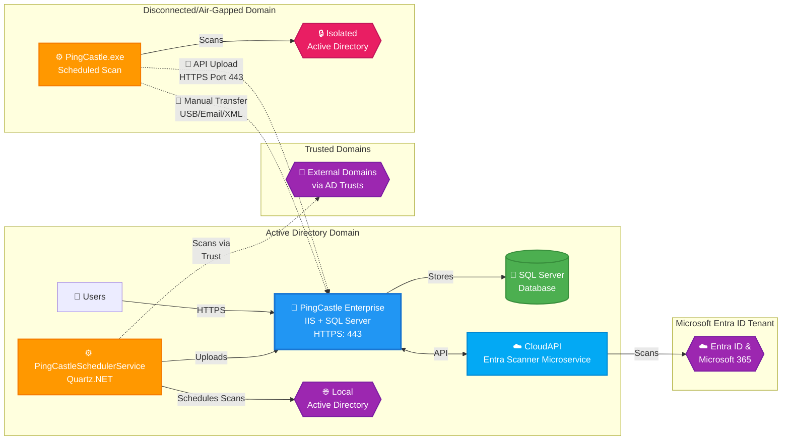

# PingCastle Enterprise Architecture

## Description

PingCastle Enterprise is a tool that helps you improve and follow your overall Active Directory security level. The software is compatible with most existing configurations and provides reliable data to present the situation to management, enabling continuous improvement over time.

## Architecture

PingCastle Enterprise uses a distributed architecture where the scanner (PingCastle.exe) performs Active Directory assessments and sends reports to the central Enterprise server for analysis, storage, and visualization.

### Architecture Overview

### Key Components

#### PingCastle Enterprise Server

- Runs on IIS with Windows Authentication
- Requires SQL Server database for data storage
- Accessible via HTTP/HTTPS (ports 80/443)
- Provides web interface for administrators and users
- `PingCastleSchedulerService` handles scheduled scans of local and trusted domains (see [Scheduling your first scan](enterprisepostinstall.md#scheduling-your-first-scan))

#### CloudAPI Service

- Standalone microservice that performs Entra ID scanning
- Runs as its own IIS application pool in a `CloudAPI` subfolder under the PingCastle Enterprise installation path
- Communicates with the Enterprise server via HTTPS API connections, authenticated using the `CloudServiceAPIKey`
- See [Entra Scanning](enterpriseentrascan.md) for architecture and setup details

#### PingCastle.exe Scanner

- Standalone executable with embedded .NET runtime
- Performs Active Directory security assessments
- Generates reports in XML and HTML formats
- Can run on any Windows system
- Requires standard Active Directory ports (389, 636, 88, 9389, 53)

#### Report Upload Methods

**API Upload (Connected Domains)**
- PingCastle.exe connects directly to Enterprise server via HTTPS (port 443)
- Automated upload after scan completion
- Requires API key configuration
- Real-time data synchronization

**Manual Transfer (Disconnected Domains)**
- Export XML reports from isolated environments
- Transfer via USB drive, email, or secure file transfer
- Import through Enterprise web interface
- Suitable for air-gapped or highly secure networks

#### Network Ports

##### PingCastle Enterprise Server

| Service | Port | Protocol | Notes |
|---------|------|----------|-------|
| HTTP | 80 | TCP | Optional, typically redirected to HTTPS |
| HTTPS | 443 | TCP | Recommended |

##### Active Directory Scanning

| Service | Ports | Protocol | Notes |
|---------|---------|----------|-------|
| LDAP | 389 | TCP/UDP | LDAP - Fallback when ADWS isn't present. Less performant |
| LDAPS | 636 | TCP | Checks for LDAPS   Also you can run the entire scan with LDAPS using `-port 636` in the command line|
| Kerberos | 88 | TCP/UDP | |
| DNS | 53 | TCP/UDP | |
| SMB | 445 | TCP | |
| ADWS | 9389 | TCP | Active Directory Web Services for performant scans |

##### Entra Scanning

| Service | Port | Protocol | Notes |
|---------|------|----------|-------|
| Microsoft Graph | 443 | TCP | HTTPS outbound from the CloudAPI service |
| Microsoft 365 (SharePoint, Teams, Exchange, Azure role-based access control (RBAC)) | 443 | TCP | HTTPS outbound from the CloudAPI service |

## Security

PingCastle Enterprise is a tool dedicated to improving Active Directory security, so security is a priority at every step of development.

The application uses a framework that prevents most common attacks, such as cross-site scripting (XSS) or SQL injection, by design.

Because attackers can sometimes bypass such protections, the application adds a layer of protection with all known HTTP security headers, including the Content Security Policy header in strict mode. The application stores all JavaScript code in separate files, so any JavaScript injected into the page doesn't run in the browser. You can verify this protection with a third-party service such as Security Headers. The application doesn't accept `unsafe-inline` or `unsafe-eval`.

The application uses enforced controls that check parameters twice against a model — first in the browser, then in the server application — and parameterizes all database queries. The application never builds SQL strings. A filter verifies each database access by checking the query before PingCastle Enterprise sends it to the database. Unit tests cover this code to lower the risk of a misconfigured filter.

The application mainly uses the following frameworks:

- asp.net core
- bootstrap
- jQuery
- vis.js
- chart.js

You can view the up-to-date list of components on the about page of the application.
