# Overview

Platform Governance for Salesforce – Zendesk Integration supports three types of approval processes. These processes control how Change Requests (CRs) are approved, either within Zendesk or Salesforce. The approval type is configured in the app settings in Zendesk and determines the user actions available.

# Approval Process Types

## a. Approval in Zendesk

- Operators can Request Approval when the CR is in Draft.
- Admins can Approve or Reject when the CR is Pending Approval.
- Admins can Complete the CR once it is Approved.

### Screenshots

**Request Approval:**

**Approve / Reject:**

**Complete:**

After completing the Change Request you will see the record in a complete status:

## b. Approval in Salesforce

- Operators initiate Request Approval from Zendesk.
- The approval continues in Salesforce according to approval rules configured there.
- Admins in Zendesk only see Complete once Salesforce has approved the CR.

### Screenshots

**Request Approval:**

**Users should continue the approval process in Salesforce:**

## c. No Approval Needed

- No formal approval is required.
- Admins can Push the CR directly from Zendesk.
- Complete is available after the Push or once marked Approved.

### Screenshots

**Push:**

**Complete:**

After completing the Change Request you will see the record in a complete status:

# Governance Elements

The following elements may require approval based on governance policies in Salesforce:

- **Change Requests (CRs)**: each Zendesk ticket generates a CR.
- **Customizations**: fields, objects, workflows, validations, and other metadata.
- **Data Records**: configuration data critical to business processes.
- **Policies**: define whether changes require approval.

# End-to-End Flow Diagrams

The approval flow varies depending on the configuration:

- **Approval in Zendesk**: Complete workflow handled within Zendesk

```mermaid
flowchart TD
    A[Draft]
    B[Pending Approval]
    C[Approved]
    D[Rejected]
    E[Completed]

    %% Actions
    A -.->|"🔵 Request Approval<br/>(Operator)"| B
    B -.->|"✅ Approve<br/>(Administrator)"| C
    B -.->|"❌ Reject<br/>(Administrator)"| D
    C -.->|"✔️ Complete<br/>(Administrator)"| E

    style A fill:#f9f,stroke:#333,stroke-width:2px
    style B fill:#bbf,stroke:#333,stroke-width:2px
    style C fill:#bfb,stroke:#333,stroke-width:2px
    style D fill:#fbb,stroke:#333,stroke-width:2px
    style E fill:#bbb,stroke:#333,stroke-width:2px
```

- **Approval in Salesforce**: Initial request in Zendesk, approval in Salesforce

```mermaid
flowchart TD
    A[Draft]
    B[Pending Approval]
    C[Approved]
    D[Rejected]
    E[Completed]

    %% Zendesk Actions
    A -.->|"🔵 Request Approval<br/>(Operator - Zendesk)"| B
    C -.->|"✔️ Complete<br/>(Administrator - Zendesk)"| E

    %% Salesforce Process
    B -.->|"⚙️ Approval Process<br/>(In Salesforce)"| C
    B -.->|"⚙️ Approval Process<br/>(In Salesforce)"| D

    style A fill:#f9f,stroke:#333,stroke-width:2px
    style B fill:#bbf,stroke:#333,stroke-width:2px
    style C fill:#bfb,stroke:#333,stroke-width:2px
    style D fill:#fbb,stroke:#333,stroke-width:2px
    style E fill:#bbb,stroke:#333,stroke-width:2px
```

- **No Approval Needed**: Direct push without approval requirements

```mermaid
flowchart TD
    A[Draft]
    B["Pushed (Approved)"]
    C[Completed]
    D[Operator]

    %% Actions
    A -.->|"🚀 Push<br/>(Administrator)"| B
    B -.->|"✔️ Complete<br/>(Administrator)"| C

    %% Operator limitation
    D -.->|"🚫 No actions available"| A

    style A fill:#f9f,stroke:#333,stroke-width:2px
    style B fill:#fd7,stroke:#333,stroke-width:2px
    style C fill:#bbb,stroke:#333,stroke-width:2px
    style D fill:#eee,stroke:#333,stroke-width:2px,stroke-dasharray: 5 5
```

