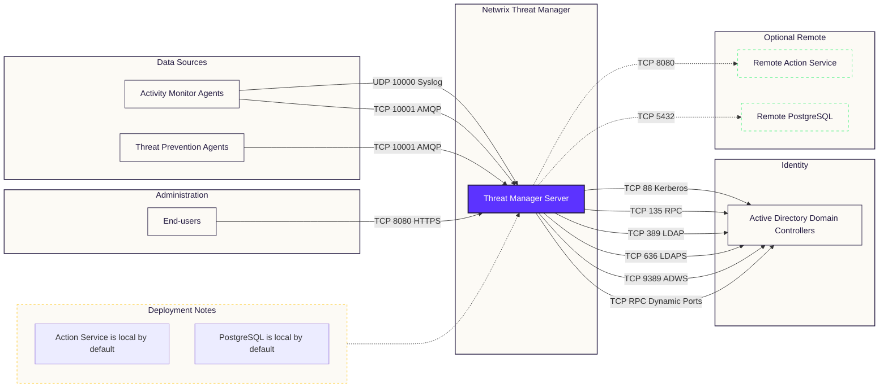

# Ports Requirements

Netwrix Threat Manager architecture and components interactions are shown in the figure below.

<!-- -->

Configure appropriate firewall rules to allow these connections.

## Data Stream Firewall Rules

The following firewall settings are required for communication between the Threat Manager server and
applications that provide the data stream:

| Communication Direction | Protocol | Ports | Description                                                                                                                                                                                                            |
| ----------------------- | -------- | ----- | ---------------------------------------------------------------------------------------------------------------------------------------------------------------------------------------------------------------------- |
| Inbound                 | UDP      | 10000 | Syslog messaging File System event data stream from Activity Monitor agent host(s)                                                                                                                                     |
| Inbound                 | TCP      | 10001 | AMPQ Active Directory event data stream from Activity Monitor agent host(s) Active Directory event data stream from Threat Prevention agent host(s) File System event data stream from Threat Prevention agent host(s) |
| Bidirectional           | TCP      | 8080  | Access Analyzer Console Host(s)                                                                                                                                                                                        |

## Application Services Firewall Rules

The following firewall settings are required for communication for the Threat Manager services:

| Communication Direction | Protocol | Ports                             | Description                                                                      |
| ----------------------- | -------- | --------------------------------- | -------------------------------------------------------------------------------- |
| Bidirectional           | TCP      | 55555                             | Active Directory login to the application console                                |
| Bidirectional           | TCP      | 55556                             | Active Directory login to the application console                                |
| Bidirectional           | TCP      | 55557                             | Local host communication from the Event Service to the Job Service agent host(s) |
| Bidirectional           | TCP      | Dynamically Configured on Startup | Local host communication from the Event Service to the Job Service agent host(s) |

## Database Firewall Rules

The following firewall settings are required for communication between the Threat Manager server and
the database server, when it is installed on a separate server:

:::note
These firewall rules are only needed if using a remote PostgreSQL database. That is not
recommended or the default.
:::

| Communication Direction | Protocol | Ports | Description                                                                           |
| ----------------------- | -------- | ----- | ------------------------------------------------------------------------------------- |
| Outbound                | TCP      | 5432  | Local Host and Remote communication from the PostgreSQL to the Threat Manager server. |

## Application Console Access Firewall Rules

The following firewall settings are required for accessing the Threat Manager console:

| Communication Direction | Protocol | Ports | Description                              |
| ----------------------- | -------- | ----- | ---------------------------------------- |
| Bidirectional           | TCP      | 8080  | Remote access to the application console |

:::note
Threat Manager requires the default dynamic port range specified by Microsoft (49152
through 65535) for Windows Server client/server operations. If a firewall or other appliance is
blocking these ports, this server will no longer properly respond to client requests and no longer
support standard IP Stack operations that are required for the operation of this product.
:::

## Active Directory Domain Controllers Firewall Rules

The following firewall settings are required for communication between the Threat Manager server and
Active Directory domain controllers:

| Communication Direction | Protocol | Ports   | Description                                                                                                                   |
| ----------------------- | -------- | ------- | ----------------------------------------------------------------------------------------------------------------------------- |
| Outbound                | TCP      | 88      | Kerberos-sec                                                                                                                  |
| Outbound                | TCP      | 135     | The endpoint mapper tells the client which randomly assigned port a service (FRS, AD replication, MAPI, etc.) is listening on |
| Outbound                | TCP      | 389     | LDAP                                                                                                                          |
| Outbound                | TCP      | 636     | SSL LDAP                                                                                                                      |
| Outbound                | TCP      | 9389    | Active Directory Web Services                                                                                                 |
| Outbound                | TCP      | Various | The port that 135 reports. Used to bulk translate AD object names between formats.(Ephemeral Ports)                           |

## Remote Action Service Firewall Rules

The following firewall settings are required for communication between the Threat Manager server and
the remote Action Service server, when it is installed on additional server(s):

| Communication Direction | Protocol | Ports | Description                                |
| ----------------------- | -------- | ----- | ------------------------------------------ |
| Outbound                | TCP      | 8080  | Remote access to the Action Service server |
