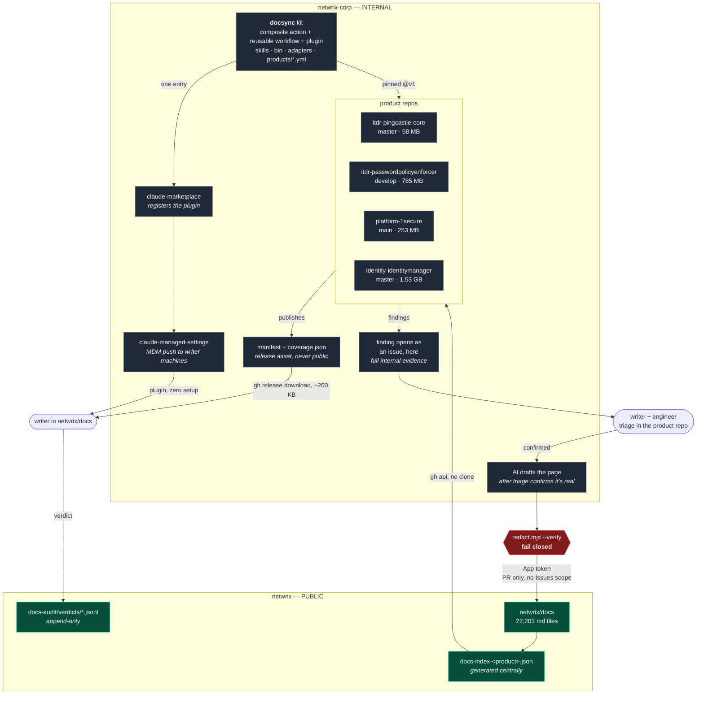
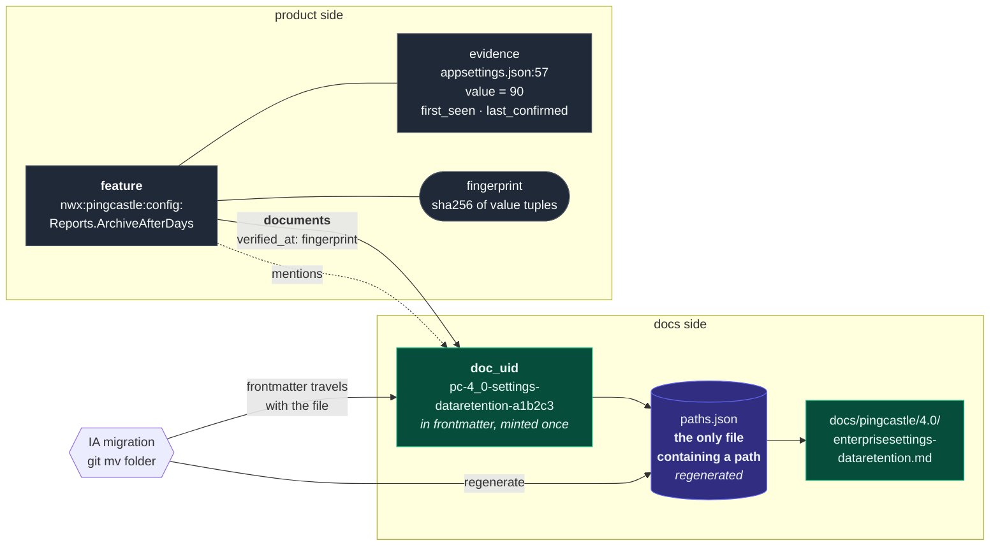
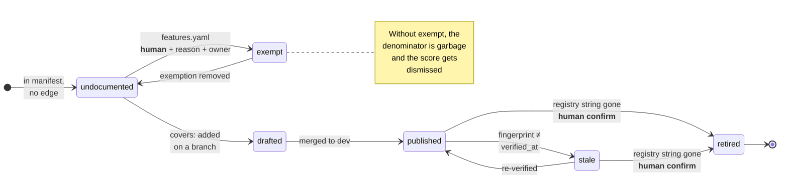

# Self-Drafting, Self-Aligning Documentation System

> **Status:** design proposal — nothing here is built yet. The pilot in *Stage 1* has explicit
> numeric kill criteria, because two earlier attempts at this problem produced zero merged
> documentation changes.
>
> **Note for reviewers:** this document references internal repository names, branches, secret
> names, and the Azure DevOps organization. `netwrix/docs` is a public repository. This was
> committed unredacted deliberately; confirm that is still the intent before this branch is
> pushed or a PR is opened.

## Context

Netwrix documents 27 products in `netwrix/docs` (~22,203 markdown files, Docusaurus, **public** repo). Docs drift from product reality because nothing connects a doc page to the code or spec that makes it true — most pages carry only `title`, `description`, and `sidebar_position`. There is no `feature`, `version_introduced`, `source_of_truth`, or ticket field anywhere. Drift is currently found by humans reading pages one at a time.

The goal is three capabilities per product: **product understanding** (what the product does, requires, and asks of users, from code plus specs), **documentation alignment** (map features onto doc pages; find gaps in both directions), and **documentation drafting** (write docs using understanding for substance and alignment for placement).

The organizing principle of this design: **deterministic code extracts facts and computes joins; the model only writes prose and classifies ambiguous gaps.** Every place a model is asked to *find* something rather than *describe* something is a place false positives enter, and writer trust is the scarce resource.

### Decisions locked in

| Decision | Choice |
|---|---|
| Topology | Distributed — capabilities run in product repos; the finding issue opens **there** too. Only the drafted PR crosses into `netwrix/docs` |
| First output | Read-only gap report. No automated writes until accuracy is proven |
| State | Regenerable derived data in freely-overwritten generated files; durable human verdicts in frontmatter + an append-only ledger |
| Sequencing | This system first; IA taxonomy migration after (design makes renames non-breaking anyway) |
| Reviewers | Documentation writers *and* product engineers |
| Pilot | **PingCastle settings pages** — the narrowest surface with genuinely checkable claims |
| Prototype | `~/docsauditor-prototype` runs as a **control arm**, not ignored |
| Spec sources | ProductBoard → ADO → JIRA → Xchange by preference; v1 capability order is the near-inverse (see §6) |

## What already exists (verified, do not rebuild)

| Asset | Relevance |
|---|---|
`netwrix-corp/claude-marketplace` | The official internal Claude Code plugin marketplace, with `.claude-plugin/marketplace.json` (`name: netwrix-marketplace`, `pluginRoot: ./plugins`) and a documented contribution path. **This is the distribution mechanism.** |
`netwrix-corp/claude-reviewer` | Composite GitHub Action, tagged `v1`/`v1.0.1`, with `auto-tag.yml` that moves the `v1` float tag. Consumed by product repos in ~6 lines. **The org's proven answer to "ship a Claude capability to N repos without drift."** Copy its skeleton. |
`netwrix-corp/claude-reviewer/scripts/find-linked-items.sh` | Working ADO adapter: `AB#\d+` extraction → `POST dev.azure.com/NetwrixCorporation/_apis/wit/workitemsbatch?api-version=7.1`, Basic auth from `AZURE_DEVOPS_PAT`, pulls `AcceptanceCriteria`. **No `az` CLI needed** — that constraint evaporates. |
`identity-identitymanager/.github/workflows/claude-pr-review.yml` | Working JIRA adapter: `NIM-\d+` → `POST ${JIRA_URL}/rest/api/3/search`, `renderedFields`. Secrets already provisioned. |
`netwrix-corp/claude-managed-settings` | Org-wide managed settings incl. `availableModels` and **OTEL telemetry to `otel.claudecode.nwx.ai`**. Cost observability already exists; add CI to it rather than building a second path. |
AI Readiness Sprint | All four candidate repos carry engineer-curated `ARCHITECTURE.md`, `GLOSSARY.md`, `CONTRIBUTING.md`, `README.md`, `.claude/`. PingCastle has 25 skills tracked in git. **Understanding should lean on these curated artifacts, not raw C#.** |
In `netwrix/docs` | `.claude/skills/audit-fix/` + `scripts/find-siblings.mjs` (sibling-version classification), `scripts/generate-audit-list.mjs` (page walker + Docusaurus slug reproduction + content-hash duplicate detection), `doc-help`, `tech-writer`, `dale`, `derek`, Vale, and the `vale-rule-writer`/`vale-auditor` agents that keep the Dale/Vale rule set — including AI-isms — current and conflict-free. `claude-issue-labeler.yml` has a **label-gated issue→PR path** (`content:fix` → `/content-fix` → `jq --slurp` → `gh pr create`) — cataloged here as a precedent, but **not reused by Stage 3 drafting**, since it only fires on issues already in `netwrix/docs` and the finding issue now lives in the product repo instead (see Triggers). |

## Blockers to fix before anything else

1. **`doc-code-audit` is not in version control.** `.gitignore:13` is `.claude`, and while 33 `.claude` files are tracked on `origin/dev`, `.claude/skills/doc-code-audit/` and `.claude/agents/doc-code-checker.md` are **not**. `docs-audit/source-repos.json` isn't tracked either. The most sophisticated existing piece of this system exists only on one laptop — and no CI job can ever run it. Fix with a `!.claude/skills/**` / `!.claude/agents/**` negation.
2. **A 253 MB internal clone sits inside the public working tree.** `.gitignore` covers `.cache-loader` but not `.cache/`. One `git add -A` publishes internal C# to a public repo, and `sync-dev-to-main.yml` auto-merges `dev`→`main` daily at 8am PST — there is no take-back window. It also contains 16 nested `CLAUDE.md` files that pollute Claude's context in the docs repo.

## Diagrams

### 1. Repo topology and the public/internal trust boundary

The single most important structural fact: the kit, every manifest, and the finding itself all stay internal. Only a redacted, drafted page crosses into the public repo, and it passes a fail-closed redaction gate to get there.



### 2. The three capabilities, split by deterministic vs. model

Every model box is a place false positives can enter. The design pushes as much as possible into the zero-token column.

```mermaid
flowchart LR
  subgraph SRC["sources"]
    direction TB
    CODE["product source<br/>appsettings · .resx · routes<br/>installer templates"]
    CURATED["AI-readiness artifacts<br/>ARCHITECTURE.md · GLOSSARY.md"]
    SPEC["specs<br/>ADO folders · ADO REST · JIRA"]
  end

  subgraph C1["① Understanding"]
    direction TB
    EXTRACT["<b>collect-surface.mjs</b><br/>enumerate keys, defaults,<br/>routes, spec index"]
    ADAPT["<b>adapters/*.sh</b><br/>probe · extract · fetch"]
    SYNTH["docsync-understand<br/><i>narrative fields only</i>"]
  end

  MAN[("manifest.json<br/>+ evidence/*.jsonl<br/><i>fingerprinted</i>")]

  subgraph C2["② Alignment"]
    direction TB
    DOCIDX["<b>generate-docs-index.mjs</b><br/>paths · frontmatter · slugs"]
    JOIN["<b>build-coverage.mjs</b><br/>manifest × docs index"]
    CLASS["docsync-align<br/><i>is this gap real?</i>"]
  end

  COV[("coverage.json<br/>edges · states · staleness")]

  subgraph C3["③ Drafting"]
    direction TB
    PLACE["docsync-place<br/><i>which file, which version,<br/>which required sections</i>"]
    PROSE["doc-help / tech-writer<br/>writes or revises prose"]
    READ{"readability-check.mjs<br/><i>score above threshold?</i>"}
    SLOP{"dale --self-check<br/><i>AI-isms found?</i>"}
    SHELL["<b>shell</b>: branch, commit, PR"]
  end

  OUT["gap report<br/><i>Stage 1 output</i>"]
  PRD["draft PR to dev"]

  CODE --> EXTRACT
  CURATED --> SYNTH
  SPEC --> ADAPT
  EXTRACT --> MAN
  ADAPT --> MAN
  SYNTH --> MAN
  MAN --> JOIN
  DOCIDX --> JOIN
  JOIN --> CLASS
  CLASS --> COV
  COV --> OUT
  COV --> PLACE
  MAN --> PLACE
  PLACE --> PROSE
  PROSE --> READ
  READ -- "below threshold" --> PROSE
  READ -- "passes" --> SLOP
  SLOP -- "found, revise" --> PROSE
  SLOP -- "clean" --> SHELL
  SHELL --> PRD

  classDef det fill:#0c4a6e,stroke:#0ea5e9,color:#f0f9ff
  classDef mod fill:#78350f,stroke:#f59e0b,color:#fffbeb
  classDef store fill:#312e81,stroke:#6366f1,color:#eef2ff
  class EXTRACT,ADAPT,DOCIDX,JOIN,SHELL,READ,SLOP det
  class SYNTH,CLASS,PLACE,PROSE mod
  class MAN,COV store
```



Blue = deterministic, zero tokens. Amber = model. Note the model never *finds* a gap unaided — it only classifies candidates the join already produced, and writes prose.

Drafting's self-check loop follows the same rule: readability and AI-slop are **measured, not judged**. `readability-check.mjs` computes a deterministic score (e.g., Flesch-Kincaid) against a per-doc-area threshold; `dale --self-check` runs the same AI-isms/style ruleset that already gates incoming PRs (see "What already exists"), kept current by the existing `vale-rule-writer`/`vale-auditor` agents rather than some separate list the model consults ad hoc. Either gate failing sends the draft back to `doc-help`/`tech-writer` for revision — the model revises, but never grades its own work. This doesn't replace the human review or the post-PR Vale/Dale CI gate (`vale-autofix.yml`, `claude-documentation-reviewer.yml`); it means a human's first look has already cleared both bars, so a bad draft costs revision cycles rather than reviewer patience.

### 3. The graph: why folder renames can't break it



Every edge is keyed `(feature_id, doc_version, doc_uid)`. Because **no edge contains a file path**, a wholesale folder rename touches exactly one regenerated file and breaks zero edges.

### 4. Coverage state machine

Every transition is mechanical except the two marked.



Page states are tracked separately — `mapped` / `unmapped` / `dangling` / `deprecated`. A page with no `covers:` at all is **unmapped**, never reported as drift.

### 5. Merge trigger: three gates before any token is spent

```mermaid
flowchart TB
  PUSH(["push to product default branch"]) --> LOOP{"bot commit?<br/>docs&#40;sync&#41;: · [skip docsync]<br/>· bot author"}
  LOOP -- yes --> STOP1(["exit — loop broken"])
  LOOP -- no --> G1{"<b>gate 1</b><br/>any path survives<br/>test/IaC/lockfile filter?"}
  G1 -- no --> STOP2(["exit — 0 tokens"])
  G1 -- yes --> G2{"<b>gate 2</b><br/>surface-map hit in<br/>products/&lt;id&gt;.yml?"}
  G2 -- no --> STOP3(["exit — 0 tokens<br/><i>log reason to step summary</i>"])
  G2 -- yes --> G3{"<b>gate 3</b><br/>doc-relevant token in<br/>git diff -U0?"}
  G3 -- no --> STOP3
  G3 -- yes --> DEDUPE{"issue already exists<br/>for docsync:&lt;product&gt;:&lt;sha12&gt;?"}
  DEDUPE -- yes --> STOP4(["exit — idempotent"])
  DEDUPE -- no --> FETCH["fetch docs index + specs<br/><i>deterministic</i>"]
  FETCH --> ALIGN["docsync-align<br/>Sonnet · max-turns 20"]
  ALIGN --> ISSUE["gh issue create,<br/><b>in this repo</b><br/>label: docsync"]
  ISSUE --> HUMAN(["writer + engineer<br/>triage"])
  HUMAN -- "not real" --> CLOSE(["issue closed<br/>recorded, never resurfaces"])
  HUMAN -- "confirmed" --> DRAFT["docsync-draft:<br/>docsync-place + doc-help/tech-writer"]
  DRAFT --> RED{{"redact.mjs --verify"}}
  RED -- fail --> FAILJOB(["<b>fail the job</b><br/>never strip silently"])
  RED -- pass --> PROPEN["gh pr create,<br/><b>in netwrix/docs</b>"]

  classDef stop fill:#374151,stroke:#6b7280,color:#f9fafb
  classDef det fill:#0c4a6e,stroke:#0ea5e9,color:#f0f9ff
  classDef mod fill:#78350f,stroke:#f59e0b,color:#fffbeb
  classDef gate fill:#7f1d1d,stroke:#ef4444,color:#fef2f2
  class STOP1,STOP2,STOP3,STOP4,CLOSE stop
  class FETCH,ISSUE,PROPEN det
  class ALIGN,DRAFT mod
  class RED,FAILJOB gate
```



Gates 2 **and** 3 must both fire. A 400-file refactor that renames only private members yields zero hits and costs nothing. The finding, and its triage, stay in this repo — the redaction gate now guards the one remaining crossing, the drafted page, right before `gh pr create` targets `netwrix/docs`.

### 6. Rollout, with the gate between each stage

```mermaid
flowchart LR
  S0["<b>Stage 0</b><br/>Unblock · no AI · ~1 day<br/>gitignore · cache · docs-index<br/>create docsync kit"]
  G0{"/doc-code-audit<br/>runs end to end<br/>for the first time"}
  S1["<b>Stage 1</b><br/>PingCastle settings<br/>9 pages · 308 lines<br/>Arm A vs Arm B"]
  G1{"precision ≥0.70<br/>≥5 real · <b>≥3 merged</b><br/>≤4 min/finding<br/>Arm A beats Arm B"}
  S2["<b>Stage 2</b><br/>PPE<br/>HelpHelper.cs free edges<br/>+ multi-version siblings"]
  G2{"gap reported once<br/>with version list,<br/>not 5 times"}
  S3["<b>Stage 3</b><br/>1Secure<br/>ADO spec folders<br/>+ merge trigger + drafting"]
  G3{"drafted PR passes<br/>doc-pr + vale + dale<br/>zero internal refs"}
  S4["<b>Stage 4</b><br/>Identity Manager<br/>scale · JIRA<br/><i>talk to docs owner first</i>"]
  S5["remaining 23 products<br/>= products/&lt;id&gt;.yml<br/>+ 14 lines"]

  S0 --> G0 --> S1 --> G1 --> S2 --> G2 --> S3 --> G3 --> S4 --> S5
  G1 -- fail --> KILL(["<b>kill</b><br/>invest in the<br/>UI-grounded prototype"])

  classDef stage fill:#0c4a6e,stroke:#0ea5e9,color:#f0f9ff
  classDef gate fill:#78350f,stroke:#f59e0b,color:#fffbeb
  classDef kill fill:#7f1d1d,stroke:#ef4444,color:#fef2f2
  class S0,S1,S2,S3,S4,S5 stage
  class G0,G1,G2,G3 gate
  class KILL kill
```



## Architecture

### Mechanism per capability

The line between script and model is the most important choice in this design.

| Capability | Deterministic part (zero tokens) | Model part |
|---|---|---|
**1. Understanding** | `bin/collect-surface.mjs` — enumerate projects, config keys from `appsettings*.json`, `.resx` strings, public API surface, installer templates, spec-folder index, git metadata. `adapters/*.sh` — fetch linked ADO/JIRA items | `docsync-understand` skill (Sonnet, `--max-turns 25`) synthesizes the manifest's *narrative* fields only. `docsync-source-reader` subagent (generalized from `doc-code-checker.md`) answers bounded questions |
**2. Alignment** | `scripts/generate-docs-index.mjs` (**central, in `netwrix/docs`**) — every md path, frontmatter, heading slugs, version dirs. `bin/build-coverage.mjs` — join manifest keys × docs index → matches, orphan features, orphan pages | `docsync-align` skill (Sonnet, `--max-turns 20`, ≤25 candidates/batch) classifies whether an unmatched item is genuinely doc-worthy |
**3. Drafting** | `bin/impact-filter.mjs` pre-filter; `bin/readability-check.mjs` (deterministic score against a per-doc-area threshold) and `dale --self-check` (same AI-isms/style ruleset as the post-PR gate) loop a draft back for revision until both pass; all git/gh operations in shell steps | `docsync-place` (placement + structural conventions — required sections, heading order) then **existing** `doc-help` / `tech-writer` for prose, revised until it clears both gates. `docsync-gate` (Opus, `--max-turns 10`) only on the release trigger |

**Rejected:** an MCP server in v1 (build the index before the retrieval layer; then adopt `netwrix/Netwrix-MCP` or `mcp-server-Qdrant` rather than writing a third). A cron-driven agent as primary driver (event triggers give you a SHA, which is a free idempotency key). Hooks (can't cross repos, don't run in CI).

**One honest exception to the distributed topology:** `generate-docs-index.mjs` must run centrally in `netwrix/docs` — it needs `src/config/products.js` and 22k files. It is a ~150-line deterministic script, published as an artifact that product repos fetch via `gh api` (~100 KB, no clone). Distributed *execution*, single-sourced *definition*.

### Artifacts and who owns them

The rule that makes state durable: **no file mixes human and machine state.** Each is wholly human-owned and never machine-rewritten, or wholly machine-owned and freely regenerated. (`docs-audit/*/review-list.csv` gets this right on purpose — `generate-audit-list.mjs:15-18` documents that reviewer status lives outside the repo *because* the CSV is regenerated. Follow that, don't repeat the near-miss.)

| Path | Repo | Owner | Regenerable |
|---|---|---|---|
`docs-knowledge/manifest.json` | product | bot | yes |
`docs-knowledge/evidence/<class>.jsonl` | product | bot | yes — one fact per line, with `path`/`line`/`first_seen_commit` |
`docs-knowledge/features.yaml` | product | **human** | no — curated capabilities + **exemptions** |
`docs-knowledge/ids.json` | product | human, **append-only** | no — ID ledger, aliases, supersessions |
`products/<id>.yml` | `docsync` kit | human | no — repo, branch, sparse paths, surface map, release patterns |
`docsync/<product>/coverage.json` | product artifact | bot | yes — edges, states, staleness |
`docs-audit/verdicts/<product>.jsonl` | `netwrix/docs` | **human, append-only** | **never** |
frontmatter `doc_uid` / `covers` / `mentions` | `netwrix/docs` | **human** | no |

**Frontmatter — exactly three new keys, all optional and additive:**

```yaml
doc_uid: pc-4_0-settings-dataretention-a1b2c3   # minted once, never recomputed
covers: [nwx:pingcastle:config:Reports.ArchiveAfterDays]   # "learn this here"
mentions: [nwx:pingcastle:config:Reports.UserListCap]      # "referenced, documented elsewhere"
```

Deliberately **excluded** from frontmatter: `source_commit`, `last_verified`, `coverage_state` (they churn on every product commit — a bot touching thousands of `.md` files would conflict with every open writer branch), and `owner`/`last_reviewed` (derive from `CODEOWNERS` + `git log -1`, which cannot rot). Unknown-key safety is already demonstrated: 192 files carry `products:` and 185 carry `knowledge_article_id:`, neither a Docusaurus key, and the site builds with `onBrokenLinks: 'throw'`.

**Why `doc_uid` is load-bearing:** every edge is keyed `(feature_id, doc_version, doc_uid)` and **no edge contains a file path**. Paths live only in one regenerated lookup file. `git mv` carries frontmatter, so the IA migration's wholesale folder renames break **zero** edges — which is what lets both initiatives proceed without contention.

### Feature identity

`nwx:<productId>:<kind>:<slug>`, minted from a **code-owned registry string**, never from a file path, never LLM-generated, never content-hashed. `kind ∈ {config, flag, rule, api_route, ui_route, connector, capability}`, where `capability` is the human escape hatch for things customers name that code doesn't.

Bind IDs to string literals, not symbol names — in 1Secure these genuinely diverge (`Features.ValidateWindowsDeviceSources => "ValidateComputerSources"`), so this one choice buys refactor immunity. `ids.json` is CI-enforced append-only: a PR deleting or editing an existing ID fails; only `aliases[]` and `superseded_by` may be added. Rename candidates are emitted to stdout for human confirmation, never auto-merged.

### Drift detection

**Diff the manifest, never the code.** Because the manifest contains only customer-observable evidence classes, churn that doesn't move the manifest is by construction not doc-relevant. This converts an unbounded false-positive problem into a bounded schema-design problem.

- **T1 — auto-stale, no model.** Config key added/removed or **default value changed**; flag availability changed; API/UI route added/removed or auth policy changed; localized validation string changed; `TargetFramework` changed.
- **T2 — review queue, model triage allowed, never auto-stale.** New spec folder; new migration with no manifest match; a proposed new `capability`.
- **T0 — ignored.** `*Tests*`, `*.Sample`, `appsettings.Development.json`, `*.Designer.cs`, comment-only diffs.

Each feature carries `fingerprint = sha256(sorted (kind, key, value) tuples, provenance excluded)`; each edge records the fingerprint it was verified against. **Stale is a hash comparison**, and `stale_reason[]` falls out for free. The model is invoked only *after* staleness is mechanically established, and only to say what prose should change.

Four false-positive controls, all learned from `doc-code-checker.md`'s hard-won epistemics ("silence is `unverifiable`, never a contradiction"):
1. Provenance-only changes (same value, moved file/line) never produce staleness.
2. Staleness requires an existing `documents` edge — never guess which page a change affects.
3. `parse_failed` is a first-class emission, never a silent omission (silent omission is indistinguishable from deletion).
4. **Under-emit abort:** `products/<id>.yml` declares a minimum expected count per evidence class; a run that drops >5% of any class **aborts and the previous manifest stands**. This is the credibility-ending failure mode, blocked at the pipeline level.

**Reverse direction** (docs describing what no longer exists), cheapest first: a `covers:` ID absent from the current manifest and not aliased (free, zero false positives); a registry literal that was **present in snapshot A and absent in snapshot B**, matched only inside backticked code spans and table cells (absolute absence is unverifiable; a transition between two deterministic snapshots is provable). A page with no `covers:` at all is reported as **unmapped**, never as drift — that distinction is what keeps the report credible.

## Distribution: one repo, two delivery paths

Create **`netwrix-corp/docsync`** (internal), modeled file-for-file on `claude-reviewer`. It is simultaneously a composite action, a reusable-workflow provider, and a Claude Code plugin — a plugin is a directory with `.claude-plugin/plugin.json` + `skills/`, and a composite action is a repo with `action.yml`, so **one repo can be both.** The action's first step copies `${{ github.action_path }}/skills/**` into `$GITHUB_WORKSPACE/.claude/skills/`, so CI gets the skills with zero commits in product repos; writers get the same directory via the marketplace. One source of truth, no sync job.

```
netwrix-corp/docsync/                    # INTERNAL — must never be public
├── action.yml                           # composite: impact | draft | gate
├── .claude-plugin/plugin.json
├── skills/docsync-{understand,align,place,gate,draft}/SKILL.md
├── agents/docsync-source-reader.md      # generalized from doc-code-checker.md
├── bin/                                 # deterministic, zero tokens
│   ├── collect-surface.mjs  build-coverage.mjs  impact-filter.mjs
│   ├── fetch-docs-index.mjs  sync-source-repo.mjs  redact.mjs
├── adapters/{ado-git,ado-rest,jira,productboard,xchange}.sh
├── products/{pingcastle,passwordpolicyenforcer,1secure,identitymanager}.yml
├── .github/workflows/{auto-tag,validate-plugin,test,doc-impact,doc-draft,doc-gate}.yml
└── test/*.bats
```

Register it by adding one entry to the **existing** `netwrix-corp/claude-marketplace/.claude-plugin/marketplace.json` pointing at the repo (don't vendor a copy). Then add `docsync` to `netwrix-corp/claude-managed-settings` `extraKnownMarketplaces` + `enabledPlugins` — **one JSON edit that gives every docs-team machine the skills via MDM with no install step.** Highest-leverage line in the design.

**Update path:** PR → tests + `claude plugin validate` → merge → `auto-tag.yml` bumps and moves the `v1` float tag → all product repos pinned `@v1` get it on their next run. **Zero PRs across product repos.**

**Per-product footprint, 14 lines, once:**

```yaml
# netwrix-corp/<product>/.github/workflows/docsync.yml
name: Doc Sync
on: { push: { branches: [master] }, workflow_dispatch: }
jobs:
  doc-impact:
    uses: netwrix-corp/docsync/.github/workflows/doc-impact.yml@v1
    with: { product_id: pingcastle }
    secrets: inherit
```

`secrets: inherit` makes the same 14 lines correct for all 27 products — secret wiring becomes an org-secrets problem, not a per-repo one.

**Why not the alternatives:** npm kit needs an ADO feed credential in every repo and still can't carry a workflow; subtree/submodule is copy-paste with extra steps and breaks sparse checkout; copying `.claude/skills/` guarantees drift *and* collides with the 38 `nim-*` skills in Identity Manager. A plugin alone is insufficient because `claude-code-action`'s `plugin_marketplaces:` takes git URLs, needing credentialed git in CI for no gain over `github.action_path`.

### The kit is internal; here is the boundary

`netwrix/docs` is public. The kit necessarily contains internal repo names, sparse paths that reveal module structure, ADO org/project names, `AB#`/`NIM-` conventions, and surface→doc-area maps. All of it stays in `netwrix-corp`.

**May be added to `netwrix/docs`:** `scripts/generate-docs-index.mjs`, `.github/workflows/publish-docs-index.yml`, a `docsync` label, `docs-audit/verdicts/`. **Must never:** manifests, coverage maps, docsync prompts, or `docs-audit/source-repos.json` with internal repo names — that file moves into `products/*.yml`, inverting the current `doc-code-audit` design. That inversion is correct.

## Auth

**A GitHub App, `netwrix-docsync`** — not a PAT. `KB_OPS_PAT` is the working precedent but the wrong instrument at 27 repos: it's human-scoped, carries that person's full two-org access into every product repo's CI, expires and breaks 27 pipelines at once, and attributes bot PRs to a human.

```
App: netwrix-docsync
  netwrix/docs             → Contents: write, Pull requests: write
  netwrix-corp/<products>  → Contents: read, Issues: write
  Org secrets: DOCSYNC_APP_ID, DOCSYNC_APP_PRIVATE_KEY
```

Note the scope shift from the original draft: since the finding issue now opens in the product repo rather than `netwrix/docs`, the App's write access to the **public** repo shrinks to Contents + Pull requests only — no `Issues: write` there at all. The App instead gains `Issues: write` on the internal product repos. Net effect: less write capability on the public side, not more.

Mint per job with `actions/create-github-app-token@v2` and `repositories: docs` — never a token valid for both orgs in one job. Interim substitute if App provisioning is slow: a dedicated `DOCSYNC_PAT` org secret (do **not** reuse `KB_OPS_PAT` — don't share a blast radius with the project-board automation).

**Open access question this creates:** writers currently work only in `netwrix/docs`. Triaging a finding that now lives in the product repo means a writer needs read/comment access there (or some other bridge) — that's a new requirement, not something this design already provisions. Resolve before Stage 3.

**Load-bearing detail:** a real token is functionally required, not just convenient. `vale-autofix.yml:301-303` documents that `claude-code-action` overrides git credentials with `GITHUB_TOKEN`, "which doesn't trigger workflows." Incoming docs PRs **must** fire `claude-doc-pr.yml` and `vale-autofix.yml` — that's the entire quality gate. Inherit the mitigation: re-set `origin` with the App token after any Claude step that precedes a push.

**Reverse path** — reading product source. Keep `sync-source-repo.mjs` (its `gh auth status` pre-flight and `{productId,org,repo,branch,path,commit}` contract are right), with four changes: cache root **out of the docs working tree** (`RUNNER_TEMP` / `~/.cache/netwrix-docsync`); blobless sparse clone (`git clone --filter=blob:none --sparse --depth 1` + `sparse-checkout set --no-cone`); `actions/cache` keyed on the remote head SHA resolved by `git ls-remote` *before* clone, with `restore-keys` prefix fallback; and `find "$dest" -name CLAUDE.md -delete` post-clone. Sparse paths per product in `products/<id>.yml` — mandatory for Identity Manager (1.53 GB → target ≤200 MB), unnecessary for PingCastle (58 MB).

## Triggers

**On-demand is the only trigger in v1.** It is the one place a human has already chosen to spend attention, so a false positive costs patience but not trust in an unsolicited channel. `doc-code-audit`'s own SKILL.md reached this conclusion and was right.

```
/docsync-gaps pingcastle
/docsync-check pingcastle docs/pingcastle/4.0/enterprisesettings-dataretention.md
/docsync-draft pingcastle "new SCIM setting"
```

Writers work in `netwrix/docs`. The manifest is fetched, not derived — product repos publish it as a release asset on a `docsync-latest` prerelease, so `gh release download` pulls ~200 KB in a second with no 1.5 GB clone. The manifest carries its source SHA, so the skill can say *"manifest is 3 days / 41 commits stale"* — the same freshness honesty `doc-code-audit` already practices.

**Merge trigger (Stage 3), output is an issue in the product repo — not a PR, and not an issue in `netwrix/docs`.** The pre-filter is the cost keystone: three gates, all before any model call — (1) path irrelevance drops tests/IaC/lockfiles/`.sln`; (2) surface-map hit against `products/<id>.yml` globs; (3) content screen on `git diff -U0` for doc-relevant token classes only (`public (class|interface|enum)`, `const string`, changed `.resx` `<value>`, new config keys, port/URL literals). Emit `impacted=false` unless gates 2 **and** 3 both fire, and **log why a changeset was filtered out** to `$GITHUB_STEP_SUMMARY` — false negatives are the failure you can't see otherwise. A 400-file private-rename refactor yields zero hits and zero tokens.

Issues, not PRs, for the same reasons as before: they're cheap to ignore and auto-PRs aren't, and product labels already exist for routing. But the issue lands **in the product repo, not `netwrix/docs`** — a locked-in change from the original draft. That's a real evidence-quality win (a private-repo issue can carry full internal detail — file:line citations, ticket links — with no redaction, versus a job summary that expires) but it **costs the original reuse win**: the docs repo's existing `content:fix` → `/content-fix` label path only fires on issues *in* `netwrix/docs`, so it no longer applies here. Stage 3 needs its own drafting step after all — `docsync-draft` (already anticipated in the kit's file layout as `skills/docsync-draft/`), invoked when a writer or engineer labels the *product-repo* issue confirmed. It runs `docsync-place` for placement and structural conventions, then the same `doc-help`/`tech-writer` prose tools — looping the draft through a deterministic readability check and an AI-slop self-check until both pass, see Diagram 2 — then opens the PR directly in `netwrix/docs` through the redaction gate — see Diagram 5.

**Release gate (Stage 4).** The four pilots use four conventions (`release/release_*`, `Releases/12.0`, `release/7.1` + `v/7.1.1`, and 1Secure has no release branches at all — SaaS, so it gates on `workflow_run` of `deploy-prod-core.yml`), so patterns live in `products/<id>.yml`. The enforceable gate is **the product-repo job exiting non-zero** while blocking gaps stand, surfaced as a required check where the release is cut. Ship the `docs-gate-override` label escape hatch in v1 — a gate with no override gets disabled wholesale the first time it's wrong at 5pm on release day.

**Guards on every trigger:** loop-breaker (`^docs\(sync\):` / `[skip docsync]` / bot author, mirroring `claude-doc-pr.yml:36`'s `^fix\((vale|dale)\):`); fork guard; `author_association` check on comment paths; `concurrency: docsync-<mode>-<product>` with `cancel-in-progress: false` for writes; `timeout-minutes` everywhere; and **Claude never holds a write token** — it writes `/tmp/*.json` and a shell step publishes.

## Stage 0 — Unblock. No AI. ~1 day.

This is the smallest increment that produces real value, and it needs no design review.

**In `netwrix/docs`:**
- Add `!.claude/skills/**` and `!.claude/agents/**` negations to `.gitignore`; commit `doc-code-audit` + `doc-code-checker` so they exist somewhere other than one laptop.
- Add `.cache/` to `.gitignore`; delete the untracked 253 MB clone.
- Add `Bash(git clone *)` to the **tracked** `.claude/settings.json` (not the gitignored `settings.local.json`, so it reaches other writers).
- Add `scripts/generate-docs-index.mjs` + `publish-docs-index.yml`, built from `generate-audit-list.mjs`'s walker and Docusaurus slug logic.

**Create `netwrix-corp/docsync`** from `claude-reviewer`'s skeleton; move `sync-source-repo.mjs` in with the out-of-tree cache root and sparse support; write `products/pingcastle.yml`.

**Definition of done:** the public repo cannot accidentally commit internal source; `docs-index-pingcastle.json` publishes on every `dev` push; `node bin/sync-source-repo.mjs pingcastle` clones 58 MB out-of-tree with no permission prompt. And — because `products/pingcastle.yml` replaces the missing config — **`/doc-code-audit` runs end to end for the first time**, turning five already-built assets (`doc-code-audit`, `doc-code-checker`, `audit-fix`, `find-siblings.mjs`, `docs-audit/template.md`) into a working capability with zero new automation.

## Stage 1 — The falsifiable pilot: PingCastle settings

**Target, measured rather than assumed:** the 9 `docs/pingcastle/4.0/enterprisesettings*.md` pages, **308 lines total**, against 6 `appsettings.json` files, the `AppConfigurationService.GetValue()` default fallback chain, `ConfigKeyPolicy.IsFileOnly`, and the WiX installer templates in `Setup/PingCastleEnterpriseSetup/`.

This surface was chosen after rejecting the obvious one. PingCastle has 191 rule classes with rich typed metadata (`[RuleModel]`, `[RuleComputation(TriggerOnThreshold, score, Threshold:)]`, `[RuleANSSI]`, `[RuleMitreAttackMitigation]`) and the docs mention only 3 rule IDs — but **that gap is by design**: rule descriptions ship inside the product's own HTML report via `RuleDescription.resx` and on `pingcastle.com`. A pilot aimed there would open with ~188 correct-by-design findings, which is exactly the trust-destroying first impression to avoid.

The settings pages, by contrast, assert genuinely checkable values — `enterprisesettings-dataretention.md` alone claims "a maximum of 100 users", "the cap raises to 10,000", and "Minimum 90 days". And the existence of an `add-installer-appsetting` skill (documenting how new keys survive `NeverOverwrite="yes"` upgrades via WiX patch custom actions) proves settings get added routinely — which is precisely how docs fall behind.

**Two arms, same 9 pages, same reviewer, blind to arm:**

- **Arm A (new, code-grounded):** parse the 6 `appsettings.json` files + config-service defaults + installer templates into a manifest. Join against the 9 pages. Emit two finding classes only — (i) a documented default/cap/minimum that disagrees with code; (ii) a config key present in code with no doc coverage.
- **Arm B (control, already validated):** `~/docsauditor-prototype` against the PingCastle Enterprise settings UI, unchanged.

Arm B matters because the org's only real accuracy evidence comes from it — a blind adversarial mutation benchmark scoring `TP=27 FP=0 FN=4 TN=45`, recall 0.871, precision 1.000, Wilson LB 0.818 — and it **deliberately refuses source-code input** (`run.ps1:111` hard-blocks a `source_tree` config; `README.md:61` states "No source-code access"). The premise of this whole project is the thing that pipeline cut. Running only Arm A means spending months to learn whether source grounding adds anything. The specific claim to test is narrow and plausible: the prototype's UNCERTAIN bucket was full of exactly what code answers well — validation rules, thresholds, and defaults not visible on screen.

**Human step:** one reviewer (the PingCastle doc owner), two sessions. Per finding, record one of **real / not-real / can't-tell** plus elapsed minutes. Nothing else.

**Continue only if all four hold:**

| Gate | Threshold |
|---|---|
Precision on Arm A | **≥ 0.70** (real / (real + not-real); `can't-tell` excluded) |
Findings accepted as real | **≥ 5** |
**Merged to `dev`** via `/audit-fix` | **≥ 3** |
Reviewer-minutes per accepted finding | **≤ 4** |

**Kill** if precision < 0.50, or if zero findings merge, or if **Arm B produces more accepted findings per reviewer-minute than Arm A** — in which case the source-code premise is refuted and the investment belongs in the prototype instead.

The third gate is the one both prior attempts failed. The prototype built an excellent review dashboard (`review.html`, `review-state.json`, inline margin comments) and merged **zero** doc changes; `doc-code-audit` was never run at all. The bottleneck was never detection quality — it was the absence of a path from verdict to merged PR. So: no bespoke dashboard. Verdicts land in a GitHub PR review (writers already do this daily, and `doc-pr` already posts structured comments), and the run digest goes to Xchange for visibility only.

**Verdict ledger:** `docs-audit/verdicts/pingcastle.jsonl`, append-only, never regenerated, one line per verdict: `{finding_hash, entity_id, doc_uid, verdict, reviewer, timestamp, source_sha}`. Keyed on `entity_id` from the source system (following the one working precedent in the repo — KB pages' `knowledge_article_id`), so a rejected finding **stays rejected across runs**. Re-reporting rejected findings is on its own sufficient to kill adoption, independent of precision.

## Later stages

Each gated on the prior stage's DoD.

**Stage 2 — Password Policy Enforcer: free edges + multi-version.** `Source/PPEConfUI/Helper/HelpHelper.cs` and a root `HelpLinks.md` contain **compiled `docs.netwrix.com` URLs** (7 files reference them) — the product's own UI declares which doc pages it expects to exist. Every URL that doesn't resolve to a file in `docs/` is a mechanically provable broken edge with zero judgment involved, and it seeds the coverage map for free. PPE is also the first product where multi-version fan-out matters (5 version dirs, 467 files), so `find-siblings.mjs` is reused **unmodified** — feed it the feature's evidence values as its quote array; `quote-not-found` is positive evidence a version genuinely differs and must **not** propagate. Note PPE has no `.github/workflows` at all and no secrets, so it needs the workflow and a read-only ADO PAT.

**Stage 3 — 1Secure: specs, and the merge trigger.** 127 pages, single `current` version (no sibling fan-out), `docs-audit/1secure` already populated, and **50 ADO work-item spec folders readable over plain git** (`docs/<id>-<slug>/{spec,plan,requirements,progress}.md`, with `Acceptance Criteria` and `Out of Scope` sections). `adapters/ado-git.sh` needs zero credentials. This is where drafting turns on — through the kit's own `docsync-draft` skill, triggered by a label on the finding issue in `platform-1secure` itself (the finding no longer lives in `netwrix/docs`, so the existing `content:fix` path doesn't apply here — see Triggers).

**Stage 4 — Identity Manager: scale, but talk to its owner first.** 2,082 files, 1.53 GB, three versions, JIRA + ADO. **It already has a competing documentation pipeline**: `docs/product/` is a complete second Docusaurus site with `release-docs.ps1` and `release-config.json` whose `destBasePath` is `C:\Projects\NWXdocs` — someone authors IM docs in the product repo and hand-copies them into a local clone of the docs repo. Pointing a PR-opening bot at IM docs puts it in direct conflict with a person and a process. Reconcile with that pipeline, don't route around it. (It also validates the distributed topology — it already exists there, manually.)

**Then:** the remaining 23 products are `products/<id>.yml` + 14 lines of workflow, no kit changes.

## Spec-source adapters

Bash, matching `claude-reviewer/scripts/` conventions. Contract: `mode=probe` (exit 0 if usable, **78 if creds missing**), `mode=extract` (keys found in a git range), `mode=fetch` (JSON array of `{id, title, body, acceptance_criteria, url, status}`). `collect-surface.mjs` probes each and silently skips `78`, so a missing credential **degrades the manifest rather than failing the run**.

| Adapter | v1 | How |
|---|---|---|
`ado-git.sh` | ✅ **zero credentials** | Parse 1Secure's `docs/<6-digit-id>-<slug>/` folders; spec bodies come free with the sparse clone. **Implement first** — highest substance, lowest cost, needs nothing from anyone |
`ado-rest.sh` | ✅ works | Lift `claude-reviewer/scripts/find-linked-items.sh` near-verbatim. `AZURE_DEVOPS_PAT` exists in 1Secure and IM; `ADOREADONLYPAT` in PingCastle |
`jira.sh` | ✅ works for IM | Lift from IM's own `claude-pr-review.yml`; secrets already provisioned there |
`productboard.sh` | ⚠️ CI-blocked | `claude-tag-marketplace/plugins/productboard` documents auth as **proxy-injected** inside the Claude Tag MCP deployment, which GitHub Actions is not behind. Works **now** on the writer path; needs a real `PRODUCTBOARD_API_TOKEN` for CI. Ships as a `probe`→78 stub |
`xchange.sh` | ⚠️ writer-only, permanently | MCP-over-OAuth per user; no service credential exists. Usable interactively; must never be a CI dependency |

Note this inverts the stated preference order — not a re-litigation, just that ADO and JIRA need **zero new credentials** while ProductBoard needs one that doesn't exist in CI yet. ProductBoard becomes first-class the day the token lands, with no design change.

## Safety

**Never automated without human review:** any merge to `dev` (it reaches production within 24 hours via `sync-dev-to-main.yml`, with no take-back); deleting or moving pages, or **any heading edit** (breaks anchors — the reason both `vale-autofix.yml` prompts hard-forbid heading changes); `sidebars/**`, `_category_.json`, `src/config/products.js`; new version directories; security-relevant content (permissions, ports, credential handling); `docs/kb/**` (excluded entirely — it has its own `kb-pr-open`/`derek` pipeline); and **any claim whose only support is `unverifiable` evidence** — `doc-code-checker`'s "never stretch a weak match into a contradiction" must survive into drafting, where the temptation to fill a gap with a plausible number is far stronger than in an audit.

**Preventing internal leakage into the public repo.** The natural output of code-grounded drafting is `Path/To/File.cs:42` — exactly what `doc-code-checker` is built to emit, fine internally and unacceptable in a public PR. There is now exactly **one** crossing to guard — the finding issue itself never leaves the product repo, so it needs no redaction at all. Four layers, all applied to the drafted page, right before it can become a PR:
1. Claude writes `/tmp/*.json` only; a shell step publishes. Nothing model-authored reaches `netwrix/docs` unfiltered — and this also means prompt injection from product source or a spec description cannot reach a write credential.
2. Public output is assembled from a **closed-field template** (product, version, doc area, doc paths, customer-language description, `docsync-run-id`) — an allowlist, not a denylist.
3. `redact.mjs --verify` **fails the job closed** on any hit for internal repo names, `Netwrix.Overlord.*`, source extensions (`.cs`/`.csproj`/`.resx`/`.ps1`), `dev.azure.com`, `AB#\d+`, `NIM-\d+`, `PLAT-\d+`, internal hostnames. Fail, don't strip — silent stripping trains people to trust an unverified filter.
4. Internal detail (citations, SHAs, work items) simply stays where it already lives — in the finding issue, in the product repo — rather than in a `$GITHUB_STEP_SUMMARY` that expires (GitHub's default retention is 90 days). Set `show_full_output: false` on every docsync step regardless — the action's docs warn it "outputs ALL Claude messages including tool execution results which may contain secrets," and three existing workflows in the public repo set it `true` today, which is worth a separate look.

**Cost.** Models per role: none for extraction/joins/redaction; Haiku for bulk per-file summarization (`--max-turns 8`, ≤30 files/batch); Sonnet for synthesis, gap classification, drafting; **Opus only for release-blocking judgment** (`--max-turns 10`). Pin the current-generation alias in `products/*.yml`, not inline (`claude-issue-labeler.yml:230` pins `claude-sonnet-4-6` inline — one edit in the kit should re-point all 27). `bin/budget.mjs` enforces `max_runs_per_day` from `products/<id>.yml`, failing closed — cheap insurance against a rebase storm on Identity Manager triggering 40 assessments. Export OTEL to `otel.claudecode.nwx.ai` with `service.name=docsync-ci` so CI spend lands in the dashboard the AI Enablement Group already watches.

**Idempotency.** Stable key `docsync:<product>:<sha12>` in every issue/PR body, checked via `gh issue list --search` **in the product repo, before spending tokens** (inherit the honest caveat from `auto-create-pr-tracking-issues.yml:41` — search indexing has 10-60s latency, so the per-product concurrency group reduces but doesn't eliminate races). Deterministic branch names `docsync/<product>/<sha12>`; a rerun force-updates and edits the existing PR. Release-readiness issues are **updated, never duplicated**, keyed on exact title. Manifests are content-addressed by source SHA — identical SHA short-circuits before any model call.

## Success metrics

| Metric | 30 / 60 / 90 d | Instrumentation |
|---|---|---|
**Merged doc changes attributable to the system** — the only one that matters; both prior attempts scored 0 | 3 / 10 / 25 | `gh pr list --label docsync --state merged` |
Finding precision | ≥0.70 / 0.75 / 0.80 | Count verdicts in `docs-audit/verdicts/*.jsonl` |
**Writer trust (leading):** unsolicited re-invocations by someone other than you | ≥1 / ≥3 / ≥5 distinct users | Distinct `reviewer` values in the ledger. Inverts *before* precision does |
**Busywork guard:** repeat-finding rate after a prior `not-real` | **0% at every checkpoint** | Join current `finding_hash` set against the ledger. Any non-zero value is a defect, not a tuning target |
**Busywork guard 2:** reviewer-minutes per merged change | ≤20 / ≤15 / ≤10 | Rising while precision holds ⇒ the system produces true-but-worthless findings, the subtler failure |
Build integrity: bot PRs failing `build-and-deploy.yml` | 0% / ≤5% / ≤5% | Non-zero here breaks other people's merges |
Cost per accepted finding | ≤$5 / ≤$3 / ≤$2 | OTEL. Baseline to beat: the prototype's $0.63/contradiction |

## Top risks

1. **Extractor silent under-emit → mass phantom drift.** If a config file moves or a parse fails, the manifest loses its features, every edge goes dangling, and the system reports catastrophic false drift. → minimum-count guards that **abort and keep the previous manifest**; `parse_failed` never swallowed; shrinking a manifest requires explicit human ack.
2. **Internal source in a public tree (live today).** → Stage 0, independent of everything else: cache out of tree, `.cache/` gitignored, existing clone deleted, pre-commit check rejecting staged `.cache/` paths.
3. **Pre-filter false positives.** A 60%-precise filter means writers mute the `docsync` label in week two, after which quality is irrelevant. → both gates must fire; issues not PRs; per-product run caps; **a measured stop condition — >30% FP over 20 real merges means tune, don't proceed**; and log filter-outs so false negatives are auditable too.
4. **Writers don't maintain `covers:`, so the graph under-counts silently.** → the existing `doc-pr` workflow gains a **soft, non-blocking** check proposing candidate IDs on new pages. Non-blocking is deliberate: a blocking check across 22k structurally inconsistent files gets bypassed within a week. Publish `orphan_pages` as a first-class metric so under-maintenance is visible.
5. **The coverage number gets dismissed as meaningless.** "41 of 412 documented" invites the correct objection that most of the denominator is internal plumbing. → denominator is `customer_visible ∧ ¬exempt`; exemptions require a `reason` and `owner` and are diffed in PRs; publish **three separate numbers** (covered / stale / orphan), never a composite, always per doc version. The number's job is to be arguable in a specific, fixable way.

## Verification

**Stage 0:**
- `git ls-tree -r dev --name-only | grep doc-code` returns the skill and agent files (currently returns nothing).
- `git check-ignore -v .cache/` confirms the ignore; `git status --short` is clean after deleting the clone.
- `node scripts/generate-docs-index.mjs --product pingcastle` emits an index whose page count matches `find docs/pingcastle -name '*.md' | wc -l` (46), and whose slugs match the `live_page_url` column in `docs-audit/pingcastle/review-list.csv`.
- `node bin/sync-source-repo.mjs pingcastle` clones out-of-tree, prints a commit SHA, and prompts for nothing.
- `/doc-code-audit pingcastle docs/pingcastle/4.0/enterprisesettings-dataretention.md` completes and produces a `docs-audit/template.md`-formatted report.

**Stage 1:**
- Determinism: run the extractor twice at the same SHA → byte-identical manifest. Run at two SHAs → the diff **is** the drift report.
- Abort guard: corrupt an `appsettings.json` → run aborts, previous manifest stands, `parse_failed` emitted.
- Frontmatter safety: after the `doc_uid` backfill, `DOCS_PRODUCT=pingcastle npm run build` succeeds (`onBrokenLinks` throws, so this is a real gate).
- Rename resilience: `git mv` a settings page, regenerate the path lookup, confirm **zero** edges break — this is the proof that the IA migration can follow safely.
- Redaction: feed `redact.mjs --verify` a finding containing `Netwrix.Overlord.Core/Foo.cs:42` and `AB#437903`; confirm **non-zero exit**.
- Ledger: reject a finding, re-run the same slice, confirm it is **not** re-reported.
- The four numeric gates above, scored by the PingCastle doc owner across two sessions, Arm A vs Arm B.

## Credential checklist (needs you or IT)

1. **Create GitHub App `netwrix-docsync`**; install per §Auth; add `DOCSYNC_APP_ID` + `DOCSYNC_APP_PRIVATE_KEY` as `netwrix-corp` org secrets. Interim: a dedicated `DOCSYNC_PAT` (not `KB_OPS_PAT`).
2. **Create `netwrix-corp/docsync`** (internal), docs team write access. Confirm `ANTHROPIC_API_KEY` is org-level rather than four repo copies.
3. **Confirm ADO PATs** — PingCastle has `ADOREADONLYPAT`; 1Secure and IM have `AZURE_DEVOPS_PAT`; **PPE has no workflows and no secrets**, so it needs both.
4. **Promote JIRA secrets** (`JIRA_URL`, `JIRA_USER`, `JIRA_API_TOKEN`) to org scope if any product beyond IM uses JIRA.
5. **Obtain a ProductBoard API token** (read scope on features/components/notes) → `PRODUCTBOARD_API_TOKEN`. The only genuinely new credential, and the one that unblocks your stated #1 spec source.
6. **Add `docsync` to `netwrix-corp/claude-managed-settings`** so writers get the plugin via MDM.
7. **Talk to the Identity Manager docs owner** before Stage 4 — `docs/product/release-docs.ps1` is someone's existing process.
8. **Set a spend alert** on the CI Anthropic key (or issue a separate key) so automation burn is separable from interactive use.
9. **Grant writers read/comment access to product-repo issues** (or design another bridge/notification). Introduced by keeping the finding issue in the product repo rather than `netwrix/docs` — today writers work only in the latter, and this design doesn't yet resolve that gap.
