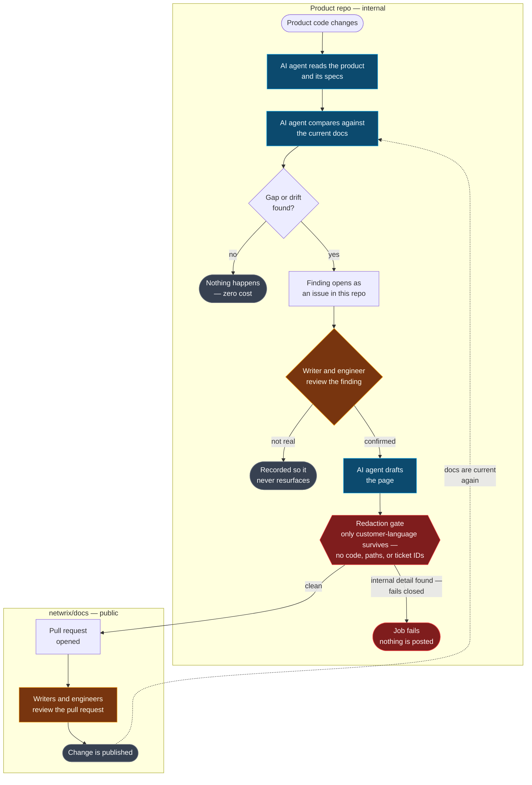
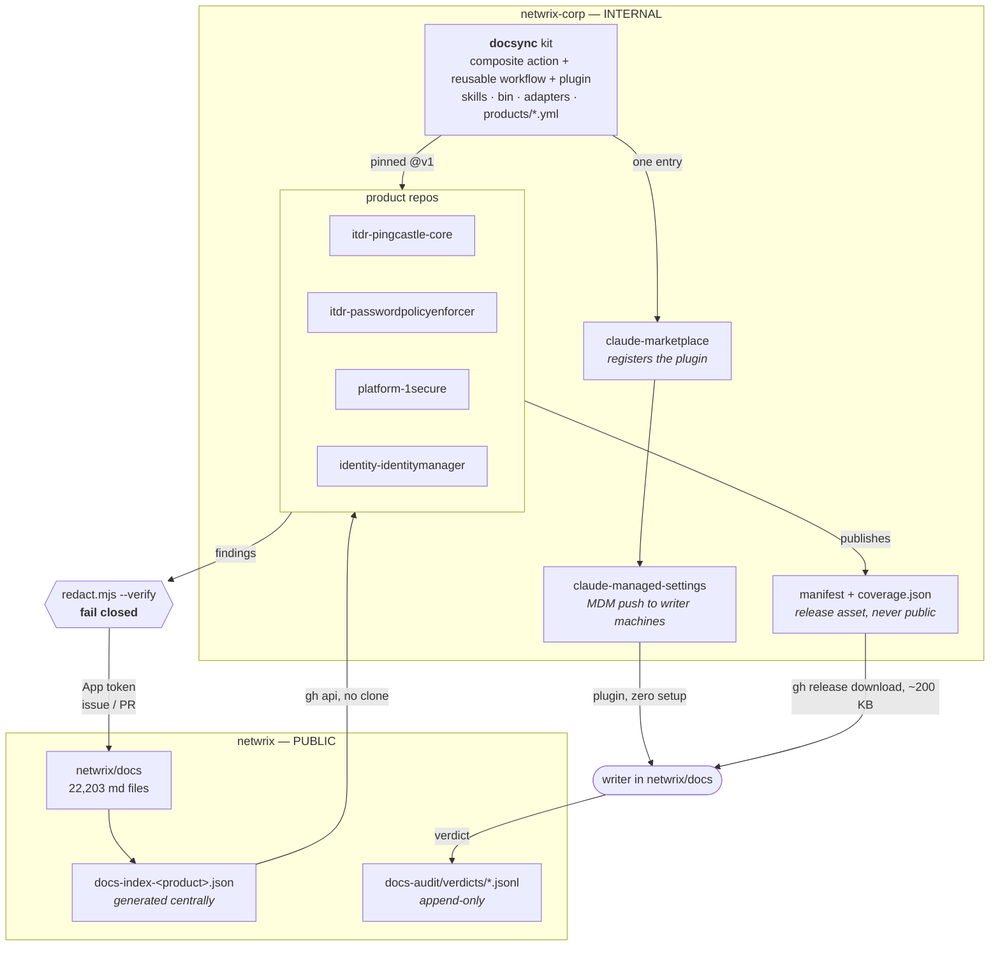
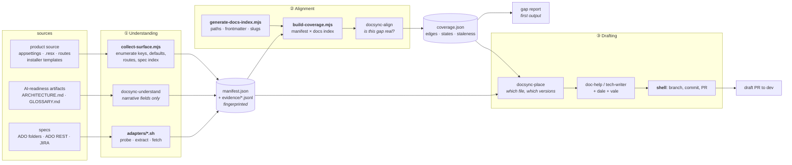
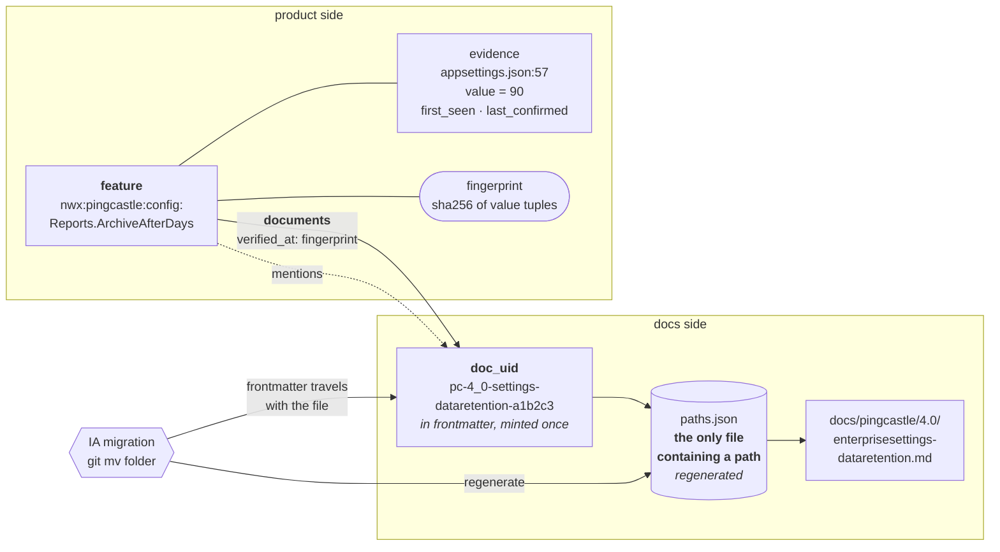
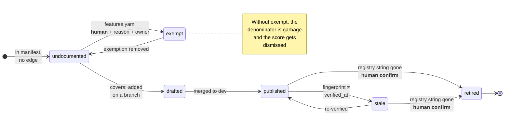
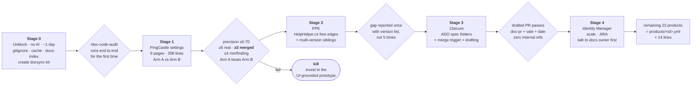

# Xchange article — Self-Aligning Documentation: Architecture Overview

This file is the publish-ready body of an internal Xchange article summarizing the
architecture in [README.md](./README.md). It is kept here so the article and the design
doc stay in sync.

## How to publish

Formatted for Xchange conventions: **title goes in the title field, not in the body** (the body must not open with an H1), Outline-flavoured `:::info` / `:::warning` callouts, and Mermaid in fenced code blocks. Mermaid rendering is confirmed — Xchange hosts a "Mermaid Diagrams" reference doc and many architecture docs use `flowchart` blocks.

**Recommended home:** `PM - Product Management › Product Operations Playbook › Docs › Processes` (collection `b1481e4d-5de7-4703-a83d-43a814e0dfa6`), as a sibling to your existing **Current workflows** doc. That doc already establishes the convention this article follows — "the pipeline is large enough that one diagram isn't readable, so it's split into four, cross-linked at the points where they hand off to each other." Cross-link the two. Alternatives with write access: **R&D - AI**, **R&D - Research & Development**, **TECH - Technical Enablement Department** (`R&D - Architecture` is read-only for you).

**Title field:** `Self-Aligning Documentation: Architecture Overview`

**Set `fullWidth: true`** — the diagram-heavy Xchange docs (NPS Architecture Diagrams, Feature Domain Map) all use it, and diagram 1 is wide.
Everything below the horizontal rule is the article body — paste it as-is. Do **not** include
the heading above it: Xchange stores the title as a separate field, so the body must not open
with an H1.

---

Netwrix documents 27 products in `netwrix/docs` — about 22,000 markdown files. Documentation drifts from product reality because nothing connects a doc page to the code or the spec that makes it true. A page carries a title, a description, and a sidebar position; it does not carry which feature it documents, which version introduced that feature, or when anyone last checked it against the product. Drift is found today by humans reading pages one at a time.

This is the architecture for a system that closes that loop: it derives what a product does from its own source and specs, maps that onto the existing doc set to find gaps in both directions, and drafts documentation that lands in the right place.

:::info
**Status: design proposal.** Nothing here is built yet. The pilot described at the end is deliberately small and has explicit numeric kill criteria, because two earlier attempts at this problem produced zero merged documentation changes.
:::

## The workflow, at a glance

The finding, and the human review of it, stay entirely inside the product's own repository (internal) — a writer and an engineer see and triage it there, not in `netwrix/docs`. The redaction gate no longer guards the finding; it guards the one remaining crossing, once, at draft time: it strips the AI's draft down to customer-language before a pull request can be opened in `netwrix/docs` (public). No internal repo name, file path, or ticket ID ever reaches the public repo, and no pull request is ever opened anywhere else.

:::warning
Keeping the finding in the product repo is a new access requirement, not something today's design already covers: writers need read/comment access to that repo (or another bridge) to see and triage it. Today writers work only in `netwrix/docs`.
:::

This traces the automated, merge-triggered path (the Stage 3 rollout target). A writer asking for a report on demand instead does the whole exchange inside `netwrix/docs` — nothing runs in the product repo for that path.

Everything below is the same loop, expanded one layer at a time: which repository each step runs in, what's deterministic versus AI-driven, and how the pieces stay correct as both the product and the documentation change underneath them.

## The three capabilities

| # | Capability | Question it answers |
|---|---|---|
| 1 | **Product understanding** | What does this product do, what does it require, and what must a user actually do? |
| 2 | **Documentation alignment** | Which doc page covers which feature — and what is uncovered, stale, or describing something that no longer exists? |
| 3 | **Documentation drafting** | Given a gap, what should the page say and where does it belong? |

Each capability runs in the product's own repository and reports into `netwrix/docs`. Understanding feeds drafting with substance; alignment feeds it with placement.

## The design principle

**Deterministic code extracts facts and computes joins. The model only writes prose and classifies ambiguous candidates.**

Every place a model is asked to *find* something rather than *describe* something is a place false positives enter — and writer trust is the scarce resource in a system like this. A tool that produces three bad findings gets filtered out permanently, and no later precision improvement wins those readers back. So the model never scans a codebase hunting for drift. A script extracts config keys, defaults, routes, and installer values into a fingerprinted manifest; a second script joins that manifest against a docs index; and only the leftover ambiguous cases go to a model.

This also means drift detection is a **hash comparison, not a judgment call**. Build the manifest at commit A, build it at commit B, and diff the manifests. Because the manifest contains only customer-observable facts, code churn that doesn't move the manifest is by construction not documentation-relevant.

## 1. Topology and the trust boundary

`netwrix/docs` is a **public** repository. Every product repository is internal. That single fact drives the shape of the system: the toolkit, every manifest, and every coverage map stay in `netwrix-corp`, and anything crossing into the public repo passes a fail-closed redaction gate.

The natural output of "read the source, write the doc" is a citation like `Netwrix.Overlord.Core/Foo.cs:42`. That is useful internally and unacceptable in a public repository. So the model never holds a write credential — it writes to a temp file, a shell step assembles public output from a **closed-field template**, and a verifier fails the job outright on any internal repo name, source file extension, ADO or JIRA work-item reference, or internal hostname. It fails rather than strips: silent stripping trains people to trust a filter nobody checks.

Internal detail still reaches the reviewer — it goes to the product repo's job summary, joined to the public issue by a run ID.

## 2. The pipeline, split by cost

An important input here is one we already have. The **AI Readiness Sprint** left every product repo with an engineer-curated `ARCHITECTURE.md` and `GLOSSARY.md` — 1Secure's architecture doc runs 555 lines with a full project reference, and its glossary defines domain terms *with pointers into the code*. Understanding should lean on those curated artifacts, written by the people who own the code, rather than trying to re-derive meaning from a gigabyte of C#. An LLM turned loose on raw source cannot reliably tell a customer-visible feature from an internal service class; an engineer-maintained glossary already made that distinction.

## 3. Why folder renames can't break the map

A separate initiative will rename documentation folders across all 27 products (`installation` → `install`, `administration` → `admin`, and so on). Any coverage map keyed on file paths would be invalidated wholesale. So none of them are.

Every edge is keyed on a **feature ID and a document ID**, never a path. Document IDs live in frontmatter, so `git mv` carries them. Paths appear in exactly one regenerated lookup file. A rename touches that file and breaks nothing.

Feature IDs are minted from code-owned registry strings — a feature flag literal, a rule attribute ID, a config key — never from a file path and never by a model. The ID ledger is append-only and CI-enforced: you may add an alias, you may not silently redefine an ID.

## 4. Coverage states

The `exempt` state is what makes a coverage number survive contact with an audience. "41 of 412 features documented" invites the entirely correct objection that most of that denominator is internal plumbing. So the denominator is *customer-visible and not exempt*, exemptions require a stated reason and an owner, and they show up in pull request diffs. We publish three separate numbers — covered, stale, orphaned — and never a single composite. A number's job is to be arguable in a specific, fixable way.

The reverse direction matters as much as the forward one. A page describing something that no longer exists is detected two ways: a coverage reference to a feature ID that has left the manifest, and a code identifier that was **present in one snapshot and absent in the next**. Absolute absence proves nothing; a transition between two deterministic snapshots proves a great deal. A page with no coverage claim at all is reported as *unmapped*, never as drift.

## 5. Spending nothing on the 85% of merges that don't matter

```mermaid
flowchart TB
  PUSH(["push to product default branch"]) --> LOOP{"bot commit?<br/>docs&#40;sync&#41;: · [skip docsync]<br/>· bot author"}
  LOOP -- yes --> STOP1(["exit — loop broken"])
  LOOP -- no --> G1{"<b>gate 1</b><br/>any path survives<br/>test/IaC/lockfile filter?"}
  G1 -- no --> STOP2(["exit — 0 tokens"])
  G1 -- yes --> G2{"<b>gate 2</b><br/>surface-map hit in<br/>products/&lt;id&gt;.yml?"}
  G2 -- no --> STOP3(["exit — 0 tokens<br/><i>log reason to step summary</i>"])
  G2 -- yes --> G3{"<b>gate 3</b><br/>doc-relevant token in<br/>git diff -U0?"}
  G3 -- no --> STOP3
  G3 -- yes --> DEDUPE{"issue already exists<br/>for docsync:&lt;product&gt;:&lt;sha12&gt;?"}
  DEDUPE -- yes --> STOP4(["exit — idempotent"])
  DEDUPE -- no --> FETCH["fetch docs index + specs<br/><i>deterministic</i>"]
  FETCH --> ALIGN["docsync-align<br/>Sonnet · max-turns 20"]
  ALIGN --> RED{{"redact.mjs --verify"}}
  RED -- fail --> FAILJOB(["<b>fail the job</b><br/>never strip silently"])
  RED -- pass --> ISSUE["gh issue create<br/>label: docsync"]
  ISSUE --> HUMAN(["writer triages"])
  HUMAN -- "adds content:fix" --> EXISTING["<b>existing</b> claude-issue-labeler<br/>drafts the PR"]
```

Three gates fire before a single token is spent, and gates 2 and 3 must **both** hit. A 400-file refactor that renames private members produces zero hits and costs nothing. When a changeset *is* filtered out, the reason is logged — false negatives are the failure mode you cannot otherwise see.

The output is a GitHub issue, not a pull request. Issues are cheap to ignore; unsolicited draft PRs are not, and at 27 products notification cost is the real budget. A writer who wants the draft adds the existing `content:fix` label and the automation we already run in `netwrix/docs` produces the pull request.

## 6. Rollout, with a gate between each stage

## What we are reusing rather than building

Most of this system already exists somewhere in the organization.

| Existing asset | Role here |
|---|---|
| `netwrix-corp/claude-marketplace` | The internal Claude Code plugin marketplace. Distribution is solved — no copying skills into 27 repositories. |
| `netwrix-corp/claude-reviewer` | A composite action with a floating `v1` tag that product repos consume in six lines. This is the organization's proven answer to shipping a capability to N repos without drift. Its skeleton is the template. |
| `claude-reviewer/scripts/find-linked-items.sh` | A working Azure DevOps adapter. Removes the need for the `az` CLI entirely. |
| Identity Manager's `claude-pr-review.yml` | A working JIRA adapter with credentials already provisioned. |
| `netwrix-corp/claude-managed-settings` | Pushes the plugin to writer machines via MDM, and already exports telemetry — cost observability is solved. |
| The AI Readiness Sprint artifacts | Engineer-curated architecture and glossary docs in every product repo: the substrate for product understanding. |
| In `netwrix/docs` | Existing Vale and Dale linting, the editorial PR review, the `content:fix` issue-to-PR path, sibling-version resolution, and the audit page walker. |

The one genuinely new component is the toolkit that binds these together, plus the manifest and coverage schemas.

## The pilot, and how we will know it failed

The pilot is **nine PingCastle settings pages — 308 lines of documentation** — checked against the product's configuration files, its config-service defaults, and its installer templates.

That target was chosen after rejecting a more attractive one. PingCastle has 191 rule classes carrying rich typed metadata, and the documentation mentions three of them. That looks like 188 gaps. It is not: rule descriptions ship inside the product's own HTML report and on the public PingCastle site, so the documentation deliberately covers *operating the scanner*, not the rule catalogue. A pilot aimed there would open with 188 correct-by-design findings — precisely the first impression that ends a project like this.

The settings pages, by contrast, assert genuinely checkable values: a cap of 100 users, a ceiling of 10,000, a 90-day minimum. And the product repo contains a skill documenting how to add new settings that survive upgrades, which tells you settings change often — which is exactly how documentation falls behind.

:::warning
**Two arms, not one.** An existing internal prototype already audits documentation against the live product UI, and scored precision 1.000 with recall 0.871 on a blind adversarial benchmark — while **explicitly refusing source-code input**. The premise of this project is the thing that pipeline cut. So the pilot runs both approaches over the same nine pages with the same reviewer, blind to arm. If reading source code does not beat UI capture on accepted findings per reviewer-minute, that is decisive, and it is far cheaper to learn now than in six months.
:::

Continue only if **all four** hold: precision at or above 0.70; at least five findings accepted as real; **at least three merged**; and no more than four reviewer-minutes per accepted finding.

That third criterion is the one both earlier attempts failed. The prior prototype built an excellent review dashboard and merged zero documentation changes; the source-code audit skill was never run at all. In neither case was detection quality the bottleneck — the missing piece was a path from a reviewer's verdict to a merged pull request. So this design adds no dashboard. Verdicts are captured in GitHub pull request reviews, which writers already do daily, and land in an append-only ledger keyed so that **a rejected finding stays rejected**. Re-reporting something a reviewer already dismissed is enough to kill adoption on its own, regardless of precision.

## Open asks

1. A GitHub App with write access to `netwrix/docs` and read access to the product repos, so automation is not running on a person's credentials.
2. An internal `docsync` repository, and confirmation that the Anthropic API key is org-scoped.
3. A ProductBoard API token. Of the four spec sources we want, Azure DevOps and JIRA need no new credentials and Xchange is reachable interactively; ProductBoard is the only one blocked in CI today.
4. A conversation with the Identity Manager documentation owner. That repository already contains its own documentation site and a release script that copies pages into a local clone of the docs repo — a real process, run by a person, that this system must reconcile with rather than route around.
