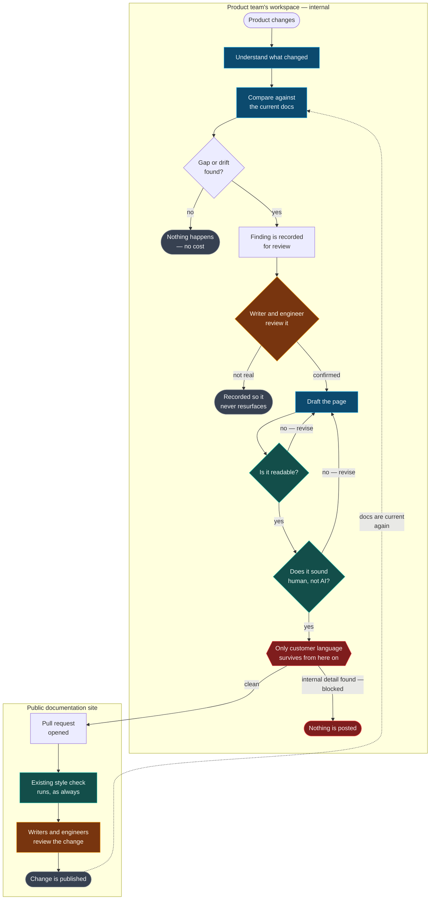
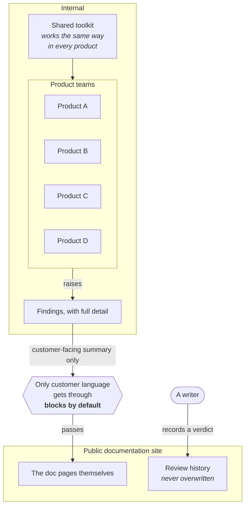
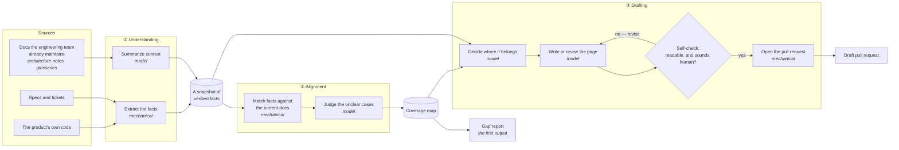
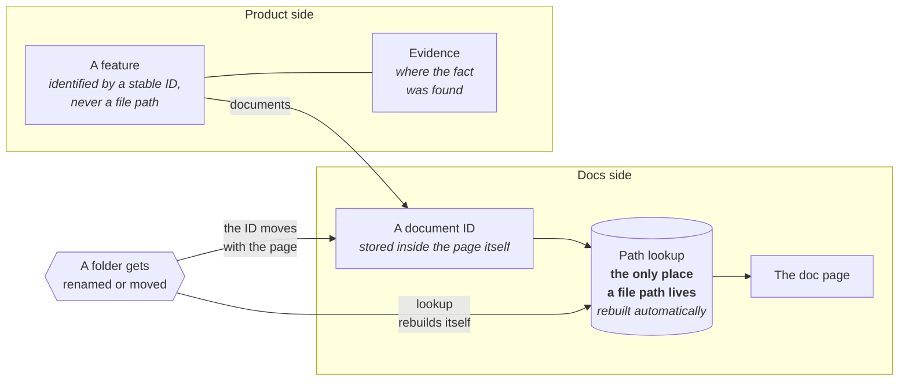
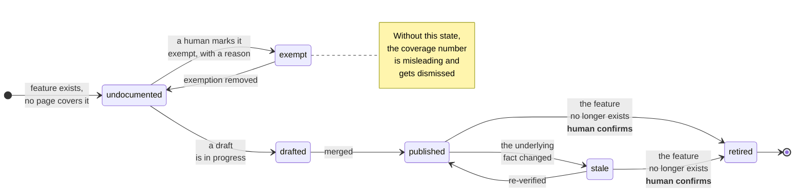
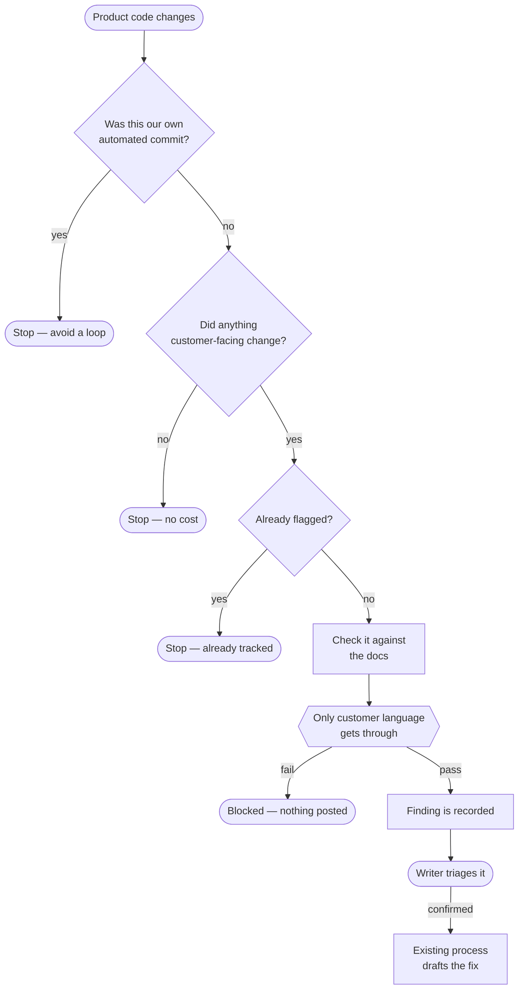
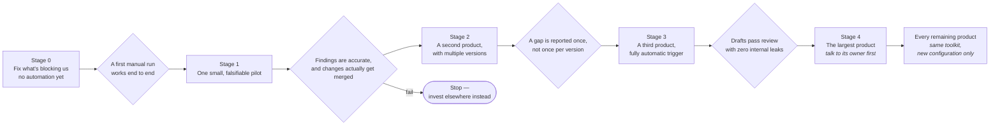

# Xchange article — Self-Aligning Documentation: Architecture Overview

This file is the publish-ready body of an internal Xchange article summarizing the
architecture in [README.md](./README.md). It is kept here so the article and the design
doc stay in sync.

## How to publish

Formatted for Xchange conventions: **title goes in the title field, not in the body** (the body must not open with an H1), Outline-flavoured `:::info` / `:::warning` callouts, and Mermaid in fenced code blocks. Mermaid rendering is confirmed — Xchange hosts a "Mermaid Diagrams" reference doc and many architecture docs use `flowchart` blocks.

**Recommended home:** `PM - Product Management › Product Operations Playbook › Docs › Processes` (collection `b1481e4d-5de7-4703-a83d-43a814e0dfa6`), as a sibling to your existing **Current workflows** doc. That doc already establishes the convention this article follows — "the pipeline is large enough that one diagram isn't readable, so it's split into four, cross-linked at the points where they hand off to each other." Cross-link the two. Alternatives with write access: **R&D - AI**, **R&D - Research & Development**, **TECH - Technical Enablement Department** (`R&D - Architecture` is read-only for you).

**Title field:** `Self-Aligning Documentation: Architecture Overview`

**Set `fullWidth: true`** — the diagram-heavy Xchange docs (NPS Architecture Diagrams, Feature Domain Map) all use it, and diagram 1 is wide.
Everything below the horizontal rule is the article body — paste it as-is. Do **not** include
the heading above it: Xchange stores the title as a separate field, so the body must not open
with an H1.

---

Netwrix documents 27 products, in one shared documentation site. Documentation drifts from product reality because nothing connects a doc page back to the product feature it describes. A page has a title and a description, but nothing says which feature it covers, when that feature last changed, or whether anyone has checked the page since. Today, drift is found by a person reading pages one at a time.

This is the architecture for a system that closes that loop. It builds an understanding of what a product actually does, compares that against the existing documentation to find gaps in both directions, and drafts the fix.

:::info
**Status: design proposal.** Nothing here is built yet. Rollout starts deliberately small, with clear pass/fail criteria at each stage, because two earlier attempts at this problem produced zero merged documentation changes.
:::

## The workflow, at a glance

A finding and its human review happen inside the product team's own workspace, not in the public documentation repository — a writer and an engineer look at it there first, which means writers will need access to that workspace, not just the docs site. Only one thing ever crosses into the public repo: a draft page, and only after it has been stripped down to plain customer-facing language. No internal file names, code, or ticket numbers ever make that crossing.

This diagram shows the automated path, triggered when the product changes. A writer can also ask for a check on demand instead; that version happens entirely within the documentation repository.

Before a person ever sees a draft, it has to pass two checks on its own: is it readable, and does it sound natural rather than generic AI writing? Either one can send it back for another pass. By the time a pull request opens, both have already passed — the public repo's own style check still runs too, the same as it does for every other change.

The rest of this article walks through the same loop one layer at a time: what stays private, what's mechanical versus judgment-based, and how the system keeps working as both the product and the documentation change underneath it.

## The three capabilities

| # | Capability | Question it answers |
|---|---|---|
| 1 | **Product understanding** | What does this product do, what does it require, and what must a user actually do? |
| 2 | **Documentation alignment** | Which doc page covers which feature — and what is uncovered, stale, or describing something that no longer exists? |
| 3 | **Documentation drafting** | Given a gap, what should the page say and where does it belong? |

Understanding feeds drafting with substance. Alignment feeds it with placement.

## The design principle

**Mechanical steps find and match facts. The model only writes prose and makes judgment calls on genuinely ambiguous cases.**

Every place a model is asked to *find* something rather than *describe* something is a place mistakes creep in — and writer trust is the scarce resource here. A tool that produces three bad findings gets ignored from then on, and no later improvement wins those readers back. So the model is never turned loose to hunt for drift on its own. A mechanical pass first extracts the facts that make a page true — a setting, a default value, a route — and matches them against what the docs currently say. Only the leftover, genuinely unclear cases go to a model for a judgment call.

This also means most drift detection is a simple comparison, not a guess: capture the facts as they stand today, capture them again later, and compare. Because that snapshot only contains things a customer could actually observe, a code change that doesn't move the snapshot is, by definition, not something a doc needs to reflect.

## 1. What stays private, and what's allowed to cross

The documentation site is public. Every product team's own workspace is internal. That one fact shapes the whole design: the tools, the raw findings, and anything that references internal file names or ticket numbers all stay inside the product team's side. Anything crossing into the public docs has to pass through a check that blocks the crossing if anything internal slips in.

Reading a product's own source naturally produces something like "this file, this line." That's useful for an engineer and unacceptable in a public page. So the model never gets to publish anything directly — it hands off a draft, and a separate check blocks the handoff outright if it spots an internal reference of any kind. It blocks rather than quietly stripping the reference out: a filter nobody has to double-check is a filter people learn not to trust.

None of that internal detail is lost — it's just kept where it belongs, visible to the product team, linked to the public finding so the two can be cross-referenced.

## 2. What's mechanical, and what's judgment

The drafting self-check follows the same rule as everything upstream of it: readability and "does this sound like AI wrote it" are measured, not eyeballed, against a fixed bar. Failing either sends the draft back for another pass — the model can revise its own work, but it never gets to grade its own work. None of this replaces a person's review, or the public repo's own style check; it just means that by the time a person looks at a draft, it has already cleared the bars a machine can check on its own, so a bad draft costs a revision cycle instead of a reviewer's patience.

One input matters more than it might seem: every product team already maintains its own architecture and glossary notes, written by the engineers who own the code. Understanding leans on those, rather than trying to re-derive meaning from raw source code. A model turned loose on source code alone can't reliably tell a customer-facing feature from an internal implementation detail; an engineer's own glossary already makes that distinction.

## 3. Why reorganizing the docs can't break anything

A separate effort is going to reorganize documentation folders across all 27 products. Any map that identified a feature by its file path would be destroyed by that reorganization. So nothing here works that way.

Every connection between a feature and a page is keyed on two stable IDs, never a path. The document's ID travels with the page when it moves. The file path lives in exactly one lookup table, and that table gets rebuilt automatically. A reorganization touches that one table and breaks nothing else.

Feature IDs come from the product's own code — a setting name, a flag, a rule ID — never from a file path, and never invented by a model. Once assigned, an ID is never silently reused or redefined; only new aliases can be added on top of it.

## 4. The states a doc page can be in

The `exempt` state is what keeps a coverage number honest. "41 of 412 features documented" invites the fair objection that most of that 412 is internal plumbing nobody should ever document. So the count only includes features a customer can actually see, exemptions require a stated reason, and they're visible whenever they're added. The system reports three separate numbers — covered, stale, and orphaned — never one composite score, because a single number invites disbelief and three numbers invite a specific, fixable conversation.

The reverse case matters just as much: a page describing something that no longer exists. That's caught when a page's claimed feature disappears from the current snapshot, or when something the product used to expose is simply gone in a later snapshot. A page that never claimed to cover anything specific is reported as merely unmapped, never as drift — that distinction is what keeps the whole report credible.

## 5. Spending nothing on the changes that don't matter

Cheap checks run first, and have to agree before anything expensive happens. A large refactor that doesn't touch anything customer-facing costs nothing, because nothing about it looks worth checking.

The result is a recorded finding, not an automatic pull request. A finding is easy to ignore if it's wrong; an unwanted pull request is not, and across 27 products that difference in cost adds up fast. A writer who agrees the finding is real triggers the existing process that turns a confirmed finding into a pull request.

## 6. Rollout, with a checkpoint between each stage

## What we're building on, not rebuilding

Most of what this needs already exists somewhere in the organization: a way to distribute a tool to every product team without copy-pasting it into each repo; working connections to the two systems that track work items; usage and cost tracking already in place; and, in every product repo, architecture and glossary notes the engineering team already keeps up to date. The documentation site itself already has editorial review, style checking, and a path from a labeled issue to a drafted fix.

The one genuinely new piece is the toolkit that connects all of this together, plus the snapshot and coverage formats it produces.

## Open asks

1. A dedicated identity for this automation, with write access to the documentation site and read access to product teams' workspaces, so it isn't running on any one person's personal access.
2. A home for the shared toolkit, and confirmation that its usage is billed centrally rather than through individual accounts.
3. Access to one more work-tracking system that today only works interactively, not from automation.
4. A conversation with the owner of the largest product before its stage begins — that team already runs its own separate, manual documentation process, and this needs to work with that process, not around it.
5. Read and comment access to each product team's workspace for documentation writers. Today writers only work inside the public documentation site.
